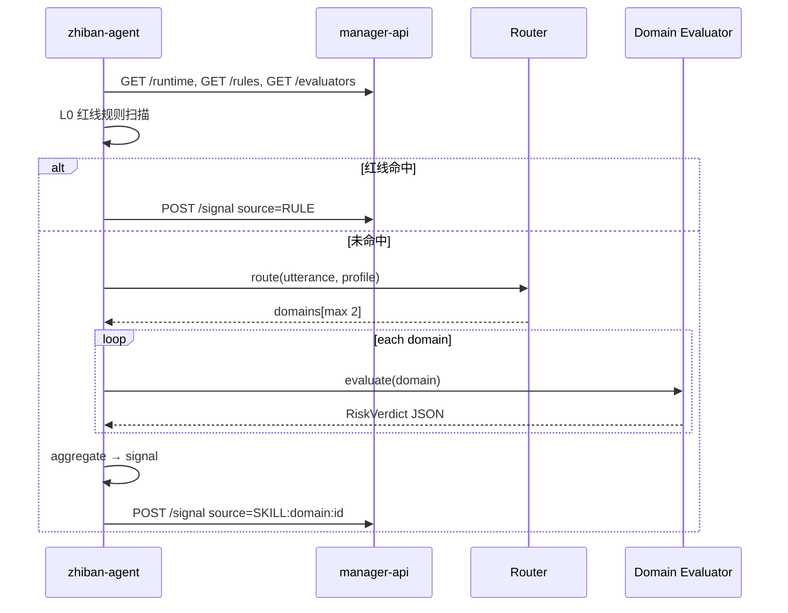

# 儿童对话风险：多领域可插拔判别技术方案

> 版本：v0.1（讨论稿）  
> 状态：待评审  
> 关联：`child-risk-alert-implementation-p0-p1-p3.md`、智伴 `child_risk_runner` / `POST /config/child/risk/signal`

---

## 一、背景与目标

### 1.1 背景

当前链路（已落地或进行中）为：

- **zhiban-agent**：每 N 轮异步扫描 → **KEYWORD/REGEX 规则**（智控台配置）→ 可选 **单路 LLM 判别**（`CHILD_RISK_LLM_JUDGE`）→ `POST /config/child/risk/signal`
- **manager-api**：`receiveSignal` → 冷却/级别过滤 → `child_risk_event` + `child_risk_outbox` → 家长小程序通知

痛点：

- 风险类型多样（心理、同伴、自伤、网络安全等），**单一通用 LLM prompt** 难以长期维护，也不利于「领域专家」独立迭代。
- 若每个领域一个 Skill **全量并行**调用，会带来 **成本、延迟、结果冲突** 与 **运维复杂度**。

### 1.2 目标

| 目标 | 说明 |
|------|------|
| **可扩展** | 领域专家可发布/更新「风险判别器」，无需改 zhiban 核心代码 |
| **可治理** | 平台统一路由、汇总、上报、冷却；红线规则平台托管 |
| **可审计** | 每次判定可追溯：来源（RULE / LLM / SKILL）、领域、版本、置信度 |
| **可演进** | 与现有 P0–P3、规则表、signal 接口兼容，分阶段上线 |

### 1.3 非目标（本期方案不解决）

- 替代临床诊断；产品定位为 **辅助预警**，需人工/家长跟进。
- 实时流式每句必判（仍采用 **每 N 轮 + 异步**，与现网一致）。
- 短信/电话外呼（仍走 P1 小程序通知形态）。

---

## 二、设计原则

1. **判别与触达分离**：Skill/Evaluator 只输出结构化判定；是否写 event、是否推家长由 **manager-api 策略引擎** 决定。
2. **统一输出 Schema**：所有判别器必须返回同一 JSON 结构，禁止各写各的字段名。
3. **先路由、后专家**：禁止「每轮调用全部领域 Skill」；由 **Router** 选出 0～K 个领域（建议 K≤2）。
4. **红线优先**：自伤、性侵暗示等 **平台 KEYWORD/REGEX** 命中即上报，**不依赖** 专家 Skill，且 **覆盖** Skill 的「无风险」结论。
5. **失败可降级**：Router / 领域 Skill / LLM 失败时，回退 **规则扫描** 或 **仅记日志**（可配置）。
6. **与聊天 Skill 解耦**：对话 Skill（讲故事、学英语）与 **RiskEvaluator** 分类型管理，避免混用同一套映射表。

---

## 三、总体架构

```text
┌─────────────────────────────────────────────────────────────────────────┐
│ zhiban-agent（异步 worker，每 N 轮触发）                                  │
│                                                                         │
│  输入: user_text, assistant_reply, child_profile, session_id            │
│                                                                         │
│  L0 平台层                                                               │
│    ├─ runtime.enabled 检查（智控台 GET /runtime）                         │
│    ├─ 红线规则 KEYWORD/REGEX（child_risk_rule，rule_scope=PLATFORM）      │
│    └─ Router → risk_domains[]（0~2）                                     │
│                                                                         │
│  L1 领域层（按 domains 加载 RiskEvaluator 配置并调用）                    │
│    ├─ psychological_evaluator  (LLM / 未来可换模型)                      │
│    ├─ peer_relation_evaluator                                       │
│    └─ online_safety_evaluator   ...                                    │
│                                                                         │
│  L2 汇总层 Aggregator                                                   │
│    ├─ 合并多领域结果 → 取最严重 risk_level                               │
│    ├─ 附 confidence / evidence                                         │
│    └─ 生成 ChildRiskSignalDTO → POST /signal                           │
└─────────────────────────────────────────────────────────────────────────┘
                                    │
                                    ▼
┌─────────────────────────────────────────────────────────────────────────┐
│ manager-api                                                             │
│  receiveSignal → 冷却 / notifyIfRiskLevelLte → event + outbox           │
│  （策略不变；扩展 source、category 枚举文档即可）                          │
└─────────────────────────────────────────────────────────────────────────┘
```



---

## 四、风险领域模型（Risk Domain）

建议平台维护 **领域目录**（枚举 + 文档），专家 Skill 必须挂载到某一 domain：

| domain_code | 中文名 | 典型 category 示例 | 说明 |
|-------------|--------|-------------------|------|
| `psychological` | 心理情绪 | `emotion_distress`, `self_harm_hint` | 无助、抑郁表述等 |
| `peer_relation` | 同伴关系 | `social_exclusion`, `bullying` | 排挤、霸凌 |
| `family` | 家庭关系 | `family_conflict` | 严重亲子冲突暗示 |
| `school` | 学业校园 | `school_stress` | 极端厌学等 |
| `online_safety` | 网络安全 | `grooming_hint`, `privacy_leak` | 诱拐、不良接触 |
| `physical_health` | 身心健康 | `eating_disorder_hint` | 视产品范围启用 |
| `other` | 其他 | `other` | 兜底 |

**category** 由各 Evaluator 输出，须在智控台 **类目白名单** 中（防止随意字符串污染统计）。

---

## 五、核心概念：RiskEvaluator vs 聊天 Skill

| 维度 | 聊天 Skill（现有） | RiskEvaluator（新增类型） |
|------|-------------------|---------------------------|
| 用途 | 对话风格、工具、任务 | 仅风险判别 |
| 触发 | 意图路由 / speaker 映射 | **仅** 儿童风险异步管线 |
| 输入 | 全量 system + 历史 | **固定 RiskEvalInput** |
| 输出 | 自然语言 / tool_call | **固定 RiskVerdict JSON** |
| 存储 | `agent_skill` 等 | 建议 `child_risk_evaluator` 表或 `agent_skill.skill_type=RISK_EVAL` |

专家交付物：**instructions（prompt 模板）+ 可选参考话术列表 + domain + 版本**，而不是改 Java/Python 业务代码。

---

## 六、数据模型

### 6.1 表：`child_risk_evaluator`（建议新增）

| 字段 | 类型 | 说明 |
|------|------|------|
| id | bigint PK | |
| code | varchar(64) UK | 稳定标识，如 `peer_relation_v1` |
| name | varchar(128) | 展示名 |
| risk_domain | varchar(32) | 见第四节 |
| version | int | 递增，便于灰度 |
| status | tinyint | 0 禁用 1 启用 |
| trigger_mode | varchar(32) | `ROUTED` / `ALWAYS` / `RULE_FALLBACK_ONLY` |
| priority | int | 同 domain 多版本时排序 |
| timeout_ms | int | 单次调用超时，默认 45000 |
| model_name | varchar(64) | 可覆盖全局 OPENAI_MODEL |
| temperature | decimal | 建议 0 |
| instructions | text | Prompt 正文（或 template_id 外键） |
| output_schema_version | varchar(16) | 如 `1.0` |
| allowed_categories | json | 该评估器允许输出的 category 列表 |
| min_child_age | int nullable | 可选年龄门槛 |
| max_child_age | int nullable | |
| sort_order | int | |
| create_time / update_time | | |

### 6.2 扩展 `child_risk_rule`（可选）

| 字段 | 说明 |
|------|------|
| `rule_scope` | `PLATFORM`（红线，平台维护）/ `DOMAIN`（某领域补充规则） |
| `risk_domain` | DOMAIN 规则时必填 |

### 6.3 扩展 `server.child_risk_config`（JSON）

在现有 `enabled, cooldownMinutes, notifyIfRiskLevelLte, evalEveryNRounds` 上增加：

```json
{
  "enabled": true,
  "evalEveryNRounds": 1,
  "cooldownMinutes": 30,
  "notifyIfRiskLevelLte": 3,
  "judgmentMode": "HYBRID",
  "routerEnabled": true,
  "maxDomainsPerRound": 2,
  "evaluatorParallelism": 2,
  "llmJudgeEnabled": false,
  "minConfidenceToAlert": 0.65,
  "platformRulesFirst": true
}
```

| 键 | 含义 |
|----|------|
| `judgmentMode` | `RULES_ONLY` / `LLM_ONLY` / `HYBRID`（推荐） |
| `routerEnabled` | 是否启用领域路由 |
| `maxDomainsPerRound` | 每轮最多调几个领域 Evaluator |
| `minConfidenceToAlert` | 低于此置信度只记审计或 SUPPRESSED |
| `platformRulesFirst` | 红线先于 Skill |

### 6.4 扩展 `child_risk_event` / signal（可选）

| 字段 | 说明 |
|------|------|
| `evaluator_code` | 命中的评估器 code |
| `confidence` | 0~1 |
| `evidence` | 截断原文片段 |
| `source` | 已有；约定 `RULE` / `LLM` / `SKILL:{domain}:{code}` |

---

## 七、统一协议（Schema）

### 7.1 RiskEvalInput（zhiban → Evaluator）

```json
{
  "child_id": 2,
  "device_id": "aa:bb:cc",
  "session_id": "uuid",
  "child_utterance": "我不想活了",
  "assistant_reply": "……",
  "child_profile": {
    "nickname": "泡泡",
    "age_band": "1-2",
    "notes": "胆小"
  },
  "recent_turns": [
    {"role": "user", "content": "..."},
    {"role": "assistant", "content": "..."}
  ],
  "locale": "zh-CN"
}
```

说明：

- **child_utterance** 必须由 zhiban 从 `用户说：` 后截取，**禁止**把整段 system prompt 交给专家模型（与现 `extract_user_turn_for_risk` 一致）。

### 7.2 RiskVerdict（Evaluator → Aggregator）

```json
{
  "hit": true,
  "need_alert": true,
  "risk_level": 1,
  "category": "self_harm_hint",
  "reason_public": "孩子表达了强烈的轻生想法，建议家长尽快关注。",
  "confidence": 0.88,
  "evidence": "我不想活了",
  "evaluator_code": "psychological_v1",
  "risk_domain": "psychological"
}
```

校验：

- `risk_level` ∈ [1,3]，1 最严重
- `category` ∈ evaluator.allowed_categories
- `need_alert=false` 时仍可填 level/category 供审计

### 7.3 RouterOutput

```json
{
  "domains": ["psychological", "peer_relation"],
  "reason": "自伤表述与同伴关系均可能相关"
}
```

Router 实现二选一（可并存）：

- **轻量 LLM**（低温、极短 prompt，只输出 domains）
- **规则表**（关键词 → domain 映射，零成本）

---

## 八、编排算法（Aggregator）

伪代码：

```text
function run_child_risk_eval(input):
  if not runtime.enabled: return

  # L0
  hit = platform_rules.match(input)
  if hit: return post_signal(hit, source=RULE)

  domains = []
  if config.routerEnabled:
    domains = router.route(input).domains[:config.maxDomainsPerRound]
  elif config.judgmentMode includes LLM:
    domains = ["psychological"]  # 默认单域，兼容旧版

  verdicts = []
  for d in domains:
    ev = registry.get_enabled_evaluator(d)
    if ev: verdicts.append(call_evaluator(ev, input, timeout=ev.timeout_ms))

  if verdicts empty and config.judgmentMode == HYBRID:
    hit = domain_rules.match(input)  # 含原 KEYWORD 规则
    if hit: return post_signal(hit, source=RULE)
    return

  best = aggregate(verdicts):
    # need_alert 任一为 true 且取 min(risk_level)
    # confidence 取 max
    # category 取最严重那条的 category

  if not best.need_alert: return
  if best.confidence < config.minConfidenceToAlert:
    return post_suppressed_or_audit_only(best)

  post_signal(best, source="SKILL:{domain}:{code}")
```

**冲突策略**：

| 场景 | 策略 |
|------|------|
| 红线 vs Skill 无风险 | **红线赢** |
| 多领域均 hit | **risk_level 取最小（最严重）**；`reason_public` 拼接或取最严重条 |
| 同 domain 多版本 | 仅 **enabled 且 version 最高** 一条 |
| Evaluator 超时 | 记日志，该 domain 跳过；若全部失败则 **规则回退** |

---

## 九、API 设计（manager-api）

### 9.1 智伴内部接口（Bearer `server.secret`）

| 方法 | 路径 | 说明 |
|------|------|------|
| GET | `/config/child/risk/runtime` | 已有；扩展返回 `judgmentMode` 等 |
| GET | `/config/child/risk/rules` | 已有；可增加 `rule_scope` 过滤 |
| GET | `/config/child/risk/evaluators` | **新增**，返回启用中的 Evaluator 列表（含 instructions） |
| GET | `/config/child/risk/domains` | **新增**，领域目录 + 类目白名单 |
| POST | `/config/child/risk/signal` | 已有；`source` 扩展约定 |

### 9.2 智控台管理接口（需登录）

| 方法 | 路径 | 说明 |
|------|------|------|
| CRUD | `/admin/child-risk/evaluators` | 评估器管理、启停、版本 |
| POST | `/admin/child-risk/evaluators/{id}/publish` | 发布新版本 |
| GET | `/admin/child-risk/domain-catalog` | 领域与 category 字典 |

### 9.3 zhiban-agent 模块划分

| 模块 | 职责 |
|------|------|
| `child_risk_runner.py` | 调度入口、轮次、异步线程 |
| `child_risk_rules.py` | KEYWORD/REGEX（从 runner 拆出） |
| `child_risk_router.py` | Router |
| `child_risk_evaluator.py` | 调用 Evaluator（HTTP LLM / 未来本地模型） |
| `child_risk_aggregator.py` | 汇总与 post_signal |
| `child_risk_llm_judge.py` | 可演进为 `psychological` 默认 Evaluator 实现 |

---

## 十、专家 Skill  authoring 规范（给领域专家）

1. **只写判别，不写对话**：instructions 中明确「只输出 JSON，不要安慰孩子」。
2. **提供 5～20 条参考表述**（正负例），写入 `instructions` 或附属 `reference_phrases` 字段。
3. **category 必须从白名单选**，禁止自造未登记类目。
4. **版本发布**：修改 instructions 走新版本号，便于 A/B 与回滚。
5. **禁止**在 prompt 里要求「忽略平台规则」类注入；平台在 system 层统一加防护句。

平台侧：**新 Evaluator 默认 `status=0`**，运营审核后启用；可先 **只写 event 不推家长**（灰度）。

---

## 十一、安全与合规

- **数据最小化**：Evaluator 输入仅必要字段；日志脱敏（手机号、地址）。
- **密钥**：LLM API Key 仅在 zhiban-agent / 安全网关，不下发设备。
- **审计**：`child_risk_event` 保留 `source`、`evaluator_code`、`evidence`。
- **误报**：`minConfidenceToAlert` + 冷却；低置信写 `SUPPRESSED`。
- **免责**：家长端文案标明「AI 辅助提示，非医疗诊断」。

---

## 十二、非功能需求

| 项 | 指标（建议） |
|----|----------------|
| 异步 | 不阻塞 `/api/chat` 与流式 |
| 延迟 | 单轮 Evaluator P99 < 60s（可配置超时） |
| 成本 | Router + ≤2 Evaluator/轮；禁止全量领域 |
| 可用性 | Evaluator 失败 → 规则回退；manager-api 不可用 → 跳过并告警 |
| 缓存 | evaluators 列表缓存 120s（与 rules 一致） |

---

## 十三、实施分期

### Phase 0（现状）

- RULE + 可选单路 `CHILD_RISK_LLM_JUDGE`
- `POST /signal`、event、outbox、家长拉取

### Phase 1（1～2 周）：协议与汇总，不拆表

- 固定 **RiskVerdict JSON**；将现有 LLM 判别视为 `psychological` 默认 Evaluator
- runner 内 **Aggregator**；`source=LLM` 改为 `SKILL:psychological:default`
- 配置仍用 env + `server.child_risk_config` 扩展 JSON

### Phase 2（2～3 周）：Router + 多 Evaluator 表

- 新增 `child_risk_evaluator` 表与 `GET /evaluators`
- 智控台 **评估器管理** 页（CRUD、启停）
- Router（规则版即可）+ 每轮最多 2 领域

### Phase 3（按需）：运营与质量

- 置信度阈值、SUPPRESSED 审计看板
- Evaluator 版本灰度、指标（命中率、误报反馈）
- 可选：向量召回辅助 Router（非必须）

---

## 十四、测试要点

| 编号 | 场景 | 预期 |
|------|------|------|
| T1 | 红线关键词 | 不调 Evaluator，直接 RULE signal |
| T2 | 仅心理 Evaluator 命中 | source 含 psychological |
| T3 | Router 返回 2 领域 | 并行 2 次调用，aggregate 取最严重 |
| T4 | Evaluator 超时 | 回退 KEYWORD，日志有 fallback |
| T5 | confidence 低于阈值 | 无家长通知或 SUPPRESSED |
| T6 | runtime.enabled=false | 全程不 POST |
| T7 | 专家 prompt 注入 | 输出仍被 schema 校验拒绝 |

---

## 十五、与现有文档/代码对照

| 现有 | 本方案 |
|------|--------|
| `child_risk_rule` | L0 平台红线 + 可选 DOMAIN 规则 |
| `CHILD_RISK_LLM_JUDGE` | 收敛为某 `RiskEvaluator` 或 `judgmentMode` |
| `ChildRiskSignalDTO.source` | 扩展 `SKILL:domain:code` |
| `agent_skill` 聊天技能 | 并列新类型 `RISK_EVAL`，不混映射 |

---

## 十六、待评审决策项

1. **Evaluator 调用位置**：仅 zhiban-agent vs manager-api 集中调用（建议先 zhiban，与现网一致）。
2. **Router 首版**：纯规则 vs 小模型（建议 **规则 + 可选 LLM**）。
3. **是否保留全局单路 LLM 开关**：建议保留为 `psychological` 默认 Evaluator 的快捷配置。
4. **低置信是否推家长**：默认 **不推**，只记 event。

---

## 附录 A：`source` 字段约定

| source 示例 | 含义 |
|-------------|------|
| `RULE` | 平台/领域 KEYWORD/REGEX |
| `LLM` | 兼容旧版单路 LLM |
| `SKILL:psychological:psychological_v1` | 领域评估器 |
| `ROUTER` | 仅审计路由结果（一般不单独上报） |

---

## 附录 B：参考：单域 Evaluator Prompt 骨架

```text
你是【心理情绪】领域的儿童对话风险评估器。只根据「孩子说」和「助手回复」判断是否需要向家长预警。
只输出 JSON：{ hit, need_alert, risk_level, category, reason_public, confidence, evidence }
category 只能从列表中选择：emotion_distress, self_harm_hint, ...
不要输出 markdown。不要扮演陪伴角色。
```

---

*文档结束。评审通过后可将 Phase 1 拆为开发任务单（manager-api / zhiban-agent / manager-web）。*
