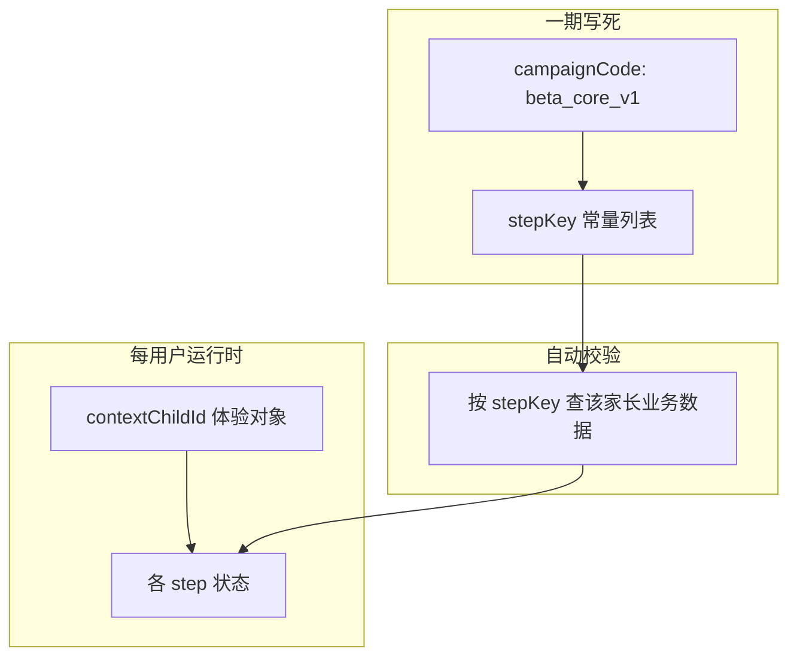
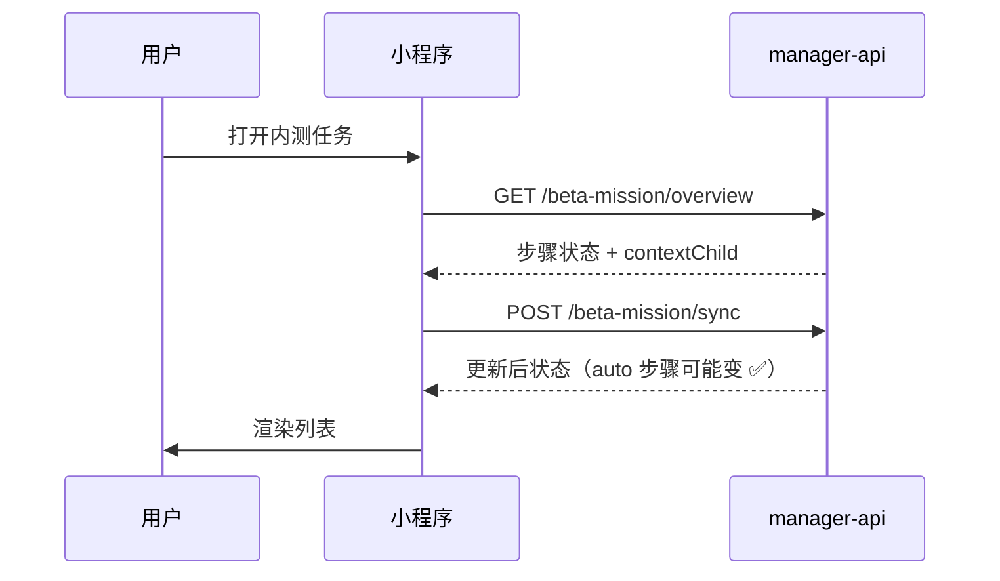

# 内测体验任务 — 完整产品方案 + 技术方案（一期）

> **一期范围：** 任务步骤**全部写死**，智控台**不支持**运营添加/编辑步骤；仅全局开关 + 进度看板。  
> **受众：** 内测用户（`parent_user.is_beta_tester=1`）。  
> **关联模块：** 与「内测反馈」并列；与「影子任务」命名区分，本产品内称 **「内测任务」** / **「体验任务」**。

---

# 第一部分：产品方案

## 1. 背景与目标

| 问题 | 方案 |
|------|------|
| 新内测用户不知道产品能做什么 | 提供固定 **8 步体验清单**，覆盖设备、对话、安全、反馈 |
| 运营不想每人单独配任务 | **全站内测用户共用一套写死步骤**；差异仅来自各家长自己的业务数据自动校验 |
| 不能硬拦主流程 | **弱引导**：不自动跳转功能页；用户主动进「内测任务」再「去完成」 |

## 2. 已拍板原则（汇总）

| # | 结论 |
|---|------|
| 1 | 仅内测用户；架构预留日后 `all_new` |
| 2 | 同时仅 **1 个固定任务包**（代码写死 `campaignCode=beta_core_v1`） |
| 3 | **必做全完成 = 包完成**；选做可「跳过」 |
| 4 | 无物质奖励 |
| 5 | 弱引导：可关闭首次弹窗；**每次进小程序不自动跳**绑定页等 |
| 6 | 内容覆盖 **设备+对话** 与 **安全+风险** 两大章节 |
| 7 | **一期不支持运营添加步骤**；步骤列表、校验、跳转均由后端常量定义 |
| 8 | **体验孩子仅可选一次**，锁定后只读，不可更换 |
| 9 | **内测任务入口**在开关+内测身份下**始终展示**；包是否完成只影响角标/副标题 |

## 3. 核心概念



- **任务包（Campaign）**：一期只有一个，`beta_core_v1`，名称「核心能力体验」。
- **步骤（Step）**：由 `stepKey` 标识，代码注册，运营不可增删。
- **体验对象 `contextChildId`**：需要「针对某个孩子」的步骤共用；由**家长在任务内选一次**（默认小程序当前选中孩子），**锁定后不可更换**；不是运营下发。
- **进度**：每用户一行（或按 step 展开），状态：`locked` / `pending` / `completed` / `skipped`。

### 3.1 与陪伴页 `currentChild` 的联动（不反向污染）

| 时机 | 行为 |
|------|------|
| **锁定前** | 可用陪伴页 `currentChild` **作默认候选**（须用户确认后 `PUT /context`，见 §5.4.2） |
| **锁定后** | 任务只认服务端 `contextChildId`；陪伴页换孩子 **不影响** 任务进度与校验 |
| **反向** | 任务 **不会** 修改陪伴页 `globalData.currentChild` |

## 4. 一期固定步骤清单（全部写死）

### 章节 A：设备与对话

| 序 | stepKey | 标题 | 必做 | 校验 | 需要 contextChild |
|----|---------|------|------|------|-------------------|
| A1 | `bind_device` | 绑定第一台设备 | 必做 | **auto** 存在有效 `parent_device_binding` | 否 |
| A2 | `has_child` | 添加设备主孩子 | 必做 | **auto** 该家长可访问的 `device_child` ≥1 | 否 |
| A3 | `voiceprint_done` | 为体验孩子录制声纹 | 选做 | **auto** 体验孩子存在可管理声纹（见技术校验） | **是** |
| A4 | `skill_created` | 添加一条对话能力 | 必做 | **auto** `parent_user_skill` 该家长 ≥1 | 否 |

### 章节 B：安全与反馈

| 序 | stepKey | 标题 | 必做 | 校验 | 需要 contextChild |
|----|---------|------|------|------|-------------------|
| B1 | `risk_preference_set` | 设置风险关注侧重 | 选做 | **auto** 体验孩子存在 `parent_risk_preference` 记录 | **是** |
| B2 | `risk_watch_created` | 提交一条风险观察 | 选做 | **auto** 体验孩子 `parent_risk_watch` ≥1（**含 pending**） | **是** |
| B3 | `risk_alert_viewed` | 查看风险告警入口 | 选做 | **visit** 用户曾进入告警列表页（服务端记标记） | 否 |
| B4 | `feedback_submitted` | 提交一条内测反馈 | 必做 | **auto** `parent_feedback` ≥1 | 否 |

**包完成条件：** A1、A2、A4、B4（`bind_device`、`has_child`、`skill_created`、`feedback_submitted`）为 `completed`；选做可为 `completed` 或 `skipped`。

**步骤依赖（软依赖，不锁死 UI）：** 建议小程序展示顺序即上表；`voiceprint_done` / B 段步骤在**未设 `contextChildId`** 时，点「去完成」先走选孩子流程。

---

## 5. 小程序端设计

### 5.1 入口与可见性

```
showEntry =
  (server.beta_mission_enabled == true)
  && (parent_user.is_beta_tester == 1)
```

与 `entry-status.showEntry` 一致；**与任务包是否完成无关**。未完成时副标题/角标提示进度；**已全部完成**时副标题改为「已完成」，入口仍保留。

| 位置 | 行为 |
|------|------|
| **我的** Tab | 菜单「内测任务」；未完成：副标题 `必做 2/4` + 角标；已完成：副标题「已完成」 |
| **首次进入（可选）** | 全屏轻弹窗一次（可「稍后再说」写入 `popupDismissed`） |

**不做：** 冷启动自动 `redirect` 到绑定页 / 声纹页。

### 5.2 页面结构

```
pages/beta-mission/index        任务首页（章节列表 + 进度；顶部可放简短说明文案）
pages/beta-mission/complete     必做全完成庆祝页
```

无需单独「步骤详情页」；在首页卡片展开说明即可。

### 5.3 任务首页 `index` 布局

```
┌─────────────────────────────────────┐
│ 核心能力体验          必做 2/4      │
│ ████████░░░░  50%                   │
│ 体验对象：泡泡（已锁定）             │
├─────────────────────────────────────┤
│ ▼ 设备与对话                        │
│  ⬜ A1 绑定第一台设备    [去完成]   │
│  ⬜ A2 添加设备主孩子    [去完成]   │
│  ○  A3 录制声纹(选做)    [去完成][跳过] │
│  ⬜ A4 添加对话能力      [去完成]   │
├─────────────────────────────────────┤
│ ▼ 安全与反馈                        │
│  ○  B1 风险关注侧重(选做) ...       │
│  ...                                │
│  ⬜ B4 提交内测反馈      [去完成]   │
└─────────────────────────────────────┘
```

**状态图标：**

| 状态 | 展示 |
|------|------|
| `completed` | ✅ |
| `pending` | ⬜（必做）/ ○（选做） |
| `skipped` | ⏭ 已跳过（仅选做） |

**顶部「建议下一步」（可选 UI）：** 第一个未完成**必做**步的标题 + 按钮「继续完成」→ 等价于点该步「去完成」。

### 5.4 交互流程

#### 5.4.1 进入首页



每次 `onShow` 建议调一次 `sync`，从功能页返回后自动勾上已完成项。

#### 5.4.2 锁定体验对象（仅可设一次）

- 若 `contextChildId` 为空（`contextLocked=false`）：
  - 顶部展示选孩子区；列表来源见 **§5.7.1**（非单独「全量孩子」API）。
  - 默认选中陪伴页 `currentChild`（若有且出现在列表中）。
  - 用户点击 **「确认体验对象」** 后再 `PUT /beta-mission/context` → `sync`。
  - **不推荐**进页静默 `PUT`（避免锁错孩子）；若产品改为自动锁定，去掉确认按钮即可。
- 若已锁定（`contextLocked=true`）：顶部**只读**「体验对象：{name}」；**无「更换」**。
- 再次 `PUT /context` → **20015** `PARENT_BETA_MISSION_CONTEXT_LOCKED`。

#### 5.4.3 点击「去完成」

| stepKey | 行为 |
|---------|------|
| 各业务步 | `navigateTo` 对应业务页，query 带 `from=beta_mission&stepKey=xxx&childId={contextChildId}`（需要时） |
| 需要 child 但未设 | 先弹选孩子 → 再跳转 |

**不自动串联**：完成 A1 后**不**自动打开 A2，用户回到任务页自己点。

#### 5.4.4 点击「跳过」（仅选做）

`POST /beta-mission/steps/{stepKey}/skip` → 状态 `skipped`，不影响包完成。

#### 5.4.5 包完成

当必做步全部 `completed`：

- 首页顶部副标题改为「已完成」
- 任务首页 `sync` 发现 `packCompleted` **刚变为 true** 时：**半屏庆祝**（非全屏挡死、不抢其它业务路由）→ 可选进入 `complete` 页
- `complete` 页：文案 +「去内测反馈」「返回我的」

#### 5.4.6 与业务页协作

业务页**不必**感知任务逻辑；仅靠返回任务页时 `sync` 更新。  
若希望 B3「查看告警」准确：告警列表页 `onShow` 时调 `POST .../risk_alert_viewed/visit`；返回 **20011** 时**静默忽略**（非内测/关开关不影响告警页）。

### 5.5 各步跳转目标（小程序路径约定）

> 下列路径为**约定占位**，实现时与小程序实际路由对齐；**query 由客户端按 overview 拼，不写死在运营配置**。

| stepKey | pagePath（建议） | query |
|---------|------------------|-------|
| `bind_device` | `/pages/add-device/add-device` | `from=beta_mission&stepKey=bind_device`（BLE 由 add-device 内跳） |
| `has_child` | `/pages/device-main-child/device-main-child` | `deviceId={首个绑定设备}&from=beta_mission&stepKey=has_child` |
| `voiceprint_done` | `/pages/voiceprint/voiceprint` | `deviceId=&childId={contextChildId}&from=beta_mission&stepKey=voiceprint_done` |
| `skill_created` | `/pages/create-skill/create-skill` | `from=beta_mission&stepKey=skill_created` |
| `risk_preference_set` | `/pages/risk-watch/index` | `childId={contextChildId}&from=beta_mission&stepKey=risk_preference_set` |
| `risk_watch_created` | `/pages/risk-watch/create-type` | `childId={contextChildId}&from=beta_mission&stepKey=risk_watch_created` |
| `risk_alert_viewed` | `/pages/risk-alerts/risk-alerts` | `from=beta_mission&stepKey=risk_alert_viewed` |
| `feedback_submitted` | `/pages/feedback/submit` | `from=beta_mission&stepKey=feedback_submitted` |

`overview` 接口可返回每步 `actionUrl`（后端根据模板 + context **拼好**），小程序直接 `navigateTo(actionUrl)`，避免前端硬编码多套规则。

### 5.6 首次弹窗（弱引导）

- **触发页：陪伴 Tab** `onShow`（非冷启动全屏挡死）
- 条件：`showEntry && !popupDismissed && !packCompleted`
- 形态：**轻量弹窗**（非全屏）
- 文案：有一份约 10 分钟体验清单，帮助熟悉设备、对话与安全功能
- 「去看看」→ 任务首页；「稍后再说」→ `POST /beta-mission/dismiss-popup`

### 5.7 小程序实现约定（无单独 API，联调前定死）

#### 5.7.1 选孩子列表来源

现网**无**「家长全部孩子」单接口。与陪伴页、告警页一致：

```
getDeviceList()
  → 每台设备 getDeviceMainChild(deviceId)
  → 仅展示「已设主孩子」的设备孩子，作为 picker 选项
```

若 A2（`has_child`）未完成导致列表为空 → 引导先完成 A1/A2，再锁定体验对象。

#### 5.7.2 我的页入口数据

「我的」Tab 菜单副标题/角标：优先 `GET /entry-status`（含 `requiredDone`/`requiredTotal`/`packCompleted`），**不必**每次拉完整 `overview`。字段在每次 `sync` 后由服务端更新，下次 `entry-status` 即反映最新进度。

#### 5.7.3 API 未上线前

可先实现：`pages/beta-mission/*`、`utils/api/betaMission.js`、我的入口、陪伴弹窗、`risk-alerts` visit；E2E 依赖 manager-api 部署。

---

## 6. 智控台设计（一期）

### 6.1 菜单位置

**参数管理 → 更多 → 内测任务**（与「内测反馈」并列）

### 6.2 页面结构（只读为主）

#### Tab1：概览

| 区块 | 内容 |
|------|------|
| 总开关 | 读写 `server.beta_mission_enabled`（与参数字典同步） |
| 任务包信息 | 只读展示：名称「核心能力体验」、code `beta_core_v1`、步骤数 8、必做 4 |
| 说明 | 一期步骤写死在代码中，如需调整请联系研发发版 |

#### Tab2：完成漏斗

| 列 | 说明 |
|----|------|
| 步骤 | stepKey + 标题 |
| 完成人数 | auto+visit 完成数 |
| 跳过人数 | 仅选做 |
| 完成率 | 完成人数 / 内测用户总数 |

#### Tab3：用户进度（可选一期简版）

表格：家长 ID、昵称、必做进度、包是否完成、`contextChildId`、最近更新时间；支持按「未完成」筛选。

**一期不做：** 步骤编辑器、拖拽排序、自定义 pagePath、按人下发不同任务包。

### 6.3 与内测用户标记

内测用户仍在用户/反馈相关处维护 `is_beta_tester`（现有能力）；本页可增加说明链接。

---

# 第二部分：技术方案

## 7. 架构总览

```mermaid
flowchart LR
  subgraph web [manager-web]
    W1[BetaMissionManagement.vue]
  end
  subgraph api [manager-api]
    P[/parent-api/beta-mission/*]
    A[/admin/beta-mission/*]
    R[BetaMissionStepRegistry 常量]
    V[BetaMissionVerifyService]
  end
  subgraph db [MySQL]
    T1[beta_mission_user_state]
  end
  MP[小程序] --> P
  W1 --> A
  P --> V
  P --> T1
  V --> T1
```

## 8. 数据库（一期）

### 8.1 表 `beta_mission_user_state`

| 字段 | 类型 | 说明 |
|------|------|------|
| id | BIGINT PK | |
| parent_user_id | BIGINT UK | 一期每用户一行（单 campaign） |
| campaign_code | VARCHAR(32) | 固定 `beta_core_v1` |
| context_child_id | BIGINT NULL | 体验对象 device_child.id |
| step_states | JSON/TEXT | `{"bind_device":"completed",...}` |
| required_done_count | INT | 冗余可选，便于统计 |
| pack_completed_at | DATETIME NULL | 必做全完成时间 |
| popup_dismissed | TINYINT | 是否点过「稍后再说」 |
| risk_alert_visited | TINYINT | B3 visit 标记 |
| create_time / update_time | DATETIME | |

**step_states 枚举值：** `pending` | `completed` | `skipped`

初始化：用户首次 `overview` 时 insert 一行，全部 `pending`。

### 8.2 参数字典

| param_code | 说明 |
|------------|------|
| `server.beta_mission_enabled` | 总开关，默认 `false` |

迁移脚本新建表 + 插入参数字典（实现阶段做 Liquibase）。

## 9. 步骤注册表（代码常量，非 DB）

`BetaMissionStepRegistry` 枚举或静态列表，示例：

```java
// 伪代码 — 实现时放 manager-api
StepDef(
  stepKey = "bind_device",
  section = "A",
  title = "绑定第一台设备",
  description = "...",
  required = true,
  verifyMode = AUTO,
  contextNeeds = NONE,
  pagePathTemplate = "/pages/add-device/add-device",
  pageQueryTemplate = "from=beta_mission&stepKey=bind_device"
)
```

**校验器映射 `BetaMissionVerifyService`：**

| stepKey | 校验逻辑 |
|---------|----------|
| `bind_device` | `parent_device_binding` 存在且 `parent_user_id` 匹配 |
| `has_child` | 通过 binding 关联的 `device_child` count ≥ 1 |
| `voiceprint_done` | `context_child_id` 非空；该 child 为某设备主孩子且存在 `agent_voice_print.child_id = context_child_id`（可管理声纹） |
| `skill_created` | `parent_user_skill` 表 `parent_user_id = ?` count ≥ 1 |
| `risk_preference_set` | `parent_risk_preference` 存在且 child_id = context |
| `risk_watch_created` | `parent_risk_watch` 该家长+child count ≥ 1（含 pending） |
| `risk_alert_viewed` | `user_state.risk_alert_visited = 1` 或 step_states 已 completed |
| `feedback_submitted` | `parent_feedback` 该家长 count ≥ 1 |

`sync` 接口：遍历 AUTO 步骤，调用校验器，满足则写 `completed`（不覆盖 `skipped`）。

## 10. 家长端 API（小程序）

**Base：** `/parent-api/beta-mission`（现网 `{baseUrl}/xiaozhi/parent-api/beta-mission/*`）  
**鉴权：** `Authorization: Bearer {token}`（与其它家长端一致）

**统一响应（与 feedback 一致）：**

```json
{ "code": 0, "msg": "success", "data": { } }
```

`GET overview`、`POST sync` 的 **`data` 即为 overview 全文**（结构相同）。`code !== 0` 时展示 `msg`；`visit` 在非内测时可 20011 且前端静默忽略。

### 10.1 入口状态

```
GET /parent-api/beta-mission/entry-status
```

**响应 data：**

```json
{
  "betaMissionEnabled": true,
  "betaTester": true,
  "showEntry": true,
  "packCompleted": false,
  "contextLocked": false,
  "popupDismissed": false,
  "requiredTotal": 4,
  "requiredDone": 2
}
```

`requiredDone` / `requiredTotal` / `packCompleted` 在每次 **`sync` 写库后更新**；`entry-status` 读库返回，供「我的」页轻量展示，无需拉 `overview`。

### 10.2 任务概览（首页）

```
GET /parent-api/beta-mission/overview
```

**响应 data：**

```json
{
  "campaignCode": "beta_core_v1",
  "campaignTitle": "核心能力体验",
  "campaignDescription": "约 10 分钟熟悉设备、对话与安全能力",
  "contextChildId": 456,
  "contextChildName": "泡泡",
  "contextLocked": true,
  "requiredTotal": 4,
  "requiredDone": 2,
  "packCompleted": false,
  "popupDismissed": false,
  "sections": [
    {
      "code": "A",
      "title": "设备与对话",
      "steps": [
        {
          "stepKey": "bind_device",
          "title": "绑定第一台设备",
          "description": "将第一台小智设备绑定到您的账号",
          "required": true,
          "verifyMode": "auto",
          "status": "pending",
          "actionUrl": "/pages/add-device/add-device?from=beta_mission&stepKey=bind_device",
          "needsContextChild": false
        }
      ]
    }
  ]
}
```

| 字段 | 说明 |
|------|------|
| actionUrl | 后端拼好的小程序路径+query |
| needsContextChild | true 时前端先确保 context 再跳 |
| status | pending / completed / skipped |

**权限：** 非内测或全局关 → `showEntry=false` 或 403（与 feedback 对齐，建议 200 + showEntry false）。

### 10.3 同步进度（auto 校验）

```
POST /parent-api/beta-mission/sync
```

无 body 或 `{}`。服务端重算所有 `verifyMode=auto` 步骤，返回与 `overview` 相同结构（或精简版 `steps` 状态数组）。

**调用时机：** 任务首页 `onShow`、从业务页返回、下拉刷新。

### 10.4 锁定体验对象（仅首次成功）

```
PUT /parent-api/beta-mission/context
Content-Type: application/json

{ "childId": 456 }
```

| 场景 | 行为 |
|------|------|
| `context_child_id` 为空 | 校验 `childId` 为**该家长某台已绑定设备上的主孩子**（`device_child` 且设备在 `parent_device_binding` 内，与小程序 picker 列表同源）→ 写入并 **锁定** → 内联 sync，**`data` 为 overview 全文** |
| child 不在上述范围 | **20014** |
| 已锁定 | **20015**，body 不变 |

`contextLocked` 仅在 **overview / sync / entry-status 的 data 根级**（`contextChildId != null` 即为 true）。

### 10.5 跳过（仅选做）

```
POST /parent-api/beta-mission/steps/{stepKey}/skip
```

必做步 skip → 错误。

### 10.6 访问标记（visit）

```
POST /parent-api/beta-mission/steps/risk_alert_viewed/visit
```

告警列表页 `onShow` 可调。

**服务端：** 仅 `beta_mission_enabled && is_beta_tester` 时处理；否则 **20011**，小程序**静默忽略**。成功时幂等：`risk_alert_visited=1` 且 `risk_alert_viewed=completed`。

### 10.7 关闭首次弹窗

```
POST /parent-api/beta-mission/dismiss-popup
```

> **说明：** 一期**无 manual 步骤**，不提供 `.../complete` 接口；任务首页顶部可用静态文案代替原「了解产品」页。

### 10.8 可选：孩子列表

复用现有家长端孩子/设备接口，不新增；`overview` 已带 `contextChildName`。

### 10.9 错误码（建议）

| code | 含义 |
|------|------|
| 20011 | 非内测或任务未开启 |
| 20012 | 无效 stepKey |
| 20013 | 该步骤不可 skip（必做步） |
| 20014 | contextChild 无效或无权 |
| 20015 | 体验孩子已锁定，不可更换 |

---

## 11. 管理端 API（智控台）

**Base：** `/admin/beta-mission`  
**权限：** `sys:role:superAdmin`（与内测反馈一致）

### 11.1 运行配置

```
GET /admin/beta-mission/config
```

```json
{
  "enabled": true,
  "campaignCode": "beta_core_v1",
  "campaignTitle": "核心能力体验",
  "stepCount": 8,
  "requiredCount": 4
}
```

```
PUT /admin/beta-mission/config
{ "enabled": true }
```

写入 `server.beta_mission_enabled`。

### 11.2 漏斗统计

```
GET /admin/beta-mission/funnel
```

```json
{
  "betaTesterTotal": 120,
  "packCompletedTotal": 45,
  "steps": [
    {
      "stepKey": "bind_device",
      "title": "绑定第一台设备",
      "required": true,
      "completedCount": 80,
      "skippedCount": 0,
      "completionRate": 0.67
    }
  ]
}
```

统计方式：扫 `beta_mission_user_state.step_states` + 未开户内测用户视为全 pending。

### 11.3 用户进度分页

```
GET /admin/beta-mission/users?page=1&limit=20&packCompleted=0
```

```json
{
  "total": 75,
  "list": [
    {
      "parentUserId": 123,
      "parentNickname": "张三",
      "contextChildId": 456,
      "requiredDone": 2,
      "requiredTotal": 4,
      "packCompleted": false,
      "updateTime": "2026-05-30T12:00:00"
    }
  ]
}
```

### 11.4 用户详情（可选）

```
GET /admin/beta-mission/users/{parentUserId}
```

返回逐步状态明细（运营排查用）。

---

## 12. manager-web 前台（一期）

| 文件 | 说明 |
|------|------|
| `views/BetaMissionManagement.vue` | Tab：概览开关 / 漏斗 / 用户进度 |
| `apis/module/admin.js` | `getBetaMissionConfig`、`saveBetaMissionConfig`、`getBetaMissionFunnel`、`getBetaMissionUsers` |
| `router/index.js` | `/beta-mission-management` |
| `HeaderBar.vue` | 更多菜单「内测任务」 |
| `i18n/zh_CN.js` + `en.js` | 文案 |

**不做：** 步骤表单、拖拽、pagePath 编辑器。

---

## 13. manager-api 模块结构（建议）

```
xiaozhi.modules.parent.beta/
  BetaMissionStepRegistry.java      // 写死 8 步
  BetaMissionVerifyService.java
  BetaMissionService.java
  BetaMissionServiceImpl.java
  BetaMissionUserStateEntity.java
  BetaMissionUserStateDao.java
  ParentBetaMissionController.java  // /parent-api/beta-mission
  BetaMissionAdminController.java   // /admin/beta-mission
  vo/*  dto/*
```

---

## 14. 实现顺序建议

1. DB + 参数字典 + `StepRegistry` + `VerifyService`
2. 家长端 `entry-status` / `overview` / `sync` / `context`
3. 小程序任务首页 + 跳转 + onShow sync
4. skip / visit / dismiss-popup
5. 智控台漏斗 + 开关
6. 联调全步骤；文档 `家长端-内测任务-小程序改造说明.md`（可从本文拆）

---

## 15. 联调检查清单

- [ ] 非内测无入口；关开关无入口
- [ ] 绑定设备后回任务页 sync，A1 自动 ✅
- [ ] 未选孩子点 B1，先选孩子再跳转
- [ ] 体验孩子锁定后无「更换」；再次 `PUT /context` 返回 20015
- [ ] 包完成后「我的」仍显示内测任务入口，副标题为「已完成」
- [ ] 选做跳过不影响包完成
- [ ] 必做 4 步完成后 `packCompleted=true`
- [ ] 首次弹窗仅一次；不自动跳绑定页
- [ ] 智控台漏斗人数合理

---

## 16. 二期预留（本期不做）

- 智控台可视化添加/排序步骤
- 多 campaign 并行
- 自动校验器插件化配置
- 消息提醒未完成用户

---

## 附录 A：服务端定稿（联调前确认，2026-05）

> 以下回应小程序侧 Cursor 提出的 17 项待确认；**manager-api / manager-web 按此实现**，小程序只消费接口。

### A.1 路由与跳转（#1 #2 #3）

**#1 `actionUrl`：** 在 `BetaMissionStepRegistry` **写死**与小程序 `app.json` 一致的路径（由小程序仓库提供最终路径表后锁定，勿用文档早期占位符）。联调基准路径（小程序侧已提及，**待小程序确认后原样写入 Registry**）：

| stepKey | pagePath（联调基准） | 备注 |
|---------|----------------------|------|
| `bind_device` | `/pages/add-device/add-device?from=beta_mission&stepKey=bind_device` | 绑定入口；BLE 走 `device-ble-provision` 由 add-device 内跳 |
| `has_child` | `/pages/device-main-child/device-main-child` | query 见下 |
| `voiceprint_done` | `/pages/voiceprint/voiceprint` | 需 deviceId + childId |
| `skill_created` | `/pages/create-skill/create-skill` | |
| `risk_preference_set` | `/pages/risk-watch/index` | childId |
| `risk_watch_created` | `/pages/risk-watch/create-type` | childId |
| `risk_alert_viewed` | `/pages/risk-alerts/risk-alerts` | |
| `feedback_submitted` | `/pages/feedback/submit` | |

**#2 `navigateType`：** 每步额外返回 `navigateType`，默认 **`navigateTo`**。8 步目标均为子页/分包，**无一期 `switchTab`**。任务入口在「我的」由小程序自己 `switchTab` + `navigateTo` 任务首页，不由 `actionUrl` 承担。

**#3 `deviceId` 由后端拼：**

| stepKey | 规则 |
|---------|------|
| `has_child` | 取该家长**最早一条** `parent_device_binding` 的 `device_id`（MAC 原样，与声纹接口一致，**不做 encode**） |
| `voiceprint_done` | `device_id` = `device_child.device_id`（where `device_child.id = contextChildId`）；若无 context 则 `actionUrl` 为空、`needsContextChild=true` |
| 其它 | 不带 deviceId |

统一 query：`from=beta_mission&stepKey={key}`，需要时追加 `childId`、`deviceId`。

### A.2 校验口径（#4 #5 #6）

**#4 `has_child`：** **任意一台**已绑定设备存在 `device_child` 主孩子记录即完成（`count ≥ 1`）。**不要求**每台设备都有孩子。与文案「添加设备主孩子」一致。

SQL 概念：`parent_device_binding` ⋈ `device_child` on `device_id`，`parent_user_id = ?`，存在一行即可。

**#5 `voiceprint_done`：**

- 条件：`context_child_id` 非空，且 `agent_voice_print.child_id = context_child_id` **至少 1 条**。
- **一条即可**；须为该 child 关联声纹（即主孩子可管理声纹，`child_id` 非空）。
- **无**「审核中」状态；保存成功即入库，失败则不计入。
- 不区分「刚录/重录」，有记录即 completed。

**#6 `skill_created`：** 表名定稿 **`parent_user_skill`**（非 `parent_skill`）。`parent_user_id = ?` **count ≥ 1** 即完成；不要求已绑定到设备。

### A.3 接口契约（#7 #8 #9 #17）

**#7 `sync` vs `overview`：** **`POST /sync` 响应 body 与 `GET /overview` 的 data 结构完全一致**（便于小程序 `onShow` 直接覆盖 state）。`sync` 内部先跑校验再组装 overview。

**#8 非内测 / 关开关：**

| 接口 | 行为 |
|------|------|
| `GET entry-status` | 始终 **200**，`showEntry=false`（与内测反馈一致） |
| `GET overview` / `POST sync` / `PUT context` 等 | **20011** `PARENT_BETA_MISSION_DISABLED`（与 feedback 写操作抛 20008 对齐） |
| 智控台 admin | 超管不受限 |

**#9 错误码（落 `ErrorCode.java`）：**

| code | 常量 | 含义 |
|------|------|------|
| 20011 | `PARENT_BETA_MISSION_DISABLED` | 未开启或非内测 |
| 20012 | `PARENT_BETA_MISSION_STEP_INVALID` | 无效 stepKey |
| 20013 | `PARENT_BETA_MISSION_STEP_NOT_SKIPPABLE` | 必做步不可 skip |
| 20014 | `PARENT_BETA_MISSION_CONTEXT_INVALID` | childId 无权或不存在 |
| 20015 | `PARENT_BETA_MISSION_CONTEXT_LOCKED` | 体验孩子已锁定，不可 `PUT /context` |

**#17 API 前缀：** 与现网一致：`{baseUrl}/xiaozhi/parent-api/beta-mission/*`（本地示例 `http://localhost:8002/xiaozhi/parent-api/...`）。小程序 baseUrl 与 feedback、risk-watch **共用**。

### A.4 状态与统计（#10 #11 #12 #13 #14）

**#10 首次 insert 幂等：** `beta_mission_user_state.parent_user_id` **UNIQUE**；`overview` 内 `insert` 捕获重复或 `INSERT ... ON DUPLICATE KEY` / 先 select 后 insert，并发安全。

**#11 体验对象锁定（不可更换）：** `PUT /context` **仅在 `context_child_id` 为空时成功**；写入后永久锁定，再次 PUT → **20015**。不存在「换 child 重算」；`voiceprint_done` / B1 / B2 校验始终针对**首次锁定**的 `context_child_id`。

**#12 B3 visit：** `POST .../risk_alert_viewed/visit` **幂等**；写 `risk_alert_visited=1` 且 `step_states.risk_alert_viewed=completed` **立即生效**，无需再 sync。

**#13 漏斗分母：** `betaTesterTotal` = `parent_user.is_beta_tester=1` 人数。**不要求**先调过 overview。未开户（无 `beta_mission_user_state` 行）的用户：漏斗各步按 **pending** 计入分母、完成数 +0。

**#14 `packCompleted`：** 4 个必做步均为 `completed` 时 `packCompleted=true`；首次满足时写 `pack_completed_at`（仅写一次）。`required_done_count` **冗余维护**（每次 sync 更新），便于智控台列表查询。

### A.5 智控台与参数字典（#15 #16）

**#15：** `server.beta_mission_enabled` 默认 **`false`**；Liquibase 插入。`PUT /admin/beta-mission/config` 走现有 `SysParamsService` 写参数字典（与 beta feedback 同链路）。

**#16：** `/admin/beta-mission/*` 全部 `@RequiresPermissions("sys:role:superAdmin")`。

### A.6 两边对齐项

| 事项 | 定稿 |
|------|------|
| 陪伴联动 | 锁定前可用 `currentChild` 作默认候选；锁定后任务独立；**不改**陪伴 globalData |
| 体验孩子 | **确认按钮**后 `PUT /context`（推荐）；锁定后只读；20015 拒换 |
| 选孩子列表 | `getDeviceList` + `getDeviceMainChild`；与 `PUT /context` 20014 校验范围一致 |
| `showEntry` | **`enabled && betaTester`**；与 `packCompleted` 无关 |
| `entry-status` | 含 `requiredDone/Total`、`packCompleted`、`contextLocked`；我的页轻量拉取 |
| `contextChildName` | overview 根级返回 |
| `from=beta_mission` | 后端 query 统一带；业务页一期无差异化 |
| `visit` / 非内测 | 20011 静默忽略 |
| 联调顺序 | DB + 家长端 API → 小程序 → 智控台 |

---

## 附录 B：与现有文档交叉引用

| 能力 | 文档 |
|------|------|
| 内测反馈 | `docs/家长端-内测反馈-小程序改造说明.md` |
| 对话能力 | `docs/家长端-对话能力-小程序改造说明.md` |
| 风险观察 | `docs/家长端-风险观察-小程序改造说明.md` |
| 声纹 | `docs/家长端-声纹管理-小程序开发提示词.md` |
| 设备绑定 | `docs/家长端-登录与设备绑定-接口实现说明.md` |

---

## 附录 C：overview 字段定稿

**根级（§10.2 data）：** `campaignCode`、`campaignTitle`、`contextChildId`、`contextChildName`、**`contextLocked`**、`requiredTotal`、`requiredDone`、`packCompleted`、`popupDismissed`、`sections`。

**每步 step 对象额外字段：**

| 字段 | 类型 | 说明 |
|------|------|------|
| navigateType | string | 固定 `navigateTo`（一期） |
| actionUrl | string \| null | 后端拼好；缺 context 时为 null |
| needsContextChild | boolean | true 且 context 为空时先选孩子并确认锁定 |
