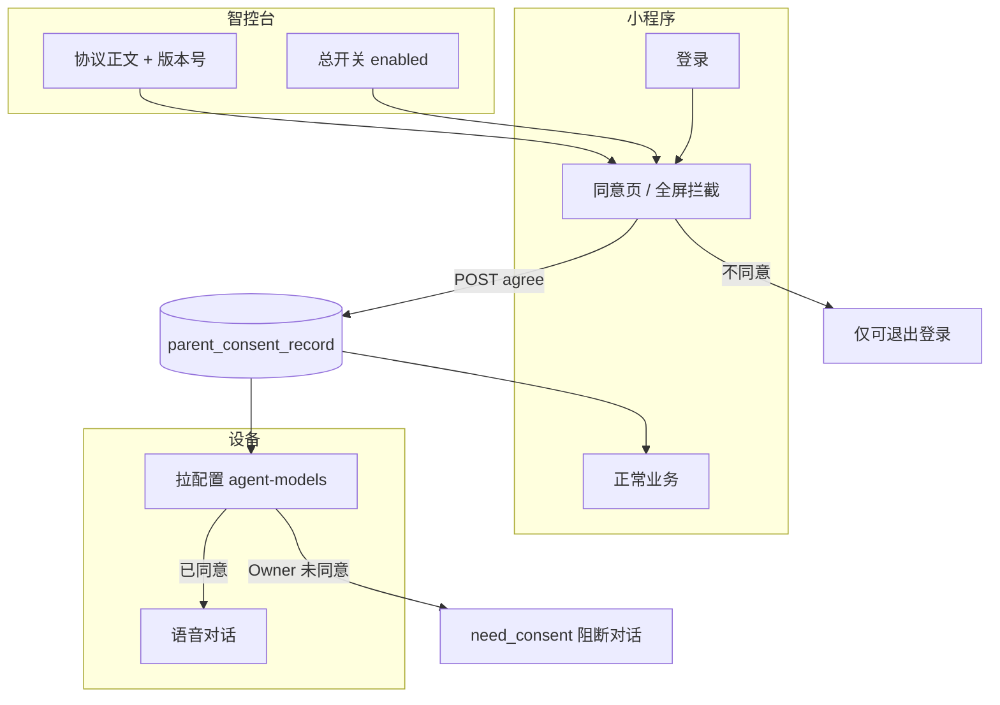
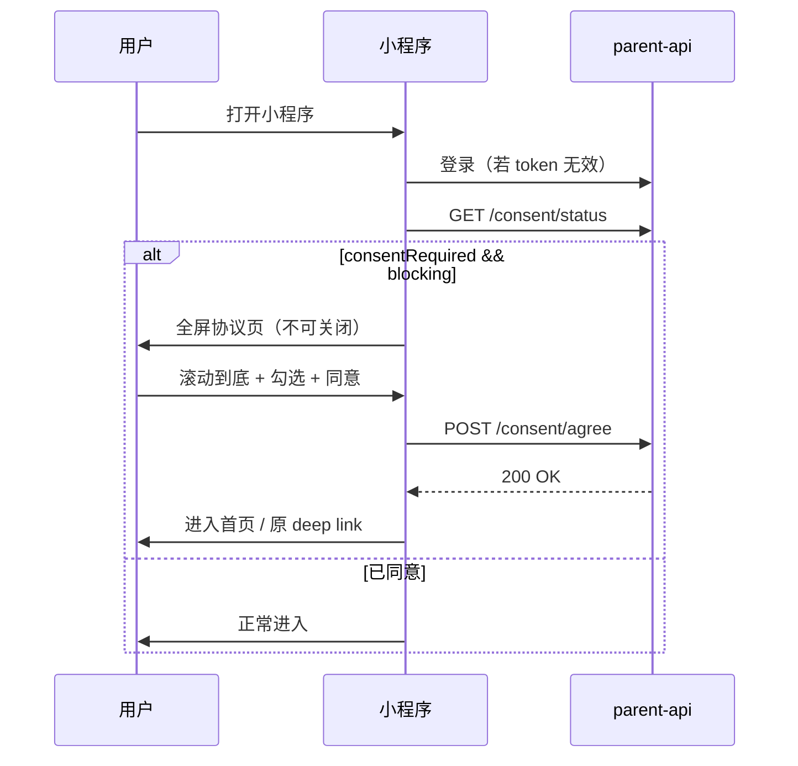

# 儿童隐私保护 / 用户服务协议 — 产品方案 + 服务端 + 小程序

> **目标：** 所有家长端用户（含家庭共享 Member）在首次使用及协议更新后，必须阅读并同意统一协议；**未同意**则小程序不可用、不可绑定设备；**已绑定设备**在 Owner 未同意当前版本时 **禁止儿童对话**。  
> **协议正文**可在智控台配置，支持版本管理与更新后重新签署。

---

## 一、产品原则（已拍板方向）

| # | 原则 |
|---|------|
| 1 | **一份协议**覆盖小程序 + 智能硬件，说明数据采集、用途、存储、共享与家长权利 |
| 2 | **按家长账号**记录同意（`parent_user_id`），Owner / Member 各自签署 |
| 3 | **版本化**：智控台改正文 → 自动或手动升版本 → 未签署新版本的用户视为「未同意」 |
| 4 | **硬阻断**：未同意时除「看协议、登录、同意/退出」外，**所有** `parent-api` 写操作与读业务接口拒绝 |
| 5 | **设备对话**：以设备 **Primary Owner** 是否同意**当前生效版本**为准（可配置为「全员同意」，见 §4.3） |
| 6 | **存量用户**：上线后首次打开小程序弹出协议；Owner 未补签则设备进入「需同意协议」状态，行为类似现有 `need_bind` |

---

## 二、协议初稿（v1 默认文案，智控台可改）

以下为**拟定默认正文**，上线时写入参数字典 / 协议表；运营可在智控台替换为法务定稿。

### 标题

**《小智儿童智能设备用户服务与儿童个人信息保护说明》**

### 摘要（勾选框旁短文案，≤120 字）

> 为保障儿童安全使用本设备与小程序，我们将收集设备标识、语音对话、声纹特征等信息用于陪伴对话、家长监护与风险提醒。请您阅读全文后自愿同意；不同意将无法绑定或使用设备。

### 正文（Markdown，智控台富文本/Markdown 编辑）

```markdown
更新日期：2026-07-12  
版本号：20260712_v1

欢迎使用小智儿童智能陪伴设备及家长端小程序（以下统称「本服务」）。本说明由【运营主体名称】（以下简称「我们」）制定，适用于您为未成年人配置、绑定和使用本服务的全部场景。

## 一、我们是谁

- 智能硬件：儿童语音陪伴设备（ESP32 等），通过 Wi-Fi 与云端通信。
- 家长端小程序：用于设备绑定、孩子档案、声纹管理、对话记录查看、安全风险提示等。
- 云端服务：提供语音识别（ASR）、语音合成（TTS）、大语言模型对话、风险识别与家长通知。

## 二、我们收集哪些信息

在您同意本说明后，我们可能处理以下信息：

| 类型 | 示例 | 目的 |
|------|------|------|
| 账户信息 | 微信 OpenID、手机号（若绑定） | 登录与家长身份识别 |
| 设备信息 | 设备 MAC/ID、固件版本、在线状态 | 绑定、运维、安全 |
| 儿童档案 | 昵称、年龄、性别（由家长填写） | 个性化陪伴与适龄内容 |
| 声纹信息 | 儿童语音样本（经家长主动录制） | 识别说话人、优先服务主孩子 |
| 语音与对话 | 设备采集的语音及转写文本 | 实时对话、历史记录（供家长查看） |
| 风险信号 | 对话中触发的安全类标签（如隐私泄露、不当内容等） | 向家长推送风险提示 |
| 使用日志 | 操作时间、功能使用情况 | 改进产品与故障排查 |

**我们不会**向儿童主动索取超出服务所必需的个人信息；敏感处理均建立在家长同意与主动配置之上。

## 三、我们如何使用与共享

- **使用范围：** 仅用于本说明所列功能，包括陪伴对话、家长监护、内测改进（若您参与内测并另行同意）。
- **自动化决策：** 对话回复、风险识别由算法生成，重要安全提示会推送家长确认，不单独对儿童做法律意义上的 solely automated 重大决策。
- **第三方服务商：** 语音、大模型等能力可能由合规供应商提供；我们仅传输实现功能所必需的数据，并通过合同要求其保护儿童个人信息。
- **不出售：** 我们不出售儿童个人信息。

## 四、存储与保留

- 数据存储于中华人民共和国境内服务器（或智控台配置的境内区域）。
- 对话与日志保留期限：默认【180】天（可在智控台配置展示），到期后删除或匿名化。
- 家长可在小程序中申请删除孩子档案、声纹；解绑设备后我们将按规则停止收集并清理关联数据。

## 五、您的权利

您作为监护人可以：

- 查询、更正孩子档案与声纹；
- 查看对话记录（在小程序提供范围内）；
- 关闭或调整风险提醒订阅（Member 需 Owner 授权）；
- 解绑设备、注销账户（按产品流程）；
- 撤回同意：撤回后我们将停止收集新的个人数据，已绑定设备将无法继续对话，直至您重新同意或解绑。

## 六、儿童使用须知

- 本设备面向家长为 **14 周岁以下未成年人** 提供陪伴服务，需**监护人**绑定并同意本说明。
- 请家长指导儿童安全、适度使用，避免在对话中透露家庭住址、学校、联系方式等敏感信息。

## 七、协议更新

我们可能修订本说明。重大变更将在小程序内弹窗提示，您需重新阅读并同意后方可继续使用；若不同意，请停止使用并解绑设备。

## 八、联系我们

如有疑问或行使权利，请通过小程序「内测反馈」或【客服邮箱/电话】联系我们。

---

**勾选即表示：** 您是儿童的监护人或已取得监护人授权，已阅读并同意本说明及《隐私政策》全文，同意我们为提供本服务而处理上述信息。
```

---

## 三、核心概念



| 概念 | 说明 |
|------|------|
| **生效版本 `currentVersion`** | 智控台当前对外版本，如 `20260712_v1` |
| **用户已同意版本 `agreedVersion`** | 该家长最近一次 `POST agree` 记录的版本 |
| **需签署 `consentRequired`** | 开关开启 且 `agreedVersion != currentVersion` |
| **设备可对话 `deviceConsentOk`** | 按 §4.3 规则，Primary Owner（或全员）已同意当前版本 |

---

## 四、服务端设计

### 4.1 数据表

#### `parent_consent_document`（协议版本，智控台编辑）

| 字段 | 类型 | 说明 |
|------|------|------|
| id | BIGINT PK | |
| version | VARCHAR(32) UNIQUE | 如 `20260712_v1` |
| title | VARCHAR(200) | 协议标题 |
| summary | VARCHAR(500) | 勾选旁摘要 |
| content | MEDIUMTEXT | Markdown/HTML 正文 |
| status | VARCHAR(16) | `draft` / `published` |
| published_at | DATETIME | 发布时间 |
| created_at / updated_at | DATETIME | |

**规则：** 全局仅 **1 条 `published`**；发布新版本时旧版改 `archived`（保留审计）。

#### `parent_consent_record`（用户同意记录，追加写）

| 字段 | 类型 | 说明 |
|------|------|------|
| id | BIGINT PK | |
| parent_user_id | BIGINT | 家长 ID |
| version | VARCHAR(32) | 同意的版本号 |
| agreed_at | DATETIME | 同意时间 |
| channel | VARCHAR(32) | `wechat_miniprogram` |
| client_ip | VARCHAR(64) | 可选 |
| user_agent | VARCHAR(512) | 可选 |

**索引：** `(parent_user_id, version)` UNIQUE；`(parent_user_id, agreed_at DESC)` 查最新。

> 不物理删除；撤回同意 = 新插一条「撤回事件」或单独字段 `revoked_at`（推荐 **不单独撤回接口一期**，仅「不同意 → 不用」；二期再做显式撤回）。

#### 参数字典（与现有 `sys_params` 一致）

| param_code | 默认 | 说明 |
|------------|------|------|
| `parent.consent.enabled` | `true` | 总开关；`false` 时不拦截（灰度/紧急关闭） |
| `parent.consent.device_block_mode` | `owner_only` | `owner_only`：仅 Primary Owner 同意即可对话；`all_members`：所有 active Member 均需同意 |
| `parent.consent.device_blocked_prompt` | 见下 | 设备未同意时 TTS 文案 |
| `parent.consent.retention_days_display` | `180` | 正文展示用保留天数 |

默认 TTS：`请先由主账号家长在小程序中阅读并同意儿童隐私保护说明，同意后设备即可正常使用。`

### 4.2 家长端 API

**Base：** `/xiaozhi/parent-api/consent`

| 方法 | 路径 | 鉴权 | 说明 |
|------|------|------|------|
| GET | `/document` | **可选 token** | 返回当前 `published` 协议（标题、摘要、正文、version）。未登录也可看，便于登录前展示 |
| GET | `/status` | 必填 token | 见下方响应 |
| POST | `/agree` | 必填 token | Body: `{ "version": "20260712_v1" }`，版本必须等于当前 published，幂等 |

**GET `/status` 响应示例：**

```json
{
  "consentEnabled": true,
  "consentRequired": true,
  "currentVersion": "20260712_v1",
  "agreedVersion": null,
  "agreedAt": null,
  "title": "小智儿童智能设备用户服务与儿童个人信息保护说明",
  "summary": "为保障儿童安全使用…",
  "deviceBlockMode": "owner_only",
  "blocking": true
}
```

- `blocking=true`：小程序应展示全屏同意页，并禁止进入 Tab 业务页。
- `consentRequired=false`：开关关闭或已同意当前版本。

**错误码（新增）：**

| code | 含义 |
|------|------|
| `20027` | 须先同意儿童隐私协议 |
| `20028` | 协议版本无效或已过期，请刷新后重试 |
| `10043` | 设备端：主账号尚未同意协议（OTA/agent-models 专用，msg 为 TTS 文案） |

### 4.3 门禁策略

#### A. 小程序 `parent-api` 拦截器

在 `ParentTokenFilter` 之后增加 `ParentConsentFilter`（或 Service 层 AOP）：

**白名单（无需已同意）：**

- `POST /parent-api/auth/**`（登录）
- `GET /parent-api/consent/document`
- `GET /parent-api/consent/status`
- `POST /parent-api/consent/agree`
- `GET /parent-api/auth/profile`（可选，仅展示昵称）
- 静态文件：`auth/avatar/file/**`

**其余所有 parent-api：** 若 `consentRequired` → 抛 `20027`。

特别拦截：

- `POST /parent-api/device/bind` — 绑定前必须已同意
- `POST /parent-api/device/invite/accept` — 接受邀请前必须已同意

#### B. 设备对话（存量已绑定）

在 `ConfigServiceImpl.getAgentModels()` 中，设备已入库且 agent 存在后：

1. 查设备 Primary Owner（`ParentDeviceAccessHelper.findPrimaryOwner`）
2. 若 `parent.consent.enabled=false` → 正常下发
3. 若 Owner 未同意当前 published version → **抛 `RenException(10043, prompt)`**
4. 若 `device_block_mode=all_members` → 任一 active binding 未同意则同样 10043

**xiaozhi-server 改造（与 `need_bind` 并列）：**

```text
getAgentModels 返回 code=10043
  → connection.py 设 need_consent=True
  → receiveAudioHandle 丢弃语音，周期性 TTS 播放 parent.consent.device_blocked_prompt
  → reportHandle 跳过 ASR/TTS 上报（可选，与 need_bind 一致）
```

参考现有：`device_bind_prompt.prompt` + `need_bind` 链路，新增 `consent_blocked_prompt` 配置节点。

#### C. 家庭共享 Member

- Member **必须自己**同意，才能用小程序（看对话、风险、设置等）
- 设备能否说话：**默认只看 Owner** 是否同意（避免一人未签全家设备瘫痪）
- 若运营选 `all_members`，则任一 Member 未签 → 整机不可对话（严格模式，智控台可选）

### 4.4 智控台

**入口：** 参数管理 → **更多** → **儿童隐私协议**

| Tab | 功能 |
|-----|------|
| 当前生效 | 编辑标题、摘要、正文；**发布**生成新版本（自动递增 version） |
| 历史版本 | 只读列表 |
| 签署统计 | 已同意当前版本人数 / 内测或全量家长数；未签署列表导出（二期） |

**发布流程：**

1. 编辑 draft → 点击「发布」→ `version = yyyyMMdd_v{n}`，`status=published`
2. 旧 published → `archived`
3. 所有 `agreedVersion != currentVersion` 的用户下次打开小程序重新弹窗

权限：`sys:role:superAdmin` 或与「内测反馈」同级。

### 4.5 模块结构（manager-api）

```text
xiaozhi.modules.parent.consent/
  ParentConsentDocumentEntity.java
  ParentConsentRecordEntity.java
  ParentConsentDocumentDao.java
  ParentConsentRecordDao.java
  ParentConsentService.java
  ParentConsentServiceImpl.java
  ParentConsentController.java      // /parent-api/consent/*
  ParentConsentAdminController.java // /admin/parent-consent/*
  ParentConsentFilter.java          // 或 ParentConsentInterceptor
  ParentConsentAccessHelper.java    // isAgreed(parentUserId), deviceConsentOk(deviceId)
```

**Liquibase：** `202607121400.sql` 建表 + 插入 v1 默认正文 + sys_params seed。

---

## 五、小程序交互设计

### 5.1 启动流程



### 5.2 协议页 UI（建议独立页 `pages/consent/index`）

| 区域 | 说明 |
|------|------|
| 顶栏 | 标题「儿童隐私保护说明」，**无返回键**（或返回 = 退出小程序） |
| 正文区 | `rich-text` / `mp-html` 渲染 Markdown；**必须可滚动** |
| 版本 footnote | 「版本 20260712_v1 · 更新于 2026-07-12」 |
| 勾选 | 「我已阅读并同意上述说明」；**未勾选禁用主按钮** |
| 主按钮 | 「同意并继续」→ `POST agree` → `wx.reLaunch` 到首页 |
| 次按钮 | 「不同意」→ 二次确认弹窗 → 仅保留「退出」/`wx.exitMiniProgram` |

**不同意时：**

- 不写入 agree 记录
- 不进入任何 Tab；若已有 token，可调用「退出登录」清 token
- 提示：「需同意后方可绑定设备与查看孩子对话；已绑定设备将无法与儿童对话，直至主账号在小程序中完成同意。」

### 5.3 全局拦截（`app.js` / 路由守卫）

```javascript
// 伪代码
async function ensureConsent() {
  const s = await api.getConsentStatus()
  if (!s.consentEnabled) return true
  if (!s.consentRequired) return true
  wx.redirectTo({ url: '/pages/consent/index' })
  return false
}

// 每个 Tab 页 onShow、bind 页 onLoad、invite accept 前均调用
```

**与登录顺序：** 先登录拿 token → 再 `consent/status` → 再业务。

### 5.4 特殊场景

| 场景 | 交互 |
|------|------|
| **协议升级** | 启动时 `agreedVersion != currentVersion` → 再次全屏；文案「我们更新了隐私说明，请重新阅读并同意」 |
| **绑定设备** | 进入 bind 页前 `ensureConsent()`；服务端 `20027` 兜底 |
| **接受家庭邀请** | accept 前必须已同意；否则先跳协议页，完成后回到邀请页 |
| **主账号未签、Member 已签** | Member 可用小程序；设备端仍 TTS 提示主账号去签（Owner 模式） |
| **Member 未签、Owner 已签** | Member 打开小程序仍被拦；设备正常对话（Owner 模式） |
| **离线打开** | 若本地缓存 version 一致且曾 agree，可短暂进缓存页；**onShow 必须联网校验** |

### 5.5 本地缓存建议

```javascript
// storage keys
consent_agreed_version  // 与服务端 agreedVersion 对齐
consent_current_version   // 上次拉取的 currentVersion
```

**不要**仅信本地缓存跳过弹窗；以 `GET /status` 为准。

### 5.6 页面清单

```text
pages/consent/index     全屏协议 + 同意/不同意（新增）
```

无需单独「隐私政策」页若正文已合并；若法务要求拆分，可增加 `pages/consent/privacy` 链接跳转，仍算同一 `version` 一次同意。

---

## 六、与现有能力对齐

| 现有 | 本方案 |
|------|--------|
| `need_bind` + `device_bind_prompt` | 并列 `need_consent` + `consent_blocked_prompt` |
| `GET .../entry-status`（内测） | Consent 用 `GET /consent/status`，启动必调 |
| `sys_params` + 智控台「更多」 | 同模式；正文走专用表便于版本化 |
| `ParentTokenFilter` | 后挂 Consent 拦截 |

---

## 七、实施状态

**已实现**（manager-api + xiaozhi-server + 智控台）：

- 建表 `parent_consent_document` / `parent_consent_record`（Liquibase `202607121500.sql`）
- 家长端 `/parent-api/consent/*` + `ParentConsentFilter` 拦截
- 设备端 `getAgentModels` → `10043` + xiaozhi `need_consent`
- 智控台：参数管理 → 更多 → **儿童隐私协议**（编辑、发布、历史、未签署名单）

**未做（可后续迭代）：** 显式撤回同意 API、多语言协议正文。

---

## 八、验收清单

- [ ] 新用户登录后必须先同意才能见 Tab
- [ ] 不同意无法绑定设备（前后端双重拦截）
- [ ] 存量 Owner 未补签时，设备对话被 TTS 阻断
- [ ] Member 必须自签才能用小程序；默认不影响 Owner 已签设备的对话
- [ ] 智控台发布新版本后，已同意旧版用户再次弹窗
- [ ] `parent.consent.enabled=false` 时全站不拦截（应急）
- [ ] 同意记录可审计：parent_user_id + version + agreed_at

---

## 九、小程序 Cursor 提示词（可复制）

```text
实现儿童隐私协议模块：
1. 启动：登录成功后调用 GET /xiaozhi/parent-api/consent/status
2. consentRequired=true 时 wx.redirectTo pages/consent/index，全屏无 TabBar
3. 协议页：rich-text 展示 content，勾选后 POST /consent/agree { version }
4. 所有 Tab 页 onShow 调用 ensureConsent()；api 返回 20027 同样跳协议页
5. bind、invite/accept 前 ensureConsent
6. 不同意：confirm 后 exitMiniProgram，清 token
7. 详见 docs/家长端-儿童隐私协议-产品与接口方案.md
```

---

**文档版本：** 2026-07-12 · 服务端已实现，小程序待对接 §五
