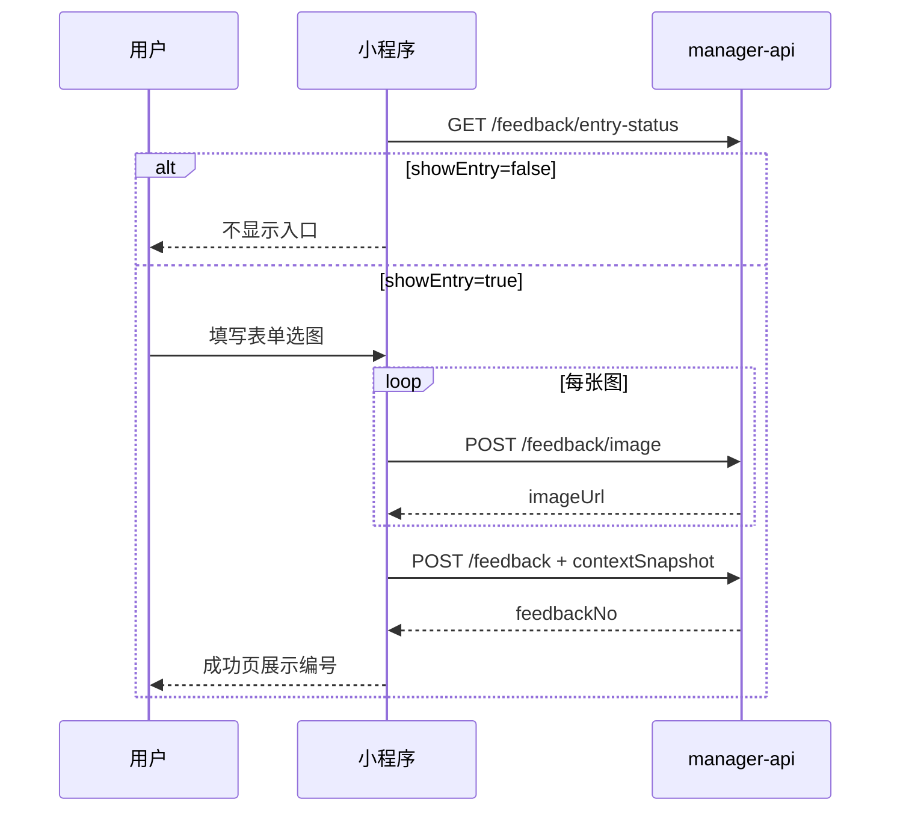

# 家长端「内测反馈」小程序改造说明（含接口）

> 面向小程序开发：入口展示、页面交互、接口调用。  
> 后端：`manager-api` `/parent-api/feedback/*`  
> 智控台：参数管理 → **更多** → **内测反馈**

---

## 一、产品约定（已拍板）

| 项 | 约定 |
|----|------|
| 受众 | **仅内测用户**可见入口并可提交 |
| 与儿童风险 | **独立模块**，不走风险告警接口 |
| 登录 | **必须登录**，不支持匿名 |
| 阻塞类告警 | 不做飞书/webhook，后台列表红色「阻塞」即可 |
| 重复反馈 | **人工处理**，不做自动合并 |

**入口是否展示：**

```
showEntry = (参数字典 server.beta_feedback_enabled == true)
         && (当前家长 parent_user.is_beta_tester == 1)
```

也可直接调 `GET /parent-api/feedback/entry-status` 的 `showEntry` 字段。

---

## 二、小程序入口与页面

### 2.1 入口（仅 showEntry=true 时）

| 位置 | 行为 |
|------|------|
| **我的** Tab | 菜单项「内测反馈」→ 反馈首页 |
| **可选** 全局悬浮按钮 | 内测包显示，点击带当前 `page_path` 进提交页 |

正式版用户：`showEntry=false`，**不要渲染**上述入口。

### 2.2 页面结构（3 页）

```
feedback/index     我的反馈列表 + 右上角「提交反馈」
feedback/submit    提交表单
feedback/detail    单条详情（只读，含状态）
feedback/success   提交成功（展示 feedbackNo）
```

### 2.3 提交页表单

| 字段 | UI | 必填 |
|------|-----|------|
| 问题类型 | 单选 6 项 | 是 |
| 问题描述 | 多行，最多 2000 字 | 是 |
| 是否阻塞使用 | Switch | 否，默认关 |
| 允许运营联系我 | Switch | 否，默认关 |
| 截图 | 最多 3 张，先上传再提交 | 否 |

**问题类型（category 枚举，提交原样英文 key）：**

| key | 展示文案 |
|-----|----------|
| `device_bind` | 设备与绑定 |
| `child_voiceprint` | 孩子与声纹 |
| `chat_voice` | 对话与语音 |
| `skill` | 对话能力 |
| `shadow_mission` | 影子任务 |
| `other` | 其他 |

**描述 placeholder 建议：**

> 请说明：发生了什么？您期望怎样？若可复现请写操作步骤。

### 2.4 列表页状态展示

| status | 文案 |
|--------|------|
| `pending` | 待处理 |
| `processing` | 处理中 |
| `resolved` | 已解决 |
| `wont_fix` | 暂不处理 |

列表卡片展示：`feedbackNo`、类型文案、描述前 50 字、状态、时间。`blocking=true` 显示红色标签「阻塞」。  
若 `adminNote` 非空，可在卡片次要行展示一行摘要（如「处理说明：…」前 30 字）。

### 2.5 详情页运营回复

| 字段 | 展示建议 |
|------|----------|
| `adminNote` | 有值时展示区块「处理说明」，全文只读 |
| `wontFixReason` | `status=wont_fix` 且有值时展示「暂不处理原因」；可与 `adminNote` 同时存在 |
| 均为空 | 不展示该区块，仅显示状态文案 |

### 2.6 提交成功页

> 感谢反馈！编号：**FB-20260522-00012**  
> 我们会在 1～2 个工作日内查看。紧急问题可在内测群说明编号。

按钮：查看我的反馈 / 返回

---

## 三、自动上下文 contextSnapshot（提交时带上）

在 `POST /parent-api/feedback` 的 body 中传 JSON 对象 `contextSnapshot`，建议字段：

```json
{
  "parent_user_id": 123,
  "child_id": 456,
  "device_id": "AA:BB:CC:DD:EE:FF",
  "mini_program_version": "1.2.0-beta",
  "page_path": "pages/skill/create",
  "page_query": "childId=1",
  "client_time": "2026-05-22T14:30:00+08:00",
  "network_type": "wifi",
  "system": "iOS 17.0",
  "model": "iPhone 15"
}
```

- `parent_user_id` / `child_id` / `device_id`：从全局 store 取当前选中孩子与设备  
- `page_path` / `page_query`：提交页 `getCurrentPages()` 或入口参数  
- 其余能采则采，没有可省略  

**不要**在 context 里放 token、完整手机号等敏感信息。

---

## 四、接口说明

**Base URL：** 与现有家长端一致（如 `https://your-host`）  
**鉴权：** 所有接口（除截图文件 GET）需 Header：

```
Authorization: Bearer {家长登录token}
```

**统一响应：**

```json
{ "code": 0, "msg": "success", "data": { ... } }
```

`code !== 0` 为失败，`msg` 为错误说明。

---

### 4.1 入口状态（进「我的」时调一次）

```
GET /parent-api/feedback/entry-status
```

**响应 data：**

| 字段 | 类型 | 说明 |
|------|------|------|
| betaFeedbackEnabled | boolean | 全局开关 |
| betaTester | boolean | 是否内测用户 |
| showEntry | boolean | **是否显示反馈入口** |

也可从 `GET /parent-api/auth/info` 读取 `betaFeedbackEnabled`、`betaTester`，自行计算 `showEntry`。

---

### 4.2 上传截图（提交前）

```
POST /parent-api/feedback/image
Content-Type: multipart/form-data
字段名: file
```

**限制：** jpg/jpeg/png/gif/webp，单张 ≤ 5MB，提交时最多 3 个 URL。

**响应 data：**

```json
{ "imageUrl": "https://host/parent-api/feedback/image/file/uuid.jpg" }
```

将 `imageUrl` 收集到数组，提交反馈时传入 `imageUrls`。

---

### 4.3 提交反馈

```
POST /parent-api/feedback
Content-Type: application/json
```

**请求 body：**

```json
{
  "category": "skill",
  "description": "添加对话能力后预览页只显示一行描述",
  "blocking": false,
  "allowContact": true,
  "contextSnapshot": { "page_path": "pages/skill/preview", "child_id": 1 },
  "imageUrls": [
    "https://host/parent-api/feedback/image/file/xxx.jpg"
  ]
}
```

| 字段 | 类型 | 必填 |
|------|------|------|
| category | string | 是，见枚举 |
| description | string | 是，≤2000 |
| blocking | boolean | 否 |
| allowContact | boolean | 否 |
| contextSnapshot | object | 否 |
| imageUrls | string[] | 否，≤3 |

**响应 data：** 与列表项相同，含 `id`、`feedbackNo`、`status`（初始 `pending`）等。

**错误码：**

| code | 含义 |
|------|------|
| 20008 | 非内测用户或全局开关关闭 |
| 401 | token 无效 |

---

### 4.4 我的反馈列表

```
GET /parent-api/feedback/page?page=1&limit=20
```

**响应 data：**

```json
{
  "total": 5,
  "list": [
    {
      "id": 12,
      "feedbackNo": "FB-20260522-00012",
      "category": "skill",
      "description": "...",
      "blocking": false,
      "allowContact": true,
      "status": "processing",
      "adminNote": "已复现，下个版本修复",
      "wontFixReason": null,
      "imageUrls": ["https://..."],
      "createTime": "2026-05-22T14:30:00.000+00:00",
      "updateTime": "2026-05-23T10:00:00.000+00:00"
    }
  ]
}
```

| 字段 | 类型 | 说明 |
|------|------|------|
| adminNote | string \| null | 智控台「更新状态」或「内部备注」写入的处理说明，**可展示给家长** |
| wontFixReason | string \| null | 状态为 `wont_fix` 时运营填写的原因，可选展示 |

---

### 4.5 反馈详情

```
GET /parent-api/feedback/{id}
```

**响应 data：** 在列表字段基础上增加 `contextSnapshot`（object）；`adminNote`、`wontFixReason` 与列表一致。  
仅能查看**本人**提交的反馈。

---

### 4.6 截图展示

`imageUrls` 可直接用于 `<image src="..." />`（GET 匿名，与头像文件类似）。

---

## 五、推荐调用顺序



---

## 六、wx.request 示例（提交）

```javascript
const token = wx.getStorageSync('parentToken');
const pages = getCurrentPages();
const cur = pages[pages.length - 1];

wx.request({
  url: `${BASE_URL}/parent-api/feedback`,
  method: 'POST',
  header: {
    'Content-Type': 'application/json',
    Authorization: `Bearer ${token}`,
  },
  data: {
    category: 'skill',
    description: form.description,
    blocking: form.blocking,
    allowContact: form.allowContact,
    contextSnapshot: {
      page_path: cur?.route || '',
      child_id: app.globalData.currentChildId,
      device_id: app.globalData.currentDeviceId,
      mini_program_version: app.globalData.version,
    },
    imageUrls: uploadedUrls,
  },
  success(res) {
    if (res.data?.code === 0) {
      wx.navigateTo({
        url: `/pages/feedback/success?no=${res.data.data.feedbackNo}`,
      });
    } else {
      wx.showToast({ title: res.data?.msg || '提交失败', icon: 'none' });
    }
  },
});
```

**上传截图（wx.uploadFile）：**

```javascript
wx.uploadFile({
  url: `${BASE_URL}/parent-api/feedback/image`,
  filePath: tempFilePath,
  name: 'file',
  header: { Authorization: `Bearer ${token}` },
  success(res) {
    const body = JSON.parse(res.data || '{}');
    if (body.code === 0) urls.push(body.data.imageUrl);
  },
});
```

---

## 七、运营侧（供联调参考）

1. 智控台 → 参数管理：`server.beta_feedback_enabled` = `true`  
2. 智控台 → 更多 → **内测反馈** → 详情里设置「内测用户」，或 SQL：  
   `UPDATE parent_user SET is_beta_tester=1 WHERE id=?;`  
3. 管理端接口（小程序无需调用）：`GET/PUT /admin/feedback/*`

---

## 八、验收清单

- [ ] 非内测用户看不到「内测反馈」入口  
- [ ] 内测用户可上传 0～3 张图并提交  
- [ ] 提交成功展示 `feedbackNo`  
- [ ] 列表/详情仅本人数据，状态文案正确  
- [ ] 智控台能看到记录、改状态、看 context 与截图  

---

## 九、错误与边界

- 未登录：401，引导重新登录  
- 20008：提示「内测反馈暂未开放」  
- 描述超长、类型非法：后端 `msg` 直出 toast  
- 提交中禁用重复点击，防止双份反馈  
