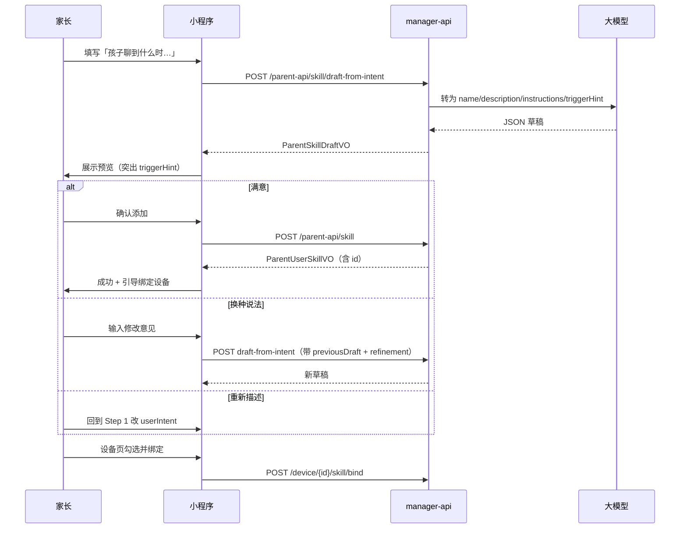

# 家长端「对话能力」小程序改造说明

> 面向小程序开发：界面文案、交互流程、接口调用一览。  
> 后端实现：`manager-api` `/parent-api/skill/*`  
> 关联接口文档：[家长端-技能接口文档.md](./家长端-技能接口文档.md)

---

## 一、概念：先让家长理解「这不是下发任务」

| 对比项 | **对话能力（Skill）** | **影子任务（Shadow Mission）** |
|--------|----------------------|-------------------------------|
| 入口建议 | 智能体 Tab → **对话能力** | 设备/任务 Tab → **影子任务** |
| 触发方式 | 孩子**主动聊天**，系统做**意图识别**，自动选用一种聊天方式 | 家长**主动下发**，带截止时间 |
| 家长期望 | 「孩子聊到故事时，机器人温柔地讲」 | 「8 点提醒刷牙」「30 分钟内收玩具」 |
| 是否远程指挥 | 否，随聊随用 | 是，有明确任务目标 |
| 后端 API | `/parent-api/skill/*` | `/parent-api/shadow-mission/*` |

**运行时链路（无需在 UI 展开技术细节，可用一句话说明）：**

```
孩子说话 → 机器人识别聊的内容（意图）→ 从已绑定的对话能力中选一个 → 按该方式回复
```

---

## 二、小程序界面改造清单

### 2.1 全局文案替换

| 位置 | 原文案（建议改） | 新文案 |
|------|------------------|--------|
| Tab 名称 | 智能体 | **对话能力**（或「聊天陪伴」） |
| 列表页标题 | 我的技能 / 创建技能 | **孩子的对话能力** |
| 创建页标题 | 创建技能 | **添加对话能力** |
| 创建按钮 | 创建 | **添加** / **确认添加** |
| 字段：技能名称 | 技能名称 | **能力名称** |
| 字段：简要描述 | 简要描述 | **孩子会体验到** |
| 字段：技能指令 | 技能指令 | **对话规则（高级）**——默认隐藏 |

### 2.2 列表页（原「我的技能」）

**顶部说明（灰色小字，常驻）：**

> 当孩子和机器人聊天时，机器人会根据聊的内容，自动选用您添加的能力来陪伴。  
> 这不是定时任务，也不会替您远程指挥孩子。

**列表卡片展示字段：**

| 展示 | 数据来源 | 说明 |
|------|----------|------|
| 标题 | `name` | 如「睡前故事」 |
| 副标题 | `description` | 一句话说明体验 |
| 可选标签 | 本地文案 | 「聊天时自动启用」 |

**操作：** 编辑 · 删除 · **绑定到设备**（若未绑定，卡片角标「未绑定」）

**底部入口：**

- 主按钮：**+ 添加对话能力**
- 文字链：想布置限时任务？去 **影子任务** →

### 2.3 创建页（核心改造）

#### 页面结构（两屏 / 两步）

**Step 1：描述（默认只显示这一屏）**

| 元素 | 文案 / 行为 |
|------|-------------|
| 页顶说明 | 当孩子和机器人**聊天**时，机器人会根据聊的内容，自动用这种方式陪伴。 |
| 主输入 label | **孩子聊到什么时，希望机器人怎样陪伴？** |
| placeholder | 例如：孩子说想听故事时，温柔讲 5 分钟睡前小故事，内容要积极温暖 |
| 示例 chip（可点选填入） | 「睡前讲故事」「用简单英语陪聊」「耐心回答为什么」 |
| 反例提示（折叠/小字） | ❌ 不是这里填的：「每天 8 点提醒刷牙」「监督写作业 30 分钟」→ 请用 **影子任务** |
| 主按钮 | **AI 帮我生成**（loading 文案：「正在理解您的描述…」） |

**Step 2：预览确认（AI 生成成功后展示）**

| 元素 | 数据来源 | 说明 |
|------|----------|------|
| 能力名称 | `name` | 可 inline 编辑 |
| **何时启用**（重点，加粗） | `triggerHint` | 如：当孩子说「讲个故事」「睡不着」时 |
| 机器人会 | `description` | 可 inline 编辑 |
| 对话规则（高级） | `instructions` | **默认折叠**；展开后可编辑 |
| 次要按钮 | — | **重新描述**（回到 Step 1） |
| 次要按钮 | — | **换种说法**（见 3.3 二次优化） |
| 主按钮 | — | **确认添加** → 调 `POST /parent-api/skill` |

**AI 失败 fallback：**

- Toast：`AI 暂时不可用，请稍后再试或手动填写`
- 展开高级表单：名称 + 描述 + 对话规则（三字段，等同旧版）

#### 编辑页（已有能力）

- 默认展示：名称、描述、何时启用（可从 description 解析或只展示 description）
- 「高级」折叠：instructions
- 可选：提供「用 AI 重新优化」→ 调 `draft-from-intent` + `previousDraft`

### 2.4 创建成功页 / Toast

> 已添加「睡前故事」。  
> 请到 **设备 → 为孩子绑定此能力**，孩子聊天时才会生效。

按钮：**去绑定设备**（跳转设备技能绑定页）

### 2.5 设备绑定页（已有，补充说明）

**页顶说明：**

> 勾选的能力会在**孩子跟机器人聊天**时，根据聊的内容自动切换。  
> 可同时绑定多个，机器人会按对话意图选用最合适的一个。

**绑定接口：** `POST /parent-api/device/{deviceId}/skill/bind`  
**speakerType：** 家长为孩子添加的能力，固定传 **`owner_child`**

### 2.6 与影子任务的入口隔离

| 模块 | 不要混在同一表单 |
|------|------------------|
| 对话能力 | 只描述「聊天场景 + 陪伴方式」 |
| 影子任务 | 单独 Tab/页，字段含 title、instructions、durationMinutes |

---

## 三、交互流程

### 3.1 推荐流程（预览后创建）



### 3.2 简化流程（一步创建，无预览）

适用于 MVP 或「信任 AI、少一步」：

1. 用户填写 `userIntent`
2. `POST /parent-api/skill/from-intent`
3. 成功 → 引导绑定设备

**不推荐作为默认**，除非产品明确接受不可预览。

### 3.3 二次优化（换种说法）

用户在预览页输入「语气再活泼一点」：

```json
{
  "userIntent": "（保留首次描述，或传空若仅用 refinement）",
  "refinement": "语气再活泼一点，故事可以短一些",
  "previousDraft": {
    "name": "睡前故事",
    "description": "...",
    "instructions": "..."
  }
}
```

`userIntent` 在二次优化时**仍建议传首次完整描述**（后端 prompt 需要上下文）；`refinement` 传修改意见。

### 3.4 完整生命周期

```
添加对话能力 → 绑定到设备（owner_child）→ 孩子聊天 → 意图识别 → 选用能力 → 按 instructions 回复
```

---

## 四、接口文档（小程序对接）

**基础地址：** `{baseUrl}`，如 `https://your-domain.com/xiaozhi`  
**鉴权：** `Authorization: Bearer {家长登录 token}`  
**Content-Type：** `application/json`（POST/PUT）

**统一响应：**

```json
{ "code": 0, "msg": "success", "data": { } }
```

`code !== 0` 时 `msg` 为错误说明。

---

### 4.1 AI 生成草稿（推荐）

| 项目 | 说明 |
|------|------|
| **URL** | `POST /parent-api/skill/draft-from-intent` |
| **作用** | 自然语言 → 预览字段，**不落库** |
| **前置** | 智控台已配置并启用 LLM 模型 |

**请求体：**

```json
{
  "userIntent": "孩子说想听故事时，温柔讲 5 分钟睡前小故事，要积极温暖",
  "refinement": "语气再活泼一点",
  "previousDraft": {
    "name": "睡前故事",
    "description": "睡前讲温暖小故事",
    "instructions": "当孩子在对话中提到..."
  }
}
```

| 字段 | 类型 | 必填 | 说明 |
|------|------|------|------|
| userIntent | string | 是 | 5~500 字；描述**聊天场景**，非任务 |
| refinement | string | 否 | 修改意见；配合 previousDraft |
| previousDraft | object | 否 | 上一轮草稿的 name/description/instructions |

**响应 data：**

```json
{
  "name": "睡前故事",
  "description": "在孩子睡前用温柔语气讲简短、积极温暖的小故事",
  "triggerHint": "当孩子说「讲个故事」「睡不着」时",
  "instructions": "当孩子在对话中提到睡觉、想听故事时使用本能力。语气温柔舒缓..."
}
```

| 字段 | 小程序用法 |
|------|------------|
| name | 能力名称，可编辑 |
| description | 「机器人会」段落 |
| triggerHint | **何时启用**（预览页重点展示） |
| instructions | 折叠在「对话规则（高级）」；确认添加时提交给创建接口 |

**常见错误 msg：**

- `AI 服务暂不可用，请稍后在智控台配置 LLM 模型，或手动填写技能指令`
- `AI 生成技能失败，请稍后重试或手动填写`

---

### 4.2 创建对话能力（确认落库）

| 项目 | 说明 |
|------|------|
| **URL** | `POST /parent-api/skill` |

**请求体：**

```json
{
  "name": "睡前故事",
  "description": "在孩子睡前用温柔语气讲简短、积极温暖的小故事",
  "instructions": "当孩子在对话中提到睡觉、想听故事时...",
  "version": "1.0"
}
```

| 字段 | 类型 | 必填 |
|------|------|------|
| name | string | 是 |
| instructions | string | 是 |
| description | string | 否 |
| version | string | 否，默认 1.0 |

**响应 data：** 同下列「技能对象」，含 `id`（后续绑定、编辑、删除用）。

---

### 4.3 一步创建（可选）

| 项目 | 说明 |
|------|------|
| **URL** | `POST /parent-api/skill/from-intent` |
| **请求体** | 同 4.1 |
| **响应** | 同 4.2，直接返回已创建的技能对象 |

---

### 4.4 我的对话能力列表

| 项目 | 说明 |
|------|------|
| **URL** | `GET /parent-api/skill/my-list` |

**响应 data：** `ParentUserSkillVO[]`

```json
[
  {
    "id": 1,
    "name": "睡前故事",
    "description": "...",
    "instructions": "...",
    "version": "1.0",
    "tools": null,
    "metadata": null,
    "createTime": "2025-02-13T15:30:00",
    "updateTime": "2025-02-13T15:30:00"
  }
]
```

---

### 4.5 更新 / 删除

| 操作 | URL |
|------|-----|
| 更新 | `PUT /parent-api/skill/{id}`，body 同 4.2 |
| 删除 | `DELETE /parent-api/skill/{id}` |

---

### 4.6 搜索（绑定设备时选用）

| 项目 | 说明 |
|------|------|
| **URL** | `GET /parent-api/skill/search?keyword={词}&deviceId={mac}` |
| **说明** | 返回 `parentSkills` + `recommendedSkills`；传 deviceId 时排除已绑定 |

---

### 4.7 绑定到设备（创建后必做）

| 项目 | 说明 |
|------|------|
| **URL** | `POST /parent-api/device/{deviceId}/skill/bind` |

```json
{
  "skillSource": "parent",
  "skillId": "1",
  "speakerType": "owner_child"
}
```

| 字段 | 说明 |
|------|------|
| skillSource | 家长自建固定 `"parent"` |
| skillId | `parent_user_skill.id`（字符串传数字即可） |
| speakerType | 给孩子用的能力固定 **`owner_child`** |

解绑：`DELETE /parent-api/device/{deviceId}/skill/bind?skillSource=parent&skillId=1&speakerType=owner_child`

---

### 4.8 错误码

| code | 说明 |
|------|------|
| 20001 | token 无效或过期 |
| 20007 | 技能不存在或无权操作 |
| 20008 | 技能不存在或无权使用（绑定） |
| 20009 | 该技能已绑定到该说话人类型 |

---

## 五、小程序调用示例

```javascript
const baseUrl = 'https://your-domain.com/xiaozhi';
const token = '...';

// 1. AI 生成草稿
async function draftFromIntent(userIntent, refinement, previousDraft) {
  const res = await uni.request({
    url: `${baseUrl}/parent-api/skill/draft-from-intent`,
    method: 'POST',
    header: {
      Authorization: `Bearer ${token}`,
      'Content-Type': 'application/json',
    },
    data: { userIntent, refinement, previousDraft },
  });
  if (res.data.code !== 0) throw new Error(res.data.msg);
  return res.data.data; // { name, description, triggerHint, instructions }
}

// 2. 确认创建
async function createSkill(draft) {
  const res = await uni.request({
    url: `${baseUrl}/parent-api/skill`,
    method: 'POST',
    header: {
      Authorization: `Bearer ${token}`,
      'Content-Type': 'application/json',
    },
    data: {
      name: draft.name,
      description: draft.description,
      instructions: draft.instructions,
      version: '1.0',
    },
  });
  if (res.data.code !== 0) throw new Error(res.data.msg);
  return res.data.data; // { id, name, ... }
}

// 3. 绑定到设备
async function bindSkill(deviceId, skillId) {
  const res = await uni.request({
    url: `${baseUrl}/parent-api/device/${encodeURIComponent(deviceId)}/skill/bind`,
    method: 'POST',
    header: {
      Authorization: `Bearer ${token}`,
      'Content-Type': 'application/json',
    },
    data: {
      skillSource: 'parent',
      skillId: String(skillId),
      speakerType: 'owner_child',
    },
  });
  if (res.data.code !== 0) throw new Error(res.data.msg);
}

// 推荐页面流程
async function onConfirmAdd(userIntent) {
  uni.showLoading({ title: '正在理解您的描述…' });
  try {
    const draft = await draftFromIntent(userIntent);
    uni.hideLoading();
    // → 跳转预览页，展示 draft.triggerHint / name / description
    // → 用户确认后：
    const skill = await createSkill(draft);
    uni.showModal({
      title: '添加成功',
      content: '请到设备页为孩子绑定此能力，聊天时才会生效',
      confirmText: '去绑定',
    });
    return skill;
  } catch (e) {
    uni.hideLoading();
    uni.showToast({ title: e.message || '生成失败', icon: 'none' });
  }
}
```

---

## 六、页面状态机（开发参考）

```
[列表页]
  └─ 点击「添加对话能力」→ [创建-Step1 描述]
       └─ 点击「AI 帮我生成」→ loading
            ├─ 成功 → [创建-Step2 预览]
            │    ├─ 确认添加 → POST /skill → [成功引导绑定]
            │    ├─ 换种说法 → POST draft（refinement）→ 刷新预览
            │    └─ 重新描述 → 回到 Step1
            └─ 失败 → toast + 可选展开高级手动表单

[设备绑定页]
  └─ 勾选能力 → POST bind（speakerType=owner_child）
```

---

## 七、验收 checklist

- [ ] Tab/页面文案已改为「对话能力」，不再强调「创建智能体」
- [ ] 创建页默认**不展示** instructions 大文本框
- [ ] 预览页**突出** `triggerHint`（何时启用）
- [ ] 有影子任务入口分流，反例提示可见
- [ ] 创建成功引导绑定设备
- [ ] 绑定页说明「聊天时自动切换」
- [ ] `draft-from-intent` 失败有手动 fallback
- [ ] 绑定 `speakerType` 使用 `owner_child`

---

## 八、后端部署与 LLM 配置

### 8.1 部署

- 部署/重启含 `ParentSkillAssistService`、`POST draft-from-intent` / `from-intent` 的 **manager-api**
- 数据库迁移 `202605211200.sql` 会自动插入参数字典项（若不存在）

### 8.2 参数字典（对话能力 AI 专用 LLM）

与**聊天总结**解耦，单独配置：

| 项 | 说明 |
|----|------|
| **参数编码** | `server.parent_skill_assist_config` |
| **配置位置** | 智控台 → **参数字典**（路由 `/params-management`） |
| **值类型** | JSON 字符串 |

**默认值（迁移插入）：**

```json
{"enabled":true,"llmModelId":"","baseUrl":"","apiKey":"","modelName":""}
```

**方式 1：引用模型配置（推荐）**

```json
{"enabled":true,"llmModelId":"LLM_ChatGLMLLM"}
```

**方式 2：参数字典直连 API（不必在模型配置里建条目）**

```json
{
  "enabled": true,
  "llmModelId": "",
  "baseUrl": "https://dashscope-intl.aliyuncs.com/compatible-mode/v1",
  "apiKey": "sk-xxx",
  "modelName": "qwen-plus",
  "temperature": 0.7,
  "maxTokens": 2000
}
```

也支持 snake_case：`base_url`、`api_key`、`model_name`、`max_tokens`。

| 字段 | 说明 |
|------|------|
| `enabled` | `true` 允许 AI 生成；`false` 时接口提示已关闭 |
| `llmModelId` | 模型配置 → LLM 的 **模型 ID**；与直连同时填时 **优先 llmModelId** |
| `baseUrl` / `apiKey` | OpenAI 兼容接口地址与密钥；**两者都填** 则走直连 |
| `modelName` | 直连时的模型名，如 `qwen-plus`；可省略（默认 gpt-3.5-turbo） |
| `temperature` / `maxTokens` | 可选 |

**都留空时**：使用模型配置里 **默认 LLM**（与早期行为一致）。

**如何查 llmModelId：** 智控台 → 模型配置 → LLM → 表格 **模型 ID** 列（如 `LLM_ChatGLMLLM`、`LLM_XunfeiSparkLLM`）。

### 8.3 与聊天总结的模型来源对比

| 能力 | 模型怎么选 |
|------|------------|
| 聊天总结 | 角色配置 → 记忆模型 `llm` → 智能体主 LLM → 默认 LLM |
| **对话能力 AI 生成** | **参数字典 `llmModelId`** → 若无则 **默认 LLM** |

修改参数字典后一般立即生效（读缓存）；不生效可重启 manager-api。
