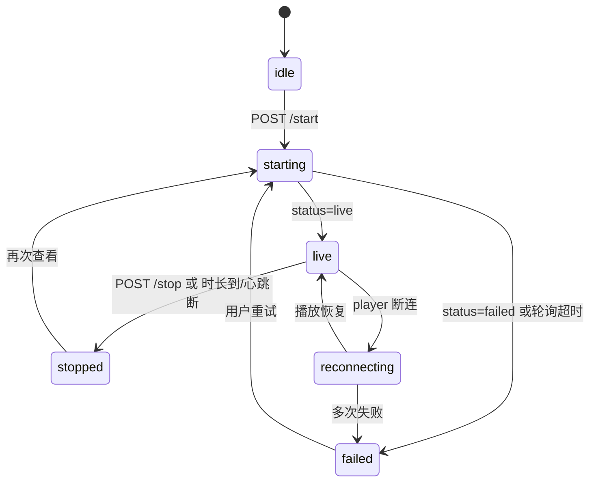

# 家长端「远程实时监控」小程序产品与接口说明

> 面向 **小程序开发 + 产品**：页面、交互、接口、`<live-player>` 集成与异常处理。  
> 全链路架构见 [家长端-远程实时监控-技术架构说明.md](./家长端-远程实时监控-技术架构说明.md)。

---

## 一、产品需求（PRD 摘要）

### 1.1 用户故事

作为家长，我希望在小程序里 **持续查看** 绑定设备摄像头照到的画面（类似家用监控），以便远程了解孩子所在环境；看完后我能 **主动停止**，避免设备长期占用摄像头与带宽。

### 1.2 产品定位

| 项 | 说明 |
|----|------|
| 与「快照看娃」关系 | **独立能力**，不在陪伴聊天里发一句话触发 |
| 与「实时对话」关系 | 孩子正在和设备深度对话时，可能 **无法开启** 或提示稍后再试 |
| 一期范围 | **纯画面、无声音**；单次有时长上限 |
| 二期（预留） | 可选开声音、观看历史、云端短时录像 |

### 1.3 已拍板（一期）

| 项 | 约定 |
|----|------|
| 权限 | 仅 **已绑定该设备** 的家长（owner + member，与设备管理一致） |
| 并发 | 同一设备 **同时仅 1 路** 监控 |
| 默认时长 | 单次最长 **10 分钟**（服务端 `maxDurationSec` 下发） |
| 心跳 | 观看中每 **20s** 调 heartbeat；离开页面/切后台 **自动 stop** |
| 音频 | **关闭**；播放器静音，无「开声音」按钮 |
| 隐私协议 | 未签署当前版 [儿童隐私协议](./家长端-儿童隐私协议-产品与接口方案.md) 时 **禁止进入** |
| 设备提示 | 文案告知：「连接成功后，设备端将提示正在远程查看」 |
| 存储 | **不保存** 监控录像到相册或聊天记录 |
| 流媒体 | **腾讯云直播** 提供播放地址；小程序仅拉 HTTPS FLV/HLS |

### 1.4 非目标（一期不做）

- 聊天内「帮我一直看着孩子」自然语言触发  
- 多设备同屏、画中画  
- 云台控制、变焦  
- 分享观看链接给非绑定用户  
- 全屏录制、截图存 OSS  

---

## 二、入口与信息架构

### 2.1 入口

| 位置 | 行为 |
|------|------|
| **设备详情页** | 按钮「远程查看」→ 监控页 |
| **孩子详情 / 安全**（可选） | 同上，携带 `childId` |
| **陪伴页**（可选二期） | 独立 Tab「查看」，不与聊天混排 |

**展示条件：**

```text
showRemoteLive =
  已登录
  && 已绑定 deviceId
  && 儿童隐私协议已签署（consent status = agreed）
  && 服务端开关 parent.live.enabled !== false
  && 设备 MQTT 在线（可选：进入前先 GET device 状态，离线则置灰）
```

### 2.2 页面结构

```text
pages/live/watch          远程监控主页面（播放器 + 控制）
pages/live/unavailable    不可用说明（离线/忙碌/无权限）— 可用 modal 代替独立页
```

**路由参数 `watch` 页：**

| 参数 | 必填 | 说明 |
|------|------|------|
| deviceId | 是 | 设备 ID |
| childId | 否 | 当前孩子，用于审计 |

---

## 三、页面交互（`pages/live/watch`）

### 3.1 布局线框

```text
┌─────────────────────────────────────┐
│  ← 返回          远程查看            │
├─────────────────────────────────────┤
│                                     │
│         [ live-player 16:9 ]        │
│         或 占位：连接中/失败         │
│                                     │
├─────────────────────────────────────┤
│  状态：正在连接设备… / 直播中 02:35  │
│  提示：单次最长 10 分钟，仅作看护参考  │
├─────────────────────────────────────┤
│  [ 开始查看 ]  或  [ 停止查看 ]       │
└─────────────────────────────────────┘
```

### 3.2 状态与 UI

| 客户端状态 | 条件 | UI |
|------------|------|-----|
| `idle` | 未开始 | 黑底占位 + 文案「点击开始查看设备画面」+ 按钮 **开始查看** |
| `starting` | 已调 start，等待推流 | Loading「正在连接设备…」；**不可重复点**；可显示 30s 超时 |
| `live` | status=live 且 player 播放 | 播放器画面 + 计时 + 按钮 **停止查看** |
| `reconnecting` | 播放中断但 session 仍 live | 「连接不稳定，正在恢复…」 |
| `failed` | 明确错误码 | 错误文案 + **重试** |
| `stopped` | 用户停止或超时 | 「已结束」+ 按钮 **再次查看** |

### 3.3 关键交互规则

1. **开始查看**  
   - 调 `POST /live/start`  
   - 进入 `starting`，展示服务端 `message`  
   - 轮询 `GET /live/status`（每 2s，最多 15 次）直到 `status=live` 或 `failed`  
   - 拿到 `playUrl` 后渲染 `<live-player>`

2. **观看中**  
   - 启动定时器：heartbeat 每 20s、界面计时器每秒更新  
   - 屏幕常亮：`wx.setKeepScreenOn({ keepScreenOn: true })`

3. **停止查看**  
   - 用户点停止 / 页面 `onUnload` / `onHide` 超过 5s → `POST /live/stop`  
   - 销毁 player、清 heartbeat、`setKeepScreenOn(false)`

4. **时长上限**  
   - 剩余 &lt; 60s 时 Toast：「即将到达单次观看上限」  
   - 到点服务端停流，status → `stopped`，提示「本次查看已结束」

5. **冲突提示**  

| failCode | 用户文案 |
|----------|----------|
| `DEVICE_OFFLINE` | 设备未联网，请确认设备在线后再试 |
| `DEVICE_BUSY` | 设备正在对话中，请稍后再试 |
| `PUSH_TIMEOUT` | 连接超时，请检查设备网络后重试 |
| `LIVE_ALREADY_ACTIVE` | 其他家长正在查看，请稍后再试 |
| `CONSENT_REQUIRED` | 请先阅读并同意儿童隐私协议 |
| `LIVE_DISABLED` | 功能暂未开放 |

### 3.4 合规文案（固定展示）

- 页脚常驻：「远程查看仅供家庭看护参考，请勿用于非法监控。」  
- 首次进入（可用 local 标记）：半屏说明 + 勾选「我已知悉单次时长与隐私要求」  

---

## 四、技术实现要点

### 4.1 微信能力与腾讯云

| 项 | 要求 |
|----|------|
| 组件 | [`live-player`](https://developers.weixin.qq.com/miniprogram/dev/component/live-player.html) |
| 拉流格式 | 优先 **FLV**（腾讯云播放域名 `.flv`）；备选 **HLS**（`.m3u8`） |
| 播放地址来源 | manager-api 返回的 `playUrl` / `playUrlHls`，域名为 **腾讯云播放域名** |
| 小程序类目 | 需 **社交 / 教育 / 硬件** 等含直播能力的类目（以微信审核为准） |
| 域名白名单 | 微信公众平台 → 开发管理 → **live-player 合法域名** → 配置腾讯云 **播放域名**（如 `play.example.com`），**不是** manager-api 域名 |
| 基础库 | 建议 ≥ 2.29.0；真机验证 iOS/Android |

**说明**：推流域名（`push.xxx`）仅 ESP32 使用，**无需**加入小程序 download/request 域名；小程序只接触 HTTPS 播放 URL。

### 4.2 live-player 示例

```xml
<!-- pages/live/watch.wxml -->
<live-player
  wx:if="{{playUrl && sessionStatus === 'live'}}"
  id="livePlayer"
  src="{{playUrl}}"
  mode="live"
  autoplay
  muted
  object-fit="contain"
  min-cache="1"
  max-cache="3"
  bindstatechange="onPlayerStateChange"
  binderror="onPlayerError"
  style="width: 100%; height: 420rpx;"
/>
```

```javascript
// muted 一期必须 true（无音频轨 + 合规）

onPlayerStateChange(e) {
  const code = e.detail.code
  // 2001 连接成功, 2004 开始播放, -2301 网络断连 等，见微信文档
  if (code === 2004) {
    this.setData({ playerReady: true })
  }
}

onPlayerError(e) {
  console.error('live-player error', e.detail)
  this.handlePlayFailed()
}
```

### 4.3 会话与轮询逻辑（伪代码）

```javascript
const API = '/parent-api/live'

async function startWatch(deviceId, childId) {
  const res = await request.post(`${API}/start`, { deviceId, childId })
  const { sessionId, playUrl, heartbeatIntervalSec, maxDurationSec } = res.data
  this.sessionId = sessionId
  this.setData({ sessionStatus: 'starting', playUrl: null })

  await this.pollUntilLive(sessionId)

  this.startHeartbeat(sessionId, heartbeatIntervalSec)
  this.startMaxDurationTimer(maxDurationSec)
  this.setData({ sessionStatus: 'live', playUrl: res.data.playUrl })
}

async function pollUntilLive(sessionId) {
  for (let i = 0; i < 15; i++) {
    await sleep(2000)
    const st = await request.get(`${API}/status`, { sessionId })
    if (st.data.status === 'live') {
      this.setData({ playUrl: st.data.playUrl })
      return
    }
    if (st.data.status === 'failed') {
      throw st.data
    }
  }
  throw { failCode: 'PUSH_TIMEOUT' }
}
```

### 4.4 生命周期

| 事件 | 行为 |
|------|------|
| `onLoad` | 校验 deviceId、consent |
| `onShow` | 若已有 sessionId 且应为 live，恢复 heartbeat |
| `onHide` | 记录 hide 时间；**不立即 stop**（避免切微信回消息就断） |
| hide &gt; 5s | 自动 stop |
| `onUnload` | **必须 stop** + 清定时器 |

---

## 五、接口文档（manager-api `parent-api`）

**Base URL**：与现有家长端一致，如 `https://your-host/xiaozhi/parent-api`  
**鉴权**：Header `token: {家长登录 token}`

### 5.1 开始远程查看

```http
POST /parent-api/live/start
Content-Type: application/json
token: xxx

{
  "deviceId": "02:1a:2b:3c:4d:5f",
  "childId": 1
}
```

**成功响应 `data`：**

| 字段 | 类型 | 说明 |
|------|------|------|
| sessionId | long | 会话 ID |
| sessionNo | string | 对外单号 |
| status | string | `starting` |
| deviceId | string | |
| playUrl | string | 腾讯云 FLV 播放地址；`starting` 时可能为空，以 status 轮询为准 |
| playUrlHls | string | 腾讯云 HLS 备选 |
| mode | string | `flv` / `hls`，建议跟 playUrl |
| maxDurationSec | int | 单次上限秒数 |
| heartbeatIntervalSec | int | 建议心跳间隔 |
| message | string | 展示用提示 |

**错误码（业务 code ≠ 0）：**

| code / failCode | 说明 |
|-----------------|------|
| CONSENT_REQUIRED | 未签隐私协议 |
| DEVICE_OFFLINE | 设备 MQTT 离线 |
| DEVICE_BUSY | 设备对话占用 |
| LIVE_ALREADY_ACTIVE | 已有活跃会话 |
| LIVE_DISABLED | 功能关闭 |
| FORBIDDEN | 无设备绑定权限 |

### 5.2 查询会话状态

```http
GET /parent-api/live/status?sessionId=10001
token: xxx
```

**响应 `data`：**

| 字段 | 说明 |
|------|------|
| sessionId | |
| status | `starting` / `live` / `stopping` / `stopped` / `failed` |
| playUrl | `live` 时必填 |
| playUrlHls | 备选 |
| failCode | failed 时 |
| failMessage | 可读原因 |
| elapsedSec | 已观看秒数 |
| remainingSec | 剩余可观看秒数 |

### 5.3 心跳续期

```http
POST /parent-api/live/heartbeat
Content-Type: application/json
token: xxx

{ "sessionId": 10001 }
```

**说明**：观看中每 20s 调用；失败可重试 2 次，仍失败则提示用户并 stop。

### 5.4 停止查看

```http
POST /parent-api/live/stop
Content-Type: application/json
token: xxx

{ "sessionId": 10001 }
```

**响应**：`status: stopped`

### 5.5 可选：当前设备活跃会话

```http
GET /parent-api/live/active?deviceId=02:1a:2b:3c:4d:5f
token: xxx
```

进入页面前查询，若已有自己发起的 `live` 会话，可直接恢复播放。

---

## 六、与服务端状态对齐



---

## 七、与现有接口的配合

| 能力 | 接口 | 用途 |
|------|------|------|
| 登录 | `POST /parent-api/auth/wechat` | token |
| 隐私协议 | `GET /parent-api/consent/status` | 进入前校验 |
| 设备列表 | 现有 device API | 取 deviceId、在线状态 |
| 孩子 | 现有 child API | 可选 childId |

**不要**走 `/parent-api/chat/send` 或 zhiban WebSocket 触发监控。

---

## 八、测试用例（小程序侧）

| # | 步骤 | 期望 |
|---|------|------|
| 1 | 未登录进入 | 跳转登录 |
| 2 | 未签协议 | 引导 consent 页 |
| 3 | 设备离线点开始 | DEVICE_OFFLINE 文案 |
| 4 | 正常 start | starting → 15s 内 live，有画面 |
| 5 | 观看中切后台 10s | 自动 stop |
| 6 | 点停止 | 画面停、设备释流 |
| 7 | 观看到 maxDuration | 自动结束提示 |
| 8 | 另一家长已在看 | LIVE_ALREADY_ACTIVE |
| 9 | 断 WiFi 再恢复 | reconnecting 或 failed |
| 10 | 真机 iOS/Android FLV | 流畅度可接受（主观） |

---

## 九、开发排期建议

| 阶段 | 内容 |
|------|------|
| W1 | 静态页 + start/stop/status 联调（player 用腾讯云测试 playUrl 或 OBS 推流后的地址） |
| W2 | 接真实 playUrl + heartbeat + 生命周期 stop |
| W3 | 异常码、合规文案、consent/离线前置校验 |
| W4 | 真机 + **腾讯云播放域名**加入 live-player 合法域名 + 与固件联调 |

---

## 十、相关文档

- [家长端-远程实时监控-技术架构说明.md](./家长端-远程实时监控-技术架构说明.md)  
- [家长端-远程看娃-技术架构说明.md](./家长端-远程看娃-技术架构说明.md)（快照，勿混淆）  
- [家长端-设备管理接口文档.md](./家长端-设备管理接口文档.md)  
- [家长端-儿童隐私协议-产品与接口方案.md](./家长端-儿童隐私协议-产品与接口方案.md)  

---

*文档版本：v2 媒体层为腾讯云直播；一期纯画面；接口路径以实现为准。*
