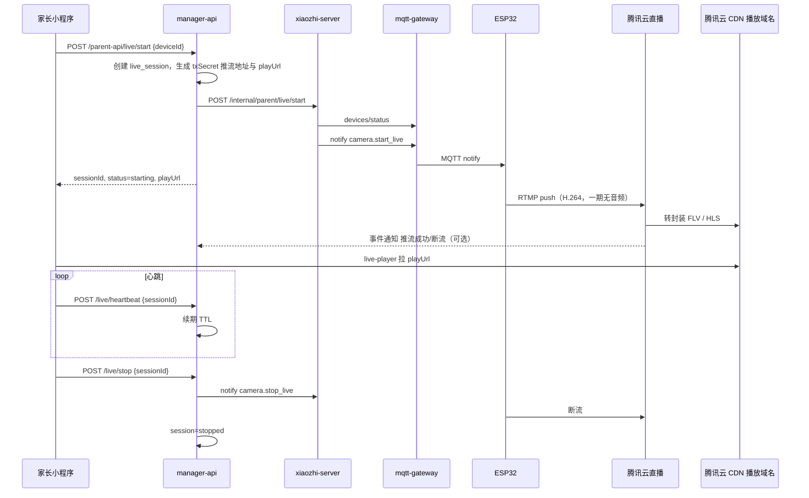

# 家长端「远程实时监控」技术架构说明

本文档描述 **家长小程序像监控一样持续观看设备摄像头画面** 的完整技术方案：**设备 RTMP 推流 → 腾讯云直播（CSS）→ 小程序 `<live-player>` 拉 FLV/HLS**。并说明 **服务端 / 设备端 / 小程序端** 各自职责。与现有 **Phase B 快照看娃**（`camera.capture_and_upload`）**并存、不替代**。

协议扩展见 [device-notify-protocol-v1.md](./device-notify-protocol-v1.md)（新增 `camera.start_live` / `camera.stop_live`）。  
小程序产品与接口见 [家长端-远程实时监控-小程序产品与接口说明.md](./家长端-远程实时监控-小程序产品与接口说明.md)。

**媒体层选型**：生产环境使用 **腾讯云直播**；本地联调可用 OBS 推腾讯云测试流，**无需自建 ZLM/SRS**。

---

## 1. 产品能力边界

| 维度 | Phase B 快照（已有） | 远程实时监控（本文） |
|------|---------------------|----------------------|
| 触发 | 聊天「看看孩子在干啥」 | 独立「远程查看」页，点「开始查看」 |
| 体验 | 先文字后单张图 | 连续画面，可一直看直到停止 |
| 通道 | Notify + HTTP 上传 JPEG | Notify 控制 + **RTMP 推腾讯云** + **FLV/HLS 拉流** |
| 是否经 LLM | 是（zhiban 意图） | **否**（纯控制面，不经 zhiban） |
| 音频 | 无 | **一期纯画面**；二期可选开声音 |
| 存储 | OSS + 聊天记录 | 默认不落库；可选云端短时录像（二期） |

---

## 2. 总体架构

### 2.1 设计原则

1. **控制与媒体分离**：会话创建、鉴权、启停走 **manager-api + xiaozhi + Notify**；大流量视频走 **腾讯云直播**，不经 xiaozhi HTTP 中继。
2. **设备主动推流**：ESP32 在 NAT 后，采用 **Outbound RTMP Push** 到腾讯云 **推流域名**，避免云端 RTSP 拉内网 IP。
3. **小程序只拉 HLS/FLV**：`<live-player>` 不直接消费 RTMP；由 **腾讯云直播 + CDN** 提供 HTTPS 播放地址。
4. **与对话/MCP/快照并存**：监控占用摄像头时，需定义与 WS 对话、MCP 拍照、快照 notify 的**互斥策略**。
5. **一期无声**：降低固件与合规复杂度；流中仅视频轨。

### 2.2 架构图



### 2.3 与现有组件关系

| 组件 | 快照看娃（已有） | 实时监控（新增） |
|------|-----------------|-----------------|
| zhiban-agent | 参与（意图/工具） | **不参与** |
| xiaozhi-server | prepare + notify 拍照 | live 编排 + notify 启停 |
| manager-api | snapshot prepare/upload | **live session CRUD + 鉴权 + playUrl** |
| mqtt-gateway | 转发 notify | 同上 |
| ESP32 | `camera.capture_and_upload` | **`camera.start_live` / `stop_live` + RTMP push** |
| 流媒体 | 无 | **腾讯云直播（CSS）** |
| OSS | 存 JPEG | 默认不用 |

---

## 3. 服务端要做什么

服务端拆成三块：**业务 API（manager-api）**、**编排（xiaozhi-server）**、**媒体层（腾讯云直播）**。

### 3.1 manager-api（核心）

#### 3.1.1 职责

| 职责 | 说明 |
|------|------|
| 会话管理 | 创建/查询/停止 `parent_live_session` |
| 权限校验 | 仅 **该设备 active 绑定家长**（owner/member 可配置）可发起 |
| 流媒体地址签发 | 按腾讯云规则生成 **推流地址（txSecret+txTime）** 与 **播放地址（FLV/HLS）** |
| 状态机 | `idle → starting → live → stopping → stopped / failed` |
| 心跳续期 | 小程序定时 heartbeat，超时自动 stop 并 notify 设备 |
| 并发控制 | 同一 device **同时最多 1 路** live；同一家长同设备防重复开 |
| 审计日志 | 谁、何时、看了哪台设备、时长（合规） |

#### 3.1.2 建议数据表 `parent_live_session`

| 字段 | 类型 | 说明 |
|------|------|------|
| id | bigint PK | 会话 ID |
| session_no | varchar | 对外展示用，如 `live_a1b2c3` |
| parent_user_id | bigint | 发起人 |
| device_id | varchar | 设备 MAC/ID |
| child_id | bigint nullable | 可选，当前选中孩子 |
| status | varchar | starting/live/stopping/stopped/failed |
| stream_app | varchar | 腾讯云 **AppName**，如 `parent` |
| stream_name | varchar | 腾讯云 **StreamName**，如 `{deviceId}_{sessionNo}` |
| push_url | varchar | 完整 RTMP 推流地址（含 txSecret、txTime，下发设备） |
| play_url_flv | varchar | 腾讯云播放域名 FLV（推荐，低延迟） |
| play_url_hls | varchar | 腾讯云播放域名 HLS 备选 |
| push_expire_at | datetime | 推流地址过期时间（与 txTime 一致） |
| fail_code | varchar | DEVICE_OFFLINE / DEVICE_BUSY / PUSH_TIMEOUT 等 |
| fail_message | varchar | 可读原因 |
| started_at | datetime | 首帧/推流成功时间 |
| stopped_at | datetime | 结束时间 |
| stop_reason | varchar | user / heartbeat_timeout / admin / device_offline |
| create_time | datetime | |
| update_time | datetime | |

#### 3.1.3 家长 API（`parent-api`）

| 方法 | 路径 | 说明 |
|------|------|------|
| POST | `/parent-api/live/start` | 发起监控，body: `{ deviceId, childId? }` |
| GET | `/parent-api/live/status` | 查询当前会话，query: `sessionId` 或 `deviceId` |
| POST | `/parent-api/live/heartbeat` | 续期，body: `{ sessionId }`，建议 15～30s 一次 |
| POST | `/parent-api/live/stop` | 停止，body: `{ sessionId }` |
| GET | `/parent-api/live/history` | 可选：最近观看记录（审计） |

**`POST /live/start` 响应示例：**

```json
{
  "code": 0,
  "data": {
    "sessionId": 10001,
    "sessionNo": "live_a1b2c3d4",
    "status": "starting",
    "deviceId": "02:1a:2b:3c:4d:5f",
    "playUrl": "https://play.example.com/parent/device_xxx_live_a1b2.flv",
    "playUrlHls": "https://play.example.com/parent/device_xxx_live_a1b2.m3u8",
    "mode": "flv",
    "maxDurationSec": 600,
    "heartbeatIntervalSec": 20,
    "message": "正在连接设备，请稍候…"
  }
}
```

状态变为 `live` 后，`playUrl` 可稳定播放（可通过轮询 `/live/status` 或 WS 推送，见小程序文档）。

#### 3.1.4 内部 API（`config/parent/live/*`，xiaozhi / 腾讯云回调）

| 方法 | 路径 | 说明 |
|------|------|------|
| POST | `/config/parent/live/prepare-notify` | xiaozhi 取 push 参数、clientId |
| POST | `/config/parent/live/tencent-callback` | 腾讯云直播 **事件通知**（推流/断流） |
| POST | `/config/parent/live/push-timeout` | 推流超时任务（定时扫描 starting 超 30s） |

#### 3.1.5 腾讯云直播集成（manager-api）

manager-api 负责按会话生成 **唯一 StreamName** 与 **带鉴权的推流/播放 URL**，无需自建流媒体进程。

**1. 腾讯云控制台前置（运维一次性）**

| 步骤 | 说明 |
|------|------|
| 开通产品 | [腾讯云直播 CSS](https://cloud.tencent.com/product/css) |
| 推流域名 | 如 `push.example.com`，CNAME 到腾讯云，**开启推流鉴权** |
| 播放域名 | 如 `play.example.com`，CNAME，HTTPS 证书 |
| AppName | 建议固定 `parent`（与文档示例一致） |
| 事件通知 | 配置推流/断流回调 URL → `POST .../config/parent/live/tencent-callback` |
| 录制 | 一期 **关闭** 全局录制；避免儿童画面落盘 |

**2. StreamName 规则**

```text
stream_name = {deviceId_normalized}_{sessionNo}
例：021a2b3c4d5f_live_a1b2c3d4
```

同一设备同时仅 1 路 live，StreamName 与会话一一对应。

**3. 推流地址（RTMP，下发 ESP32）**

腾讯云 **推流鉴权**（常用 MD5 方式）：

```text
txTime  = 过期时间 Unix 秒级，转十六进制大写（如 688B2A00）
txSecret = MD5(推流鉴权Key + StreamName + txTime)

推流地址：
rtmp://{push_domain}/{AppName}/{StreamName}?txSecret={txSecret}&txTime={txTime}
```

- `推流鉴权Key`：控制台推流域名 → 访问控制  
- `txTime` 建议 = 会话 `maxDurationSec` + 缓冲（如 +300s）  
- 完整 URL 写入 `parent_live_session.push_url`，notify 原样下发设备  

> 官方说明见腾讯云文档：[推流鉴权](https://cloud.tencent.com/document/product/267/32735)。

**4. 播放地址（下发小程序）**

```text
FLV（推荐）：https://{play_domain}/{AppName}/{StreamName}.flv
HLS（备选）：https://{play_domain}/{AppName}/{StreamName}.m3u8
```

- 写入 `play_url_flv` / `play_url_hls`  
- 小程序 `<live-player>` 的 **live-player 合法域名** = `play_domain`  
- 若开启 **播放鉴权**，manager-api 需按同样规则生成带 `txSecret`/`txTime` 的 playUrl（或 t 参数），一期可先仅推流鉴权 + HTTPS 播放域名  

**5. 推流/断流状态（session → live）**

优先使用腾讯云 **事件通知**：

| 事件 | manager-api 动作 |
|------|------------------|
| 推流（publish） | `starting` → `live`，记 `started_at` |
| 断流（publish_done） | 若 session 仍为 live → `stopped` 或 `failed` |

回调需校验腾讯云签名（配置 `callback_key`），防伪造。

**兜底**：若回调延迟，manager-api 可轮询腾讯云 API `DescribeLiveStreamState`（StreamName）判断是否在线；**仍以事件通知为主**。

**6. 断流与禁推**

用户 stop 或 heartbeat 超时：

1. notify 设备 `camera.stop_live`  
2. 可选：调腾讯云 **禁推流** API（`ForbidLiveStream`）强制断开，防止设备未正常 stop  

**7. 与自建 ZLM 的关系**

| 环境 | 媒体层 |
|------|--------|
| **生产** | 腾讯云直播 |
| **本地 PoC** | 可用 OBS 推腾讯云测试域名，或临时自建 ZLM **仅开发自测**（非产品路径） |

#### 3.1.6 Redis（建议）

| Key | 用途 |
|-----|------|
| `parent:live:device:{deviceId}` | 当前 active sessionId，防并发 |
| `parent:live:session:{sessionId}` | 缓存 status、playUrl、过期时间 |
| `parent:live:push:{stream_name}` | streamName → sessionId 映射 |

### 3.2 xiaozhi-server

#### 3.2.1 职责

| 职责 | 说明 |
|------|------|
| 编排启停 | 接收 internal live/start、live/stop |
| MQTT 在线检查 | `devices/status`，要求 `isAlive=true` |
| 设备忙检测 | 若 `bridgeAlive` 且策略为「对话优先」，返回 DEVICE_BUSY |
| 下发 Notify | `camera.start_live` / `camera.stop_live` |
| 可选 WS 推送 | 向家长聊天 WS 推送 `live_status`（若监控入口在陪伴页） |

#### 3.2.2 内部 HTTP

| 方法 | 路径 | 说明 |
|------|------|------|
| POST | `/internal/parent/live/start` | Bearer server.secret |
| POST | `/internal/parent/live/stop` | Bearer server.secret |

**start 请求 body：**

```json
{
  "session_id": 10001,
  "session_no": "live_a1b2c3d4",
  "device_id": "02:1a:2b:3c:4d:5f",
  "parent_user_id": 123,
  "push": {
    "mode": "rtmp",
    "url": "rtmp://push.example.com/parent/device_xxx_live_a1b2c3d4?txSecret=xxx&txTime=688B2A00",
    "streamKey": "device_xxx_live_a1b2c3d4",
    "appName": "parent",
    "video": {
      "width": 640,
      "height": 480,
      "fps": 10,
      "bitrate_kbps": 512,
      "codec": "h264"
    },
    "audio": {
      "enabled": false
    },
    "max_duration_sec": 600
  }
}
```

#### 3.2.3 代码索引（待实现）

| 文件 | 说明 |
|------|------|
| `core/api/device_notify_protocol.py` | 新增 live notify payload |
| `core/api/mqtt_gateway_client.py` | 复用 send_device_notify |
| `core/api/parent_live_handler.py` | internal start/stop |
| `core/api/parent_live_orchestrator.py` | 在线检查 + notify |

### 3.3 mqtt-gateway

**无业务改动**：继续透明转发 `type: notify`。  
需保证 live 会话期间 MQTT 长连接稳定（与快照相同，`isAlive` 即可，**不要求 bridgeAlive**）。

### 3.4 腾讯云直播 — 媒体层（无需自建服务器）

| 职责 | 说明 |
|------|------|
| RTMP 收流 | 推流域名（如 `rtmp://push.xxx.tlivecdn.com/...`） |
| 转协议 + CDN | 自动出 FLV、HLS，全国加速 |
| HTTPS 播放 | 播放域名配置 SSL，供小程序 `<live-player>` |
| 事件通知 | 推流/断流 HTTP 回调 manager-api |
| 鉴权 | 推流 txSecret；可选播放防盗链 |
| 录制 | 一期 **关闭** |

**不推荐**让 xiaozhi-server 或 manager-api 直接转发视频二进制；**不推荐**生产环境依赖自建 ZLM/SRS。

### 3.5 zhiban-agent

**不参与**实时监控链路。避免 LLM 超时与误触发。

---

## 4. 设备端要做什么（ESP32 固件）

### 4.1 不必改动

- MQTT hello/goodbye、idle 在线
- MCP 对话内拍照（与 live **互斥**时暂停）
- 现有 `camera.capture_and_upload` 快照 notify

### 4.2 必须新增

#### 4.2.1 Notify Action

| action | 说明 |
|--------|------|
| `camera.start_live` | 开始采集并 RTMP 推流 |
| `camera.stop_live` | 停止推流并释放摄像头 |

**`camera.start_live` payload 示例：**

```json
{
  "v": 1,
  "action": "camera.start_live",
  "taskType": "parent_live",
  "requestId": "live_a1b2c3d4",
  "params": {
    "sessionNo": "live_a1b2c3d4",
    "maxDurationSec": 600,
    "video": {
      "width": 640,
      "height": 480,
      "fps": 10,
      "bitrateKbps": 512,
      "gop": 30,
      "codec": "h264"
    },
    "audio": {
      "enabled": false
    }
  },
  "push": {
    "mode": "rtmp",
    "url": "rtmp://push.example.com/parent/device_xxx_live_a1b2c3",
    "streamKey": "device_xxx_live_a1b2c3",
    "txSecret": "xxx",
    "txTime": "688B2A00"
  }
}
```

**`camera.stop_live`：**

```json
{
  "v": 1,
  "action": "camera.stop_live",
  "taskType": "parent_live",
  "requestId": "live_a1b2c3d4",
  "params": {
    "sessionNo": "live_a1b2c3d4",
    "reason": "user_stop"
  }
}
```

#### 4.2.2 固件模块划分

```text
NotifyDispatcher
  └─ LiveStreamHandler
        ├─ CameraCaptureLoop（连续采集）
        ├─ VideoEncoder（H.264：S3 硬编优先，否则 MJPEG→需服务端转码的降级方案见 §4.4）
        ├─ RtmpPublisher（RTMP 推流客户端）
        ├─ SessionState（sessionNo、起止时间、推流状态）
        └─ WorkerTask（独立 FreeRTOS 任务，不阻塞 MQTT）
```

#### 4.2.3 行为要求

| 项 | 要求 |
|----|------|
| 启动时延 | 收到 notify 后 **10s 内**开始 push（否则云端判 PUSH_TIMEOUT） |
| 推流协议 | **RTMP + H.264**（一期无 AAC） |
| 分辨率 | 默认 640×480@10fps，可配置 |
| 单路限制 | 同时只允许 **1 路** live |
| 自动停止 | `maxDurationSec` 到点自动 stop；收到 stop notify 立即断流 |
| 断线重推 | 网络闪断可重试 2～3 次；session 已失效则放弃 |
| 互斥 | live 期间拒绝 MCP 拍照、快照 notify（或队列等 live 结束） |
| 指示 | 可选：LED/轻提示「家长正在远程查看」（合规） |
| 回调 | 以 **腾讯云事件通知** 为准；可选 HTTP 上报 `push_started`（非必须） |

#### 4.2.4 与摄像头/MCP 共用

```text
        CameraDriver + Encoder
              ↑                    ↑
    MCP take_photo          start_live RTMP
    capture_and_upload      stop_live
```

### 4.3 固件实现路径（建议分期）

| 阶段 | 设备能力 | 说明 |
|------|----------|------|
| **P0 验证** | OBS/FFmpeg 推 **腾讯云** 测试推流域名 + 小程序播 playUrl | 不依赖 ESP32，验证腾讯云+live-player |
| **P1 正式** | ESP32 **直推腾讯云 RTMP H.264** | 产品主路径 |
| **P2** | 增加 AAC 音频轨 | 需产品开关 + 合规 |

### 4.4 降级说明（开发备选，非产品主路径）

若芯片无法 H.264 硬编，可临时：

- 设备推 **MJPEG over RTSP/HTTP** 到 **内网边缘**（不可用于远程 NAT 场景），或
- 设备 WebSocket 推 JPEG 帧到 **live-bridge** 服务，由 FFmpeg 推 RTMP  

**远程生产环境仍应以 ESP32 RTMP H.264 为准。**

### 4.5 固件联调检查清单

- [ ] idle + MQTT 在线可收 `camera.start_live`
- [ ] 10s 内 RTMP 推流到 **腾讯云推流域名** 成功
- [ ] 腾讯云事件通知 / DescribeLiveStreamState → session `live`
- [ ] 小程序 live-player 播 **腾讯云播放域名** FLV/HLS
- [ ] `camera.stop_live` 后断流，摄像头释放
- [ ] live 中 MCP/快照被正确拒绝或排队
- [ ] `maxDurationSec` 自动停

---

## 5. 小程序端要做什么（摘要）

完整 **产品需求、页面、接口、live-player 集成** 见专用文档：  
[家长端-远程实时监控-小程序产品与接口说明.md](./家长端-远程实时监控-小程序产品与接口说明.md)

**职责摘要：**

| 职责 | 说明 |
|------|------|
| 入口与 UI | 设备/孩子详情页「远程查看」 |
| 会话控制 | 调 start / heartbeat / stop / status |
| 播放 | `<live-player>` 使用 `playUrl`（优先 FLV） |
| 状态展示 | starting / live / failed / stopped |
| 合规 | 单次时长上限、醒目提示、默认无音频 |
| 微信配置 | live-player 配置 **腾讯云播放域名**、直播类目 |

---

## 6. 会话状态机（全链路）

```text
                    start API
 idle ──────────────────────────► starting
                                    │
                    推流成功(腾讯云事件) │
                                    ▼
                                  live ◄──── heartbeat 续期
                                    │
              stop / 超时 / 设备离线 / 时长到
                                    ▼
                               stopping
                                    │
                                    ▼
                               stopped

 starting 超时(如30s) ──► failed(PUSH_TIMEOUT)
 设备离线 ──► failed(DEVICE_OFFLINE)
 对话占用 ──► failed(DEVICE_BUSY)
```

---

## 7. 安全与合规

| 项 | 要求 |
|----|------|
| 推流鉴权 | 腾讯云 **txSecret + txTime**，仅会话有效期内可推 |
| 播放 | 绑定家长可拿 playUrl；可选开启播放防盗链 |
| 时长 | 默认单次 **10 分钟** 上限（可配置） |
| 心跳 | 小程序后台/切页：heartbeat 停则自动 stop |
| 审计 | 记录 parent_user_id、device_id、起止时间 |
| 儿童隐私 | 与 [家长端-儿童隐私协议](./家长端-儿童隐私协议-产品与接口方案.md) 一致；首次使用需已签署 |
| 设备侧提示 | 建议 TTS/灯效：「家长正在远程查看」 |
| 音频 | 一期关闭；二期单独授权 + 默认静音 |

---

## 8. 配置清单

### 8.1 智控台 / 业务参数

| 配置项 | 位置 | 说明 |
|--------|------|------|
| `parent.live.enabled` | 智控台参数字典 | 总开关 |
| `parent.live.max_duration_sec` | 智控台 | 单次最长观看 |
| `parent.live.heartbeat_timeout_sec` | 智控台 | 心跳超时停流 |
| `server.mqtt_manager_api` | 智控台 | notify 下发 |
| `server.mqtt_signature_key` | 智控台 + gateway | 一致 |

### 8.2 腾讯云直播（manager-api / 环境变量）

| 配置项 | 说明 |
|--------|------|
| `parent.live.tencent.push_domain` | 推流域名，如 `push.example.com` |
| `parent.live.tencent.play_domain` | 播放域名，如 `play.example.com`（小程序合法域名） |
| `parent.live.tencent.app_name` | AppName，默认 `parent` |
| `parent.live.tencent.push_auth_key` | 推流鉴权 Key（控制台获取，**勿提交代码库**） |
| `parent.live.tencent.callback_key` | 事件通知校验密钥 |
| `parent.live.tencent.secret_id` / `secret_key` | 调用云 API（禁推流、DescribeLiveStreamState） |
| `parent.live.tencent.play_auth_enabled` | 是否开启播放防盗链（可选） |

### 8.3 腾讯云控制台

| 项 | 说明 |
|----|------|
| 推流域名 CNAME | 指向腾讯云分配地址 |
| 播放域名 CNAME + HTTPS | 证书上传或腾讯云托管 |
| 事件通知 URL | `https://{manager-api}/xiaozhi/config/parent/live/tencent-callback` |
| 录制模板 | 一期关闭 |

---

## 9. 部署顺序

1. **腾讯云直播**：推流/播放域名、鉴权、HTTPS、事件通知 URL  
2. **manager-api**：表结构、live API、推流/播放 URL 生成、腾讯云回调、Redis  
3. **xiaozhi-server**：internal live start/stop、notify payload  
4. **mqtt-gateway**：确认 notify 转发（通常无需改）  
5. **ESP32 固件**：start_live / stop_live + RTMP 推腾讯云  
6. **小程序**：远程查看页 + live-player + **播放域名**加入微信合法域名  
7. **联调**：OBS 或 ESP32 → 腾讯云 → starting → live → stop 全链路  

---

## 10. 与快照看娃的分工（总结）

| 场景 | 通道 | 参与者 |
|------|------|--------|
| 聊天「看看孩子」 | Notify + HTTP JPEG | zhiban + 聊天记录 |
| **远程实时监控** | **Notify + RTMP→腾讯云 + FLV/HLS** | **小程序 live 页，不经 zhiban** |
| 对话内拍照 | MCP | zhiban 多模态 |

---

## 11. 相关文档

- [device-notify-protocol-v1.md](./device-notify-protocol-v1.md)  
- [家长端-远程看娃-技术架构说明.md](./家长端-远程看娃-技术架构说明.md)  
- [家长端-远程实时监控-小程序产品与接口说明.md](./家长端-远程实时监控-小程序产品与接口说明.md)  

---

*文档版本：v2 媒体层为腾讯云直播；一期纯画面、RTMP 推流、FLV/HLS 拉流；实现以仓库代码为准。*
