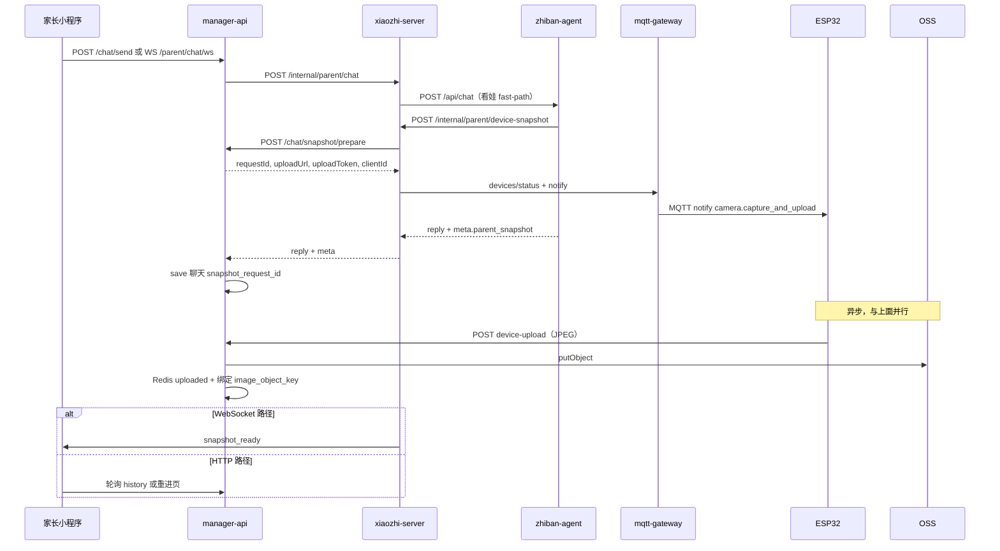

# 家长端「远程看娃」技术架构说明

本文档说明 **家长小程序「看看孩子现在在干啥」** 能力从设计到落地的完整技术架构：为什么不再走 MCP 同步返图、为什么改为 **Notify + 设备 HTTP 上传**、各组件职责、数据如何绑定到聊天记录，以及设备端 / 服务端 / 小程序分别要做什么。

协议细节见 [device-notify-protocol-v1.md](./device-notify-protocol-v1.md)；MCP 拍照返图（对话内场景）见 [esp32-mcp-camera-image-only.md](./esp32-mcp-camera-image-only.md)。

---

## 1. 产品能力是什么

家长在小程序「陪伴」页发送自然语言，例如：

- 「帮我看看娃儿现在在干啥」
- 「看看孩子」
- 「远程看一下孩子那边」

期望体验：

1. **先**收到助手文字（如「好的，我去看看孩子现在在做什么，稍等一下哦」）；
2. **再**在**同一条助手消息**下看到孩子侧摄像头快照（JPEG）；
3. 刷新聊天历史后，文字与图片仍在同一条记录里（`parent_chat_history`）。

该能力与 **孩子对着设备说话时的 MCP 拍照** 是 **不同场景**，技术路径 deliberately 分开。

---

## 2. 旧方案：MCP 同步拍照返图

### 2.1 原有链路（对话内 / zhiban 工具）

适用于：**孩子正在与设备 WS 对话**，或 zhiban 通过 xiaozhi 调用 `device_mcp/call` 让设备拍照给 **多模态 LLM** 理解。

```text
用户（设备端）说话
  → xiaozhi-server（ASR）
  → zhiban-agent
  → POST /internal/zhiban/device/mcp/call
       { tool_name: "self_camera_take_photo", mode: "image_only" }
  → mqtt-gateway  type=mcp（同步，等设备响应）
  → ESP32 拍照 → JPEG base64 塞进 MCP 响应
  → zhiban 多模态 LLM 读图生成回复
  → TTS 回设备
```

相关文档：`docs/zhiban-agent-device-mcp-image联调说明.md`。

### 2.2 MCP 路径的特点

| 特点 | 说明 |
|------|------|
| 同步 | gateway `type: mcp` **阻塞等待**设备 tools/call 完成 |
| 载荷 | 图片以 **base64 放在 MQTT/JSON-RPC 响应**里回传 |
| 会话 | 通常要求设备处于 **WS 对话桥**（`bridgeAlive`）或 MCP 栈可用 |
| 体量 | 单张建议 ≤500KB，整次 call 建议 ≤15s |

---

## 3. 为什么看娃不能继续用 MCP

家长看娃与「对话内拍照给 LLM」需求差异很大：

| 维度 | 对话内 MCP 拍照 | 家长远程看娃 |
|------|----------------|-------------|
| **触发方** | 孩子侧对话 / zhiban 工具 | 家长小程序，设备可能 **idle** |
| **设备状态** | 常在 WS 对话中 | 多数时间 **仅 MQTT 在线**，未开 WS |
| **谁消费图片** | zhiban 多模态 LLM（服务端） | 家长小程序 `<image>` 展示 |
| **时延预期** | 15～45s 内同步返回可接受 | 应先 **秒级** 回文字，图片 **异步** 到达 |
| **图片大小** | base64 经 MCP 回传，体积膨胀 | 应走 **HTTP 直传 OSS**，不污染 MQTT |
| **聊天记录** | 一般不写入家长 chat history | 必须绑定 `parent_chat_history` + OSS |

### 3.1 MCP 的具体局限性（技术）

1. **同步阻塞 gateway**  
   MCP 请求会占用 gateway→设备 一条同步通道直到拍照+编码+base64 完成。看娃若走 MCP，家长侧 zhiban/xiaozhi 会被动等待，易触发 30s HTTP 超时。

2. **base64 大图不适合 MQTT**  
   640×480 JPEG 经 base64 后可能数百 KB，在 MQTT JSON 里往返，占带宽、易超时，且与 MCP JSON-RPC 栈耦合。

3. **idle 设备未必能走 MCP**  
   看娃设计目标是 **MQTT 长连接在线即可**（`isAlive=true`），不要求 `bridgeAlive`。MCP 工具链历史上绑定 WS 会话，远程 idle 看娃不稳定。

4. **无法自然对接家长聊天存储**  
   MCP 返回的是给 LLM 的中间结果，没有 `requestId`、uploadToken、与 `parent_chat_history` 绑定的 Phase B 模型。

5. **与小程序 UX 不匹配**  
   产品要求「先文字、后图片」。MCP 同步模型是「图没回来就不该先 done」，与家长陪伴页流式体验冲突。

**结论：看娃走 Notify 异步 + HTTP 上传；MCP 继续服务对话内拍照 / image_only 给 zhiban。两条通道并存。**

---

## 4. 新方案总览：Notify + HTTP Upload（Phase B）

### 4.1 设计原则

1. **Notify 只下达任务**，gateway 立即 `accepted`，不等设备拍完后才返回。
2. **大图走 HTTP** 到 manager-api（再存 OSS），不走 MQTT payload。
3. **prepare / upload / finalize 三阶段**，用 `requestId` 关联一次看娃任务。
4. **聊天与上传并行**（「两条线」）：文字先 save，设备后 upload，再用 `requestId` 绑定 `image_object_key`。
5. **gateway 不解析业务**，只转发 `type: notify` + `payload`；扩展靠新 `action`。

### 4.2 架构图



### 4.3 MCP vs Notify 对照

| | **MCP** | **Notify（看娃）** |
|--|---------|-------------------|
| gateway 消息 | `type: mcp` | `type: notify` |
| 等待设备 | **同步**等 tools/call 完成 | **立即 accepted** |
| 图片回传 | MCP 响应 base64 | **HTTP POST** callback.url |
| 典型场景 | 对话内拍照、zhiban 看图 | 家长远程看娃 |
| 设备 idle | 不保证 | **设计目标**（`isAlive` 即可） |

---

## 5. 「两条线」是什么意思（聊天 vs 上传）

同一次看娃里，有两件事 **并行** 发生，用 **`requestId`（如 `snap_bd7b22e6b1424437`）** 最后绑在一起。

### 线 A：聊天线（文字）

```text
家长发消息 → zhiban 识别看娃 → 调 xiaozhi device-snapshot（仅 notify，不等拍照）
→ 返回助手文案 + meta.parent_snapshot.requestId
→ manager-api 保存 parent_chat_history：
     snapshot_request_id = snap_xxx
     message_kind = text_with_snapshot
     image_object_key = （此时通常还是空）
```

### 线 B：设备线（图片）

```text
prepare 生成 uploadUrl / uploadToken
→ MQTT notify → ESP32 拍照
→ HTTP POST .../snapshot/device-upload?requestId=snap_xxx
→ 图片进 OSS，Redis pending.status = uploaded，记下 objectKey
```

### 绑定（写 image_object_key）

当 **线 A 已有 snapshot_request_id** 且 **线 B 已 uploaded**：

- manager-api `tryBindAssistantMessage` / `finalizeSnapshot`  
- 把 OSS `objectKey` 写入该条助手消息的 `image_object_key`

**callback / device-upload 只完成线 B，不写聊天表；绑定是单独一步。**

---

## 6. 各组件职责

| 组件 | 职责 |
|------|------|
| **家长小程序** | 发消息；展示文字；收到 `snapshot_ready` 或轮询 history 展示 `imageUrl` |
| **manager-api** | prepare（Redis pending）；device-upload（OSS）；save 聊天；绑定 objectKey；history 返回 `imageUrl` |
| **zhiban-agent** | 看娃意图 fast-path / 工具 `fetch_child_device_snapshot`；调 xiaozhi device-snapshot |
| **xiaozhi-server** | 编排 prepare → MQTT 在线检查 → notify；WS 路径 finalize 轮询 |
| **mqtt-gateway** | 转发 `notify`；`devices/status`；不解析业务 |
| **ESP32** | 收 notify → `camera.capture_and_upload` → HTTP 上传 |

---

## 7. 服务端详细设计

### 7.1 zhiban-agent

- **工具**：`fetch_child_device_snapshot`（家长对话 `parent_tools_runner`）。
- **Fast-path**：命中「看看孩子 / 远程看 / 在干啥」等关键词时，直接 HTTP 调 xiaozhi，避免 LLM 不调工具。
- **调用**：`POST {XIAOZHI_SERVER_URL}/internal/parent/device-snapshot`  
  Body: `{ "device_id": "02:1a:2b:3c:4d:5f" }`
- **返回 meta**（非流式 `/api/chat`）：

```json
{
  "reply": "好的，我去看看孩子现在在做什么，稍等一下哦。",
  "meta": {
    "parent_snapshot": {
      "requestId": "snap_bd7b22e6b1424437",
      "code": "SUCCESS",
      "message": "..."
    }
  }
}
```

代码：`zhiban-agent/app/llm/parent_tools_runner.py`、`app/integrations/xiaozhi_server.py`。

### 7.2 xiaozhi-server

**编排入口**：`core/api/parent_device_snapshot.py` → `capture_child_snapshot()`

步骤：

1. `prepare_parent_chat_snapshot` → manager-api internal prepare  
2. `check_device_mqtt_online` → gateway `/api/devices/status`  
3. 可选：设备忙检测（WS 对话 in-flight）  
4. `send_device_notify` → gateway `/api/commands/{clientId}`，`action=camera.capture_and_upload`  
5. **立即返回** `{ ok: true, requestId }`，**不等待** ESP32 HTTP 上传  

**HTTP 内部接口**：`POST /internal/parent/device-snapshot`（Bearer `server.secret`）

**家长聊天 HTTP**（manager-api 调用）：`POST /internal/parent/chat`  
⚠️ 必须用 `asyncio.to_thread` 调 zhiban，否则 zhiban 回调 device-snapshot 时会 **阻塞 aiohttp 事件循环 30s 假超时**。

**家长聊天 WebSocket**：`GET /parent/chat/ws`  
流式 chunk + `snapshot_pending` / 后台 `finalize_parent_snapshot_on_ws` → `snapshot_ready`。

**配置**（`data/.config.yaml`）：

```yaml
manager-api:
  url: http://web:8002/xiaozhi          # 容器内访问 manager-api
  secret: <server.secret>
  device_upload_base_url: http://公网IP:8002/xiaozhi   # ESP32 可达，勿用 web
server:
  mqtt_manager_api: http://mqtt-gateway:8007   # 或智控台 server.mqtt_manager_api
  mqtt_signature_key: <与 gateway 一致>
```

代码索引：

| 文件 | 说明 |
|------|------|
| `core/api/device_notify_protocol.py` | notify payload 构造 |
| `core/api/mqtt_gateway_client.py` | 在线查询、下发 notify |
| `core/api/parent_device_snapshot.py` | 看娃编排 |
| `core/api/parent_snapshot_handler.py` | internal HTTP |
| `core/api/parent_snapshot_finalize.py` | WS 轮询 finalize |
| `core/api/parent_chat_websocket.py` | 小程序 WS |
| `core/api/parent_chat_handler.py` | manager-api HTTP 聊天 |
| `config/manage_api_client.py` | prepare / status / finalize / save |
| `config/config_loader.py` | 合并 `device_upload_base_url` |

### 7.3 manager-api

#### Phase B：prepare / device-upload / finalize

| 接口 | 调用方 | 作用 |
|------|--------|------|
| `POST /config/parent/chat/snapshot/prepare` | xiaozhi internal | 生成 requestId、uploadToken、uploadUrl、clientId；Redis pending=waiting |
| `POST /parent-api/chat/snapshot/device-upload` | **ESP32** | 校验 token；上传 OSS；pending=uploaded |
| `GET /config/parent/chat/snapshot/status` | xiaozhi | 轮询是否 uploaded |
| `POST /config/parent/chat/snapshot/finalize` | xiaozhi | 按 assistantMessageId 写 image_object_key |
| `POST /config/parent/chat/save` | xiaozhi WS | 存聊天，可带 snapshotRequestId |

**uploadUrl 形态**（设备必须能 DNS 解析）：

```text
http://39.97.236.17:8002/xiaozhi/parent-api/chat/snapshot/device-upload?requestId=snap_xxx
```

`uploadBaseUrl` 来自 xiaozhi prepare 请求的 `device_upload_base_url`，**不是**容器内 `manager-api.url` 的 `web`。

#### 聊天记录字段

表：`parent_chat_history`

| 字段 | 含义 |
|------|------|
| `snapshot_request_id` | 看娃单号，绑定用 |
| `message_kind` | `text` / `text_with_snapshot` |
| `image_object_key` | OSS 对象键（库内）；接口返回时 resolve 为 `imageUrl` |

**HTTP `/parent-api/chat/send` 路径**（小程序常用）：

- 解析 xiaozhi 返回的 `meta.parent_snapshot.requestId` 写入 `snapshot_request_id`  
- 调用 `tryBindAssistantMessage`：若设备已上传则立刻写 `image_object_key`  

代码：`ParentChatServiceImpl`、`ParentSnapshotServiceImpl`。

#### 图片 URL 给小程序

- 库存 **objectKey**，不是完整 URL。  
- `GET /parent-api/chat/history` 的 `toVO()` 调用 `resolveAccessUrl()`：  
  - OSS 公共读 / CDN → 拼接 HTTPS  
  - 私有桶 → 临时签名 URL  
  - 本地存储 → `{public-base-url}/parent-api/chat/snapshot/file/{uuid}.jpg`  

---

## 8. 设备端（ESP32）设计

### 8.1 不必改动

- 日常 UDP 音频、MQTT hello/goodbye  
- 现有 **MCP** 栈（`type: mcp`，对话内 `take_photo` / `image_only`）  
- 设备上 **不需要** zhiban / 家长意图识别  

### 8.2 必须新增

1. **MQTT 路由增加 `type: notify`**，与 `mcp` 并列。  
2. **Action 分发器**：`action` → handler 注册表（长期可扩展）。  
3. **首个 action**：`camera.capture_and_upload`  
   - 读 `params.maxWidth` / `jpegQuality`  
   - **共用** MCP 拍照底层 `CameraCapture`  
   - 读 `callback`：`mode=http_upload` 时 POST `callback.url`  
   - Header：`X-Snapshot-Token: callback.token`  
   - Body：推荐 raw JPEG（`Content-Type: image/jpeg`）或 JSON base64 / multipart  
4. **通用 HTTP 上传模块**：超时、失败重试 1 次、大小上限与 manager-api 2MB 对齐。  
5. **Worker 队列**：notify 处理勿阻塞 MQTT 线程。  

### 8.3 与 MCP 的关系

```text
        CameraCapture(jpeg)  ← 共用底层
              ↑                    ↑
    MCP take_photo          notify camera.capture_and_upload
    （同步 base64 回 MCP）   （HTTP 上传，不阻塞 MCP）
```

### 8.4 固件联调检查

- [ ] idle、MQTT 在线能收到 `type: notify`  
- [ ] `camera.capture_and_upload` 能拍照  
- [ ] HTTP POST uploadUrl 返回 `code: 0`（非 500）  
- [ ] uploadUrl 主机名是 **公网 IP/域名**，不是 `web`  

---

## 9. mqtt-gateway

- `POST /api/commands/{clientId}`：`type: notify`，payload 原样下发。  
- `POST /api/devices/status`：批量查 `isAlive` / `bridgeAlive` / `exists`。  
- 鉴权：`Authorization: Bearer sha256(yyyy-MM-dd + mqtt_signature_key)`。  

看娃 **不要求** `bridgeAlive`，只要求 `isAlive=true`（设备 MQTT 长连接在）。

---

## 10. 小程序集成要点

### 10.1 现象：当场只有文字，刷新才有图

这是 **预期时序**，不是绑库失败：

```text
0.5s  显示「好的，我去看看…」
1～5s 设备上传 + 写 image_object_key
      若小程序不处理 snapshot_ready / 不轮询 history → 气泡仍无图
刷新  GET /chat/history → imageUrl 有值 → 显示正常
```

### 10.2 推荐：WebSocket + snapshot_ready

连接：`ws://{xiaozhi}:8003/parent/chat/ws?token=...`

除 `chunk` / `done` 外，需处理：

```json
{ "type": "snapshot_pending", "requestId": "snap_xxx", "message": "正在获取孩子现在的画面…" }
{ "type": "snapshot_ready", "requestId": "snap_xxx", "image": { "accessUrl": "https://...", "width": 640, "height": 480 } }
```

收到 `snapshot_ready` 后，**更新对应助手气泡**的 `imageUrl`，不要只 append 新消息。

### 10.3 HTTP `/chat/send` 路径

- 发消息响应里可能有 `messageKind: text_with_snapshot`，但 **imageUrl 可能仍为空**（设备尚未上传完）。  
- 需 **轮询** `GET /chat/history`（如每 2s，最多 30s），直到该 `id` 的 `imageUrl` 非空。  
- 或改用 WebSocket。

### 10.4 展示与域名

```html
<image wx:if="{{item.imageUrl}}" src="{{item.imageUrl}}" mode="widthFix" />
```

微信小程序需配置 **download 合法域名**（OSS/CDN）。

---

## 11. 配置清单

| 配置项 | 位置 | 说明 |
|--------|------|------|
| `server.secret` | 智控台 | xiaozhi / zhiban 鉴权 |
| `xiaozhi.server.url` | 智控台 | manager-api 调 xiaozhi HTTP |
| `manager-api.url` | xiaozhi `data/.config.yaml` | 容器内 `http://web:8002/xiaozhi` |
| `manager-api.device_upload_base_url` | xiaozhi `data/.config.yaml` | **ESP32 可达**公网地址 |
| `server.mqtt_manager_api` | 智控台 | gateway 管理 API 地址 |
| `server.mqtt_signature_key` | 智控台 + gateway `.env` | 一致 |
| `xiaozhi.parent.public-base-url` | manager-api | 本地存储 / 头像类 URL；device-upload 备用 |
| `aliyun.oss.*` | 智控台 | 看娃快照存 OSS |
| `XIAOZHI_SERVER_URL` | zhiban `.env` | 调 xiaozhi internal API |
| `MANAGER_API_SECRET` | zhiban `.env` | 与 server.secret 一致 |

---

## 12. 部署顺序

1. **manager-api**（含 snapshot 表字段、device-upload、bind 逻辑）  
2. **xiaozhi-server**（notify 编排、config_loader、parent_chat asyncio 修复）  
3. **zhiban-agent**（看娃 fast-path + device-snapshot 客户端）  
4. **xiaozhi-mqtt-gateway**（支持 `type: notify` 的分支）  
5. **ESP32 固件**（notify + `camera.capture_and_upload`）  
6. **小程序**（`snapshot_ready` 或 history 轮询 + `imageUrl` 展示）  

固件未上线前，云端可能 `NOTIFY_FAILED` / `UPLOAD_TIMEOUT`，属预期。

---

## 13. 常见问题（联调）

| 现象 | 原因 | 处理 |
|------|------|------|
| ESP32 `Failed to get host by name: web` | uploadUrl 用了 Docker 服务名 | 配 `device_upload_base_url` 为公网 IP |
| xiaozhi 30s 超时后才 device-snapshot | HTTP 聊天阻塞事件循环 | 部署 `asyncio.to_thread` 修复 |
| OSS 有图，聊天表无 objectKey | 未写 snapshot_request_id 或未 finalize | HTTP send 需解析 meta；见 bind 逻辑 |
| 当场无图，刷新有图 | 小程序未接 snapshot_ready / 未轮询 | 见 §10 |
| device-upload 500 | 曾用 JSON @RequestBody 解析 raw JPEG | 已支持 raw/multipart/JSON |
| MQTT 在线检查失败 | mqtt_manager_api / signature_key 未配 | 智控台 + gateway |

---

## 14. 与 MCP 拍照能力的分工（总结）

| 场景 | 通道 | 图片去向 |
|------|------|----------|
| 孩子对话「拍一下周围」 | MCP `image_only` | zhiban 多模态 LLM |
| 孩子对话 vision describe | MCP + `/mcp/vision/explain` | 文字描述 |
| **家长「看看孩子在干啥」** | **Notify + HTTP** | **OSS → 家长 chat history → 小程序** |

两套能力 **共用摄像头底层**，**不共用传输与存储链路**。

---

## 15. 相关文档

- [device-notify-protocol-v1.md](./device-notify-protocol-v1.md) — Notify 协议与 payload  
- [esp32-mcp-camera-image-only.md](./esp32-mcp-camera-image-only.md) — MCP 对话内返图  
- [家长端-聊天接口-小程序调用说明.md](./家长端-聊天接口-小程序调用说明.md) — 小程序 HTTP/WS  
- [家长端-文件存储-OSS-小程序改造说明.md](./家长端-文件存储-OSS-小程序改造说明.md) — objectKey / imageUrl  

---

*文档版本：与 Phase B（Notify + device-upload + chat bind）实现一致；如有代码变更请以仓库为准。*
