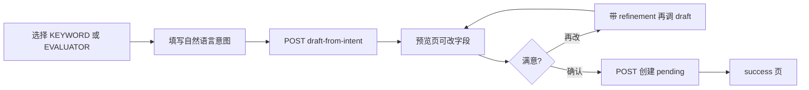

# 家长端「风险观察」小程序改造说明（含接口）

> 面向小程序开发：页面交互、接口调用、与「对话能力」对齐的创建流程。  
> 后端：`manager-api` `/parent-api/risk-watch/*`  
> 智控台：**儿童风险预警** → Tab **家长观察审核**（`admin/parent-risk-watch`）  
> 智伴：`zhiban-agent` 按 `childId` 拉取规则/判别器/关注侧重

---

## 一、产品约定（已拍板）

| 项 | 约定 |
|----|------|
| 绑定 | 每条观察必须绑定 **`child_id`（device_child.id）** |
| 生效 | 提交后 **`pending` 待审核**；运营通过后 **`enabled`** 才参与扫描 |
| 通知 | **不新建通道**，命中后仍走现有 **`parent_risk_notification` / 风险告警列表** |
| AI 配置 | 独立参数字典 **`server.parent_risk_watch_assist_config`**（与技能 assist 分离） |
| 形态 | **关注侧重** + **家庭观察词（KEYWORD）** + **领域判别（EVALUATOR）** |
| 交互 | 对标「对话能力」：**自然语言意图 → AI 草稿 → 预览编辑 → 确认提交** |
| 智控台审核 | **单独 Tab**（非内测反馈页） |

**限额（每孩子、仅计 `pending` + `enabled`）：**

| 类型 | 上限 | 审核通过后 |
|------|------|------------|
| `EVALUATOR` 领域判别 | 2 条 | 仅 `parent_risk_watch` 表 enabled，智伴合并拉取 |
| `KEYWORD` 家庭观察词 | 5 条 | 额外写入 `child_risk_rule`（`rule_scope=PARENT`） |

**扫描侧（智伴，无需小程序实现）：**

- 仅 **主孩子 `owner_child`** 对话触发风险扫描（与现网一致）
- `GET /config/child/risk/rules?childId=` → 平台规则 + 该孩家长 KEYWORD 规则
- `GET /config/child/risk/evaluators?childId=` → 平台判别器 + 该孩家长 EVALUATOR
- `GET /config/child/risk/preference?childId=` → `focusDomains` 注入领域路由 LLM 优先项

---

## 二、小程序入口与页面

### 2.1 入口

| 位置 | 行为 |
|------|------|
| 当前选中孩子的 **设置 / 安全** 区 | 菜单「风险观察」→ 观察首页 |
| 或 **风险告警** 列表页右上角 | 「管理观察」→ 同一首页 |

**展示条件建议：**

```
showEntry = 已登录
         && 当前有选中的 childId
         && 该家长与孩子有绑定关系（与设备/孩子列表同源校验）
```

全局儿童风险链路是否在跑，由服务端/智控台 `server.child_risk_config` 控制；入口可始终展示，提交成功后提示「审核通过后生效」。

### 2.2 页面结构（对标对话能力）

```
pages/risk-watch/index          观察首页（侧重 + 我的观察列表）
pages/risk-watch/preference     关注侧重（多选领域，可嵌在首页）
pages/risk-watch/create-type    选择类型：家庭观察词 / 领域判别
pages/risk-watch/intent         用自然语言描述想观察什么（多行输入）
pages/risk-watch/preview        AI 草稿预览与编辑
pages/risk-watch/detail         单条观察详情（状态、拒绝原因）
pages/risk-watch/success        提交成功（待审核提示）
```

**路由参数：** 所有页携带 `childId`（必填）。

### 2.3 观察首页 `index`

**区块 A — 关注侧重**

- 展示已选领域标签（来自 `overview.preference.focusDomains`）
- 按钮「编辑侧重」→ 多选 `domains`（`GET /domains` 的 `code` / `name`）
- 保存：`PUT /preference`

**区块 B — 我的观察**

- 列表 `overview.myWatches`：名称、类型、领域、状态标签
- 右上角「添加观察」→ `create-type`
- 点击行 → `detail?id=`
- `pending` / `enabled` 可「停用」：`PUT /{id}/disable`
- 底部文案：「家庭观察词最多 5 条，领域判别最多 2 条（含审核中）」

**状态文案：**

| status | 展示 |
|--------|------|
| `pending` | 待审核 |
| `enabled` | 已启用 |
| `rejected` | 未通过 |
| `disabled` | 已停用 |

### 2.4 创建流程（与技能类似）



**意图页 placeholder 示例：**

- KEYWORD：`孩子提到同学排挤、不想上学时使用…`
- EVALUATOR：`当孩子表达持续情绪低落、自责时，结合对话判断是否需要提醒家长…`

**预览页字段（按类型显示/编辑）：**

| 字段 | KEYWORD | EVALUATOR |
|------|---------|-----------|
| riskDomain | 必选 | 必选 |
| name | 是 | 是 |
| description | 建议 | 建议 |
| triggerHint | 可选 | 可选 |
| pattern | **必填**（多词用 `\|` 或换行分隔） | 隐藏 |
| riskLevel | 1–3，默认 2 | 隐藏 |
| category | 建议从领域 `suggestedCategories` 选 | 隐藏 |
| instructions | 隐藏 | **必填**（长文本） |
| allowedCategories | 隐藏 | JSON 数组字符串，默认可 `["other"]` |

**再生成：** `draft-from-intent` 传 `refinement` + `previousDraft`（上一轮草稿各字段）。

### 2.5 提交成功页

> 已提交审核，我们会在 1～2 个工作日内处理。  
> 通过后将在孩子对话风险扫描中生效；若触发仍会按现有方式通知您。

按钮：查看我的观察 / 返回首页

### 2.6 与风险告警的关系

- 本模块 **只配置观察**，不替代 `GET /parent-api/risk-alerts` 列表
- 观察命中后，家长仍收到 **原有风险通知**（小程序消息/列表与现网一致）
- **不要**把观察配置页做成告警详情里的子表单

---

## 三、风险领域目录

`GET /parent-api/risk-watch/domains` 与 `overview.domains` 结构一致：

| code | 名称 |
|------|------|
| `psychological` | 心理情绪 |
| `peer_relation` | 同伴关系 |
| `family` | 家庭关系 |
| `school` | 学业校园 |
| `online_safety` | 网络安全 |
| `physical_health` | 身心健康 |

`ChildRiskDomainVO.suggestedCategories` 为建议告警类目（KEYWORD 的 `category`、EVALUATOR 的 `allowedCategories` 可参考）。

---

## 四、接口说明

**Base URL：** 与现有家长端一致（如 `https://your-host`）  
**鉴权：** Header

```
Authorization: Bearer {家长登录 token}
```

**统一响应：**

```json
{ "code": 0, "msg": "success", "data": { ... } }
```

`code !== 0` 时展示 `msg`。

---

### 4.1 风险领域（只读）

```
GET /parent-api/risk-watch/domains
```

**响应 data：** `ChildRiskDomainVO[]`

```json
[
  {
    "code": "peer_relation",
    "name": "同伴关系",
    "suggestedCategories": ["social_exclusion", "bullying", "other"]
  }
]
```

---

### 4.2 观察概览（首页）

```
GET /parent-api/risk-watch/overview?childId={childId}
```

**响应 data：**

```json
{
  "preference": {
    "childId": 456,
    "focusDomains": ["peer_relation", "school"]
  },
  "domains": [ /* 同 4.1 */ ],
  "myWatches": [
    {
      "id": 10,
      "parentUserId": 123,
      "childId": 456,
      "watchType": "KEYWORD",
      "riskDomain": "peer_relation",
      "riskDomainName": "同伴关系",
      "name": "同学排挤",
      "description": "…",
      "pattern": "排挤|欺负|不理我",
      "riskLevel": 2,
      "category": "bullying",
      "status": "pending",
      "statusLabel": "待审核",
      "rejectReason": null,
      "editable": true,
      "createTime": "2026-05-30T10:00:00.000+00:00",
      "updateTime": "2026-05-30T10:00:00.000+00:00"
    }
  ],
  "maxEvaluatorPerChild": 2,
  "maxKeywordPerChild": 5
}
```

**权限：** 仅可查询当前家长 **已绑定** 的 `childId`，否则业务错误。

---

### 4.3 保存关注侧重

```
PUT /parent-api/risk-watch/preference
Content-Type: application/json
```

**请求 body：**

```json
{
  "childId": 456,
  "focusDomains": ["peer_relation", "online_safety"]
}
```

| 字段 | 类型 | 必填 |
|------|------|------|
| childId | long | 是 |
| focusDomains | string[] | 否，空数组表示清空 |

**响应 data：** 同 `preference` 对象。

---

### 4.4 AI 生成观察草稿

```
POST /parent-api/risk-watch/draft-from-intent
Content-Type: application/json
```

**请求 body：**

```json
{
  "childId": 456,
  "watchType": "KEYWORD",
  "userIntent": "孩子总说被同学排挤、不想上学",
  "refinement": "关键词再口语一点",
  "previousDraft": {
    "riskDomain": "peer_relation",
    "name": "同学排挤",
    "pattern": "排挤|欺负",
    "riskLevel": 2,
    "category": "bullying"
  }
}
```

| 字段 | 类型 | 必填 |
|------|------|------|
| childId | long | 是 |
| watchType | string | 是，`KEYWORD` 或 `EVALUATOR` |
| userIntent | string | 是 |
| refinement | string | 否 |
| previousDraft | object | 否，字段见 `ParentRiskWatchDraftFields` |

**响应 data：**

```json
{
  "watchType": "KEYWORD",
  "riskDomain": "peer_relation",
  "name": "同学排挤",
  "description": "…",
  "triggerHint": "…",
  "pattern": "排挤|欺负|不理我",
  "riskLevel": 2,
  "category": "bullying",
  "instructions": null,
  "allowedCategories": null
}
```

**说明：** 依赖 `server.parent_risk_watch_assist_config` 中 LLM；未配置时 `code!=0`，提示「服务暂不可用」。

---

### 4.5 提交观察（进入待审核）

```
POST /parent-api/risk-watch
Content-Type: application/json
```

**请求 body（KEYWORD 示例）：**

```json
{
  "childId": 456,
  "watchType": "KEYWORD",
  "riskDomain": "peer_relation",
  "name": "同学排挤",
  "description": "当孩子提到被排挤、欺负时",
  "triggerHint": "对话中出现同伴负面经历",
  "pattern": "排挤|欺负|不理我",
  "riskLevel": 2,
  "category": "bullying"
}
```

**请求 body（EVALUATOR 示例）：**

```json
{
  "childId": 456,
  "watchType": "EVALUATOR",
  "riskDomain": "psychological",
  "name": "持续情绪低落",
  "description": "…",
  "instructions": "你是儿童心理风险判别器。根据对话判断…",
  "allowedCategories": "[\"emotion_distress\",\"hopelessness\",\"other\"]"
}
```

| 字段 | 类型 | 必填 |
|------|------|------|
| childId | long | 是 |
| watchType | string | 是 |
| riskDomain | string | 是 |
| name | string | 是，≤128 |
| description | string | 否 |
| triggerHint | string | 否 |
| pattern | string | KEYWORD **必填** |
| riskLevel | int | 否，1–3，默认 2 |
| category | string | 否 |
| instructions | string | EVALUATOR **必填** |
| allowedCategories | string | 否，JSON 数组字符串 |

**响应 data：** 单条 `ParentRiskWatchVO`（`status=pending`）。

**常见错误：**

| 场景 | 说明 |
|------|------|
| 超限 | 已达该类型上限（含 pending+enabled） |
| 无权限 childId | 未绑定该孩子 |
| 缺 pattern / instructions | 校验失败 |

---

### 4.6 观察详情

```
GET /parent-api/risk-watch/{id}
```

**响应 data：** 单条 `ParentRiskWatchVO`（含 `instructions`、`rejectReason` 等）。  
仅能查看 **本人** 提交的记录。

---

### 4.7 停用 / 撤回

```
PUT /parent-api/risk-watch/{id}/disable
```

**响应 data：** `null`  
- `pending`：删除记录（撤回）  
- `enabled`：置 `disabled`，KEYWORD 会同步禁用关联 `child_risk_rule`

---

## 五、错误码

| code | 含义 |
|------|------|
| 20010 | 观察不存在或无权操作（`PARENT_RISK_WATCH_NOT_FOUND`） |
| 401 | token 无效 / 过期 |

其它校验失败以 `msg` 文案为准（如「请填写观察关键词」「仅待审核状态可操作」为管理端）。

---

## 六、小程序实现要点

### 6.1 请求封装

与现有家长端共用 `request`：自动带 `Authorization`，`childId` 从全局 store（当前孩子）读取。

### 6.2 首页加载顺序

1. `GET overview?childId=` 一次拉齐侧重 + 列表 + 限额  
2. 进入侧重编辑保存后，可只调 `PUT preference` 再局部更新，或重新 `overview`

### 6.3 预览页校验（提交前本地）

- KEYWORD：`pattern` 非空  
- EVALUATOR：`instructions` 非空  
- `riskDomain`、`name` 非空  
- `watchType` 与创建入口一致  

### 6.4 UI 类型区分

| watchType | 列表图标/标签建议 |
|-----------|-------------------|
| `KEYWORD` | 「观察词」 |
| `EVALUATOR` | 「领域判别」 |

### 6.5 拒绝后

`status=rejected` 展示 `rejectReason`；可提供「重新添加」走完整创建流程（新记录，非编辑旧 id）。

---

## 七、智控台（供联调参考）

| 接口 | 说明 |
|------|------|
| `GET /admin/parent-risk-watch/page?status=pending&page=1&limit=20` | 审核列表 |
| `GET /admin/parent-risk-watch/{id}` | 详情 |
| `PUT /admin/parent-risk-watch/{id}/audit` | body: `{ "action": "approve" \| "reject", "auditNote": "", "rejectReason": "" }` |

需超管权限 `sys:role:superAdmin`。

---

## 八、部署与迁移

1. 执行 Liquibase：`202605301200.sql`（`parent_risk_preference`、`parent_risk_watch`、`child_risk_rule` 扩展）  
2. 重启 `manager-api`，重建 `web` 镜像后 `docker compose up -d --build web`  
3. 参数字典配置 `server.parent_risk_watch_assist_config`（LLM）  
4. 部署 `zhiban-agent` 更新（`childId` 拉取 + `focusDomains` 路由）

---

## 九、联调检查清单

- [ ] 绑定孩子 A：保存侧重 2 个领域 → overview 回显  
- [ ] KEYWORD：意图 → 草稿 → 提交 → 智控台通过 → 智伴对话命中后家长收到原风险通知  
- [ ] EVALUATOR：提交 → 通过后智伴 `evaluators?childId=` 含 `parent_{parentUserId}_{id}`  
- [ ] 第 6 条 KEYWORD 提交应失败（限额）  
- [ ] `pending` 撤回后列表消失  
- [ ] `enabled` 停用后不再命中  
- [ ] 拒绝后小程序展示 `rejectReason`  

---

## 十、相关文档

- 内测反馈（交互参考）：`docs/家长端-内测反馈-小程序改造说明.md`  
- 多领域判别设计：`docs/child-risk-multi-domain-evaluator-design.md`  
- 技能接口（流程参考）：`docs/家长端-技能接口文档.md`
