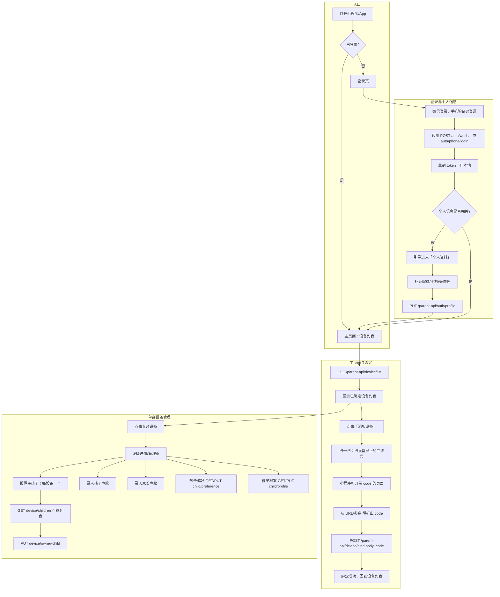
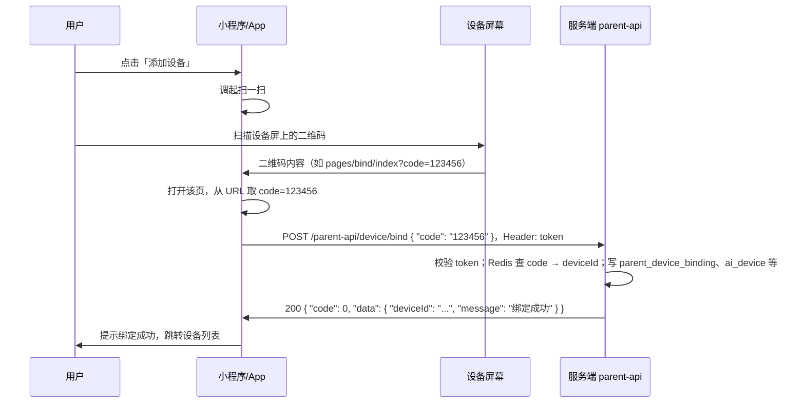

# 家长端（小程序/App）表结构与 API 接口文档

本文档结合《家长端与多模态智伴整体设计草案》与《设备绑定流程与改造说明》，**只针对小程序/App 端**，整理：**表结构**（新增 vs 现有）、**API 接口清单**（新增 vs 现有且需修改）、**主要流程**与**接口说明**。便于前后端与产品对齐开发。

---

## 零、小程序/App 端整体流程（对齐版）

以下是与产品对齐后的**主流程**与**页面/能力**概括；流程图见 0.2 节。

### 0.1 流程要点

1. **必须先登录**  
   小程序/App 进入后，若未登录则先走**登录**（微信一键 或 手机验证码）；登录接口与调用流程见 **三、3.1**。

2. **登录后补充当前用户个人信息**  
   登录成功后，若发现当前用户**尚未完善个人信息**（如昵称、手机号、头像等），应引导用户进入「个人资料」页补充；补充后调用**更新家长个人信息**接口（见 **2.2 登录与用户** 新增 **PUT /parent-api/auth/profile**）。

3. **绑定设备：扫设备屏上的码 → 从 URL 取 code → 调绑定接口**  
   - 用户点击「添加设备」，调起**扫一扫**，扫描**机器显示屏上的二维码**。  
   - 二维码内容建议为**带 code 的小程序路径或 H5 URL**，例如：  
     - 小程序：`pages/bind/index?code=123456`  
     - 或 H5：`https://your-domain.com/bind?code=123456`（若扫码后打开 H5再调起小程序，则 H5 将 code 通过 URL 或参数传给小程序）。  
   - 小程序打开该页后，从**当前页的 URL 或启动参数中解析出 `code`**（如小程序 `onLoad(options)` 的 `options.code`）。  
   - 用拿到的 **code** 调用 **POST /parent-api/device/bind**，Body：`{ "code": "123456" }`，完成绑定。

4. **主页面 = 绑定的设备列表**  
   登录后主入口为**「我的设备」**：一个家长可绑定**多台设备**，列表展示当前家长已绑定的所有设备（GET /parent-api/device/list）。

5. **每台设备下的能力**  
   点击某台设备进入**设备详情/管理**页，该页内包含：  
   - **设置主孩子**：每台设备只能添加**一个主孩子**（主人）；从「该设备可选孩子列表」中选一个作为主人（PUT /parent-api/device/{deviceId}/owner-child）。  
   - **录入孩子声纹**：为该设备下的孩子录入声纹（与现有声纹能力对接：如先建声纹再选为主人，或先选主孩子再录声纹，视现有声纹接口而定）。  
   - **录入家长声纹**：录入当前家长的声纹，便于设备识别「家长」身份并做差异化回复。  
   - **孩子偏好**：设置该设备主孩子的偏好（GET/PUT /parent-api/child/{childId}/preference）。  
   - **孩子档案**：维护该孩子的档案信息（昵称、性别、生日等）（GET/PUT /parent-api/child/{childId}/profile）。

上述「录入孩子声纹」「录入家长声纹」若走现有智控台/声纹服务（如 manager-api 或独立声纹服务的录入接口），需在小程序侧调对应**上传音频 + 创建声纹**的接口，并与 ai_agent_voice_print（及可选 parent 标记）关联；具体接口可在本稿基础上按现有声纹能力单独补充。

---

### 0.2 整体流程图（Mermaid）

---

### 0.3 绑定流程：从「扫设备屏上的码」到「调 bind 接口」

---

## 一、表结构清单

### 1.1 约定

- **新增**：当前项目没有，需要新建的表。
- **现有**：已存在，**不新建**；若需支持家长端，仅在**逻辑或返回**上扩展（如 get_agent_models 多返回字段），不强制改表结构。
- **设备标识**：家长端相关表统一用 **device_id = 设备 MAC**（与 ai_device 的 id/mac_address 对应，便于与 get_agent_models(mac) 一致）。若业务用 ai_device 主键，可再统一为 id。

---

### 1.2 新增表（家长端 + 设备绑定 + 孩子/偏好）

| 表名 | 说明 | 主要字段（建议） |
|------|------|------------------|
| **parent_user** | 家长端用户（与 sys_user 隔离） | id(BIGINT), open_id(VARCHAR), union_id(VARCHAR), phone(VARCHAR), nickname(VARCHAR), avatar_url(VARCHAR), create_time, update_time；唯一索引 open_id/channel 或 phone |
| **parent_user_token** | 家长端登录态 | id(BIGINT), parent_user_id(BIGINT), token(VARCHAR), expire_time(DATETIME), channel(VARCHAR: wechat/mini_program/app), create_time |
| **parent_device_binding** | 家长-设备绑定（绑定码/扫码后写入） | id(BIGINT), parent_user_id(BIGINT), device_id(VARCHAR, 即 mac), bind_time(DATETIME), bind_source(VARCHAR: code/qrcode), create_time；唯一 (parent_user_id, device_id) 或允许一设备多家长视业务 |
| **device_owner_child** | 设备-主人孩子（一设备一主孩） | id(BIGINT), device_id(VARCHAR), child_id(VARCHAR, 即 speaker_id/声纹id), bind_time(DATETIME), create_time；唯一 device_id |
| **child_profile** | 孩子档案（与声纹对应） | id(VARCHAR, 可=child_id=声纹id), parent_user_id(BIGINT), nickname(VARCHAR), gender(TINYINT), birth_date(DATE), preference_text(TEXT/JSON), create_time, update_time |
| **child_preference** | 孩子偏好（可选，或合并入 child_profile.preference_text） | id(BIGINT), child_id(VARCHAR), pref_key(VARCHAR), pref_value(TEXT), update_time |

可选（主人/访客、声纹落库等）：

| 表名 | 说明 |
|------|------|
| **device_speaker_relation** | 设备上非主人说话人及关系（parent/other_child/guest 等） |
| **visitor_voiceprint** | 访客声纹（若需落库） |

---

### 1.3 现有表（仅引用，不新建；必要时只改逻辑或返回）

| 表名 | 说明 | 家长端相关用法 |
|------|------|----------------|
| **ai_device** | 设备表（智控台/OTA 绑定后写入） | 家长绑定设备时：若采用「家长绑即创建设备」则在此表 insert 一条（agent_id=默认）；若采用「仅家长关联」则仅写 parent_device_binding，ai_device 须已存在（如智控台先绑）。get_agent_models(mac) 查本表。 |
| **ai_agent** | 智能体 | 设备绑定的 agent_id，配置下发用。 |
| **ai_agent_voice_print** | 声纹（speaker_id = id） | child_id 可复用本表 id；孩子列表可关联本表查声纹信息。 |
| **sys_user / sys_user_token** | 后台用户 | 与家长端隔离，不混用。 |

---

### 1.4 建表顺序建议（新增）

1. parent_user  
2. parent_user_token  
3. parent_device_binding  
4. device_owner_child  
5. child_profile  
6. child_preference（若单独表）

---

## 二、API 接口清单（家长端 /parent-api/**）

以下均为**小程序/App 调用**的接口，统一前缀 **/parent-api**，鉴权为 **Parent-Token**（与后台 /user、/device 等 Shiro 隔离）。

### 2.1 鉴权约定

- **Header**：`Authorization: Bearer <parent_token>` 或 `Parent-Token: <parent_token>`（二选一，与后端约定即可）。
- **未带有效 token**：返回 401，body 可 `{ "code": 401, "message": "未登录或登录已过期" }`。
- 所有 /parent-api/** 接口除「登录、发验证码」外，均需要鉴权。

---

### 2.2 登录与用户（新增）

| 方法 | 路径 | 说明 | 鉴权 |
|------|------|------|------|
| POST | /parent-api/auth/wechat | 微信一键登录（code 换 openid/unionid，再换或创 parent_user + token） | 否 |
| POST | /parent-api/auth/phone/code | 发送手机验证码 | 否 |
| POST | /parent-api/auth/phone/login | 手机号+验证码登录，返回 parent_token | 否 |
| GET  | /parent-api/auth/info | 当前家长信息（昵称、头像、绑定手机等） | 是 |
| PUT  | /parent-api/auth/profile | 登录后补充/更新家长个人信息（昵称、头像、手机号等） | 是 |
| POST | /parent-api/auth/logout | 登出（使当前 token 失效） | 是 |

---

### 2.3 设备绑定与解绑（新增，对应设备绑定流程）

| 方法 | 路径 | 说明 | 鉴权 |
|------|------|------|------|
| POST | /parent-api/device/bind | 通过 6 位绑定码绑定设备，Body: `{ "code": "123456" }` | 是 |
| POST | /parent-api/device/unbind | 解绑设备，Body: `{ "deviceId": "mac或id" }` | 是 |
| GET  | /parent-api/device/list | 当前家长已绑定设备列表 | 是 |

---

### 2.4 设备-主人孩子（新增）

| 方法 | 路径 | 说明 | 鉴权 |
|------|------|------|------|
| PUT  | /parent-api/device/{deviceId}/owner-child | 设置设备主人孩子，Body: `{ "childId": "声纹id" }` | 是 |
| GET  | /parent-api/device/{deviceId}/owner-child | 查询设备当前主人孩子 | 是 |
| GET  | /parent-api/device/{deviceId}/children | 该设备可选孩子列表（如该设备所属 agent 下的声纹列表） | 是 |

---

### 2.5 孩子与偏好（新增）

| 方法 | 路径 | 说明 | 鉴权 |
|------|------|------|------|
| GET  | /parent-api/child/list | 当前家长下的孩子列表（可关联声纹信息） | 是 |
| GET  | /parent-api/child/{childId}/profile | 孩子档案详情 | 是 |
| PUT  | /parent-api/child/{childId}/profile | 更新孩子档案（昵称、性别、生日、偏好摘要等） | 是 |
| GET  | /parent-api/child/{childId}/preference | 孩子偏好（结构化或 JSON） | 是 |
| PUT  | /parent-api/child/{childId}/preference | 更新孩子偏好 | 是 |

---

### 2.6 声纹录入（与现有能力对接）

**孩子声纹**、**家长声纹**的录入可与现有 **ai_agent_voice_print** 及声纹服务对接：若智控台/声纹服务已有「声纹注册」接口，小程序可调用同一套或由 parent-api 封装代理；录入后得到 speaker_id（即 child_id），用于设置设备主孩子与家长身份识别。具体接口路径与请求体以现有声纹服务为准，本文档不单独列接口表。

---

### 2.7 现有接口（不改路径，仅扩展返回或逻辑）

| 方法 | 路径 | 说明 | 变更类型 |
|------|------|------|----------|
| POST | /config/agent-models | 设备拉配置（xiaozhi 调，非小程序直调） | **修改**：返回中增加 owner_child_id、child_preferences（该设备主人孩子及偏好）；可选 speakers 中每项增加 child_id/speaker_type。逻辑上若按 mac 查到 ai_device，再按 device_id 查 device_owner_child、child_profile 拼入返回即可。 |
| POST | /ota/ | 设备上报（固件调，非小程序直调） | **现有**：不改为家长端服务；已返回 websocket、activation，无需改。 |

小程序/App **不直接**调用 /config/agent-models 和 /ota/；它们供设备和 xiaozhi-server 使用。家长端只调用 /parent-api/**。

---

## 三、主要流程与接口说明

### 3.1 登录流程

#### 3.1.1 微信登录（小程序/App 内微信）

1. 小程序/App 调 wx.login（或等效）拿到 **code**。  
2. 请求 **POST /parent-api/auth/wechat**，Body 示例：`{ "code": "xxx", "channel": "mini_program" }`。  
3. 后端用 code 向微信换 openid/unionid；若 parent_user 中已有该 openid（同 channel）则取用户并生成 token，否则**新建 parent_user** 再生成 token。  
4. 返回示例：`{ "code": 0, "data": { "token": "xxx", "expireAt": 1234567890, "user": { "id": 1, "nickname": "...", "avatarUrl": "..." } } }`。  
5. 小程序/App 将 token 存本地，后续请求 Header 带 `Authorization: Bearer <token>`。  
6. **登录后**：若后端返回的 user 中缺少昵称/手机/头像等，或单独返回 `needProfile: true`，则引导用户进入「个人资料」页，补充后调用 **PUT /parent-api/auth/profile**（见 4.2.1）。

#### 3.1.2 手机验证码登录

1. 用户输入手机号，请求 **POST /parent-api/auth/phone/code**，Body：`{ "phone": "13800138000" }`。  
2. 后端发短信验证码（对接短信服务），并可在 Redis 存 phone -> code（带 TTL，如 5 分钟）。  
3. 用户输入验证码，请求 **POST /parent-api/auth/phone/login**，Body：`{ "phone": "13800138000", "code": "123456" }`。  
4. 后端校验 code，有则查/建 parent_user（按 phone），生成 token 并返回（格式同微信登录）。  

---

### 3.2 设备绑定流程（扫设备屏上的码 → 从 URL 取 code → 调 bind）

1. 用户已登录，持有 parent_token。  
2. 进入「添加设备」：用户**扫机器显示屏上的二维码**。二维码内容建议为**带 code 的小程序路径或 URL**，例如 `pages/bind/index?code=123456` 或 `https://xxx.com/bind?code=123456`。  
3. 小程序打开该页后，**从当前页 URL 或启动参数中解析出 `code`**（如小程序 `onLoad(options)` 的 `options.code`）。  
4. 用解析到的 code 请求 **POST /parent-api/device/bind**，Header：`Authorization: Bearer <parent_token>`，Body：`{ "code": "123456" }`。  
5. 后端：用 code 查 Redis（ota:activation:code:{code} -> deviceId；ota:activation:data:{deviceId}）；校验 code 有效、设备未被他人绑定（若业务限制）；写 **parent_device_binding**；按业务写 **ai_device**（若不存在且策略为「家长绑即创建」）；删 Redis 两 key。  
6. 返回 200，body 示例：`{ "code": 0, "data": { "deviceId": "xx:xx:xx:xx:xx:xx", "message": "绑定成功" } }`；失败时返回 4xx，body 见下方错误码表。  
7. 绑定成功后跳转**主页面（设备列表）**。

**错误码建议（绑定接口）**

| HTTP 状态 | code | message（示例） |
|-----------|------|------------------|
| 400 | 400 | 请输入 6 位数字绑定码 |
| 400 | 400 | 绑定码无效或已过期，请确认设备已联网并在设备上重新获取绑定码 |
| 400 | 400 | 绑定码错误，请核对后重试 |
| 409 | 409 | 该设备已被其他账号绑定 |
| 200 | 0 | 该设备已在您的设备列表中（可选：视为成功） |

---

### 3.3 主页面：设备列表与单台设备管理

- **主页面**：登录后默认进入**设备列表**，调用 **GET /parent-api/device/list**，展示当前家长已绑定的所有设备（一个家长可绑多台）。  
- **点击某台设备**：进入该设备的**详情/管理页**，包含：设置主孩子（每台设备只能一个）、录入孩子声纹、录入家长声纹、孩子偏好、孩子档案（见 0.1）。

### 3.4 设备列表与设置主人孩子（接口）

- **GET /parent-api/device/list**：查当前家长 parent_device_binding，返回设备列表（device_id、绑定时间、可选：设备别名、当前主人 child_id 等）。  
- **PUT /parent-api/device/{deviceId}/owner-child**：Body `{ "childId": "声纹id" }`，写/更新 device_owner_child 表，保证该 device 唯一主人。  
- **GET /parent-api/device/{deviceId}/children**：返回该设备可选的「孩子」列表（如该设备所属 agent 下的 ai_agent_voice_print 列表），供设置主人时选择。

---

### 3.5 孩子与偏好

- **GET /parent-api/child/list**：当前家长可见的孩子（可来自 child_profile + 关联声纹表）。  
- **GET/PUT /parent-api/child/{childId}/profile**：孩子档案的查/改。  
- **GET/PUT /parent-api/child/{childId}/preference**：偏好的查/改（可为 JSON 或 key-value 列表）。

---

## 四、接口文档明细（请求/响应示例）

### 4.1 POST /parent-api/auth/wechat（新增）

- **请求**：`{ "code": "微信 code", "channel": "mini_program" | "app" }`  
- **响应成功**：`{ "code": 0, "data": { "token": "xxx", "expireAt": 1234567890, "user": { "id": 1, "nickname": "", "avatarUrl": "" } } }`  
- **响应失败**：如 code 无效，返回 400 + message。

---

### 4.2 POST /parent-api/auth/phone/code（新增）

- **请求**：`{ "phone": "13800138000" }`  
- **响应成功**：`{ "code": 0, "message": "验证码已发送" }`  
- **限流**：同一手机号建议 1 分钟 1 次、每日上限（如 10 次）。

---

### 4.2.1 PUT /parent-api/auth/profile（新增，登录后补充个人信息）

- **请求**：`{ "nickname": "", "avatarUrl": "", "phone": "" }`（按需传要更新的字段），Header：鉴权  
- **逻辑**：更新当前家长 parent_user 的昵称、头像、手机号等；可用于登录后引导用户完善资料。  
- **响应成功**：`{ "code": 0, "data": { "user": { "id", "nickname", "avatarUrl", "phone" } } }`  

---

### 4.3 POST /parent-api/auth/phone/login（新增）

- **请求**：`{ "phone": "13800138000", "code": "123456" }`  
- **响应成功**：同 4.1 的 data（token + user）。  
- **响应失败**：验证码错误 400。

---

### 4.4 POST /parent-api/device/bind（新增）

- **请求**：`{ "code": "123456" }`，Header：`Authorization: Bearer <token>`  
- **响应成功**：`{ "code": 0, "data": { "deviceId": "AA:BB:CC:DD:EE:FF", "message": "绑定成功" } }`  
- **响应失败**：见 3.2 错误码表。

---

### 4.5 POST /parent-api/device/unbind（新增）

- **请求**：`{ "deviceId": "AA:BB:CC:DD:EE:FF" }`，Header：鉴权  
- **逻辑**：校验该 device 属于当前家长，删 parent_device_binding 记录；若业务允许多家长共享设备则只删当前家长的绑定。  
- **响应成功**：`{ "code": 0, "message": "解绑成功" }`  

---

### 4.6 GET /parent-api/device/list（新增）

- **请求**：无 Body，Header：鉴权  
- **响应成功**：`{ "code": 0, "data": [ { "deviceId": "mac", "bindTime": "...", "ownerChildId": "声纹id或null", "ownerNickname": "..." } ] }`  

---

### 4.7 PUT /parent-api/device/{deviceId}/owner-child（新增）

- **请求**：`{ "childId": "声纹id" }`，Header：鉴权  
- **逻辑**：校验 device 属于当前家长；写或更新 device_owner_child。  
- **响应成功**：`{ "code": 0, "message": "设置成功" }`  

---

### 4.8 GET /parent-api/device/{deviceId}/children（新增）

- **请求**：无 Body，Header：鉴权  
- **逻辑**：根据 device 找到 ai_device.agent_id，查该 agent 下 ai_agent_voice_print 列表，返回可选的 child_id（声纹 id）+ 名称等。  
- **响应成功**：`{ "code": 0, "data": [ { "childId": "id", "name": "声纹名称", "introduce": "..." } ] }`  

---

### 4.9 GET /parent-api/child/list（新增）

- **请求**：无 Body，Header：鉴权  
- **响应成功**：`{ "code": 0, "data": [ { "childId": "...", "nickname": "...", "voicePrintName": "..." } ] }`（可来自 child_profile + 声纹表）。  

---

### 4.10 GET/PUT /parent-api/child/{childId}/profile（新增）

- GET：返回 child_profile 字段。  
- PUT：Body 示例 `{ "nickname": "", "gender": 0, "birthDate": "", "preferenceText": "" }`，更新 child_profile。  

---

### 4.11 GET/PUT /parent-api/child/{childId}/preference（新增）

- GET：返回偏好（JSON 或 key-value 列表）。  
- PUT：Body 为偏好结构，更新 child_preference 或 child_profile.preference_text。  

---

## 五、汇总：新增 vs 现有且需修改

| 类型 | 表 | 接口 |
|------|-----|------|
| **新增** | parent_user, parent_user_token, parent_device_binding, device_owner_child, child_profile, child_preference（及可选 device_speaker_relation, visitor_voiceprint） | 全部 /parent-api/**：auth/wechat、auth/phone/code、auth/phone/login、auth/info、**auth/profile**、auth/logout；device/bind、device/unbind、device/list、device/{id}/owner-child、device/{id}/children；child/list、child/{id}/profile、child/{id}/preference。声纹录入与现有声纹服务对接，不单独列表。 |
| **现有且需修改** | 无（不删不改现有表结构） | **POST /config/agent-models**：在现有返回上增加 owner_child_id、child_preferences（及可选 speakers 的 child_id/speaker_type）；由 xiaozhi-server 或设备拉配置时使用，非小程序直调。 |
| **现有且不改** | ai_device, ai_agent, ai_agent_voice_print, sys_user 等 | **POST /ota/**：设备上报，已返回 websocket、activation，无需改。**POST /device/bind/{agentId}/{code}**：智控台绑定，保留不变。 |

---

以上表结构与接口可作为小程序/App 与后端对接的基准；实现时可按需增删字段或合并 child_preference 到 child_profile。更细的业务规则（如「一设备是否允许多家长」）在实现时再定即可。
