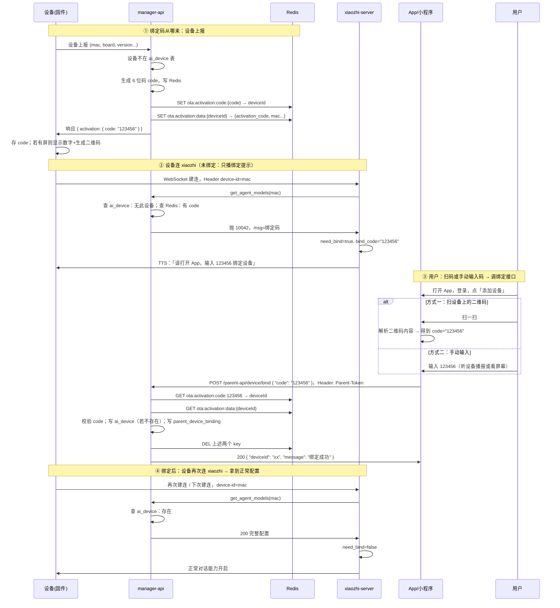
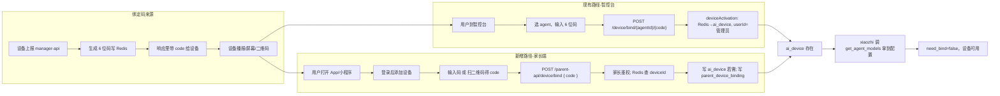

# 设备绑定流程与改造说明（含流程图）

---

## 零、我买了设备，手上有 App，我该干啥？（只看这个就够）

你就按下面几步做，做完设备就能正常跟你对话、并在 App 里管理。

| 步骤 | 你要做的事 |
|------|------------|
| **1** | **给设备通电、联网**。按说明书把设备连上家里 WiFi（或按设备提示配网）。 |
| **2** | **等设备出声或看屏幕**。设备联网后会自己找服务器，然后：要么**语音播报**「请打开 App，输入 XXXXXX 绑定设备」（XXXXXX 是 6 位数字），要么**屏幕显示 6 位数字**，有屏的还可能显示一个**二维码**。 |
| **3** | **打开你的 App**（或微信小程序），**登录**（微信或手机号）。 |
| **4** | 在 App 里点 **「添加设备」**（或「绑定新设备」）。 |
| **5** | **把 6 位码交给 App**，二选一： **① 手动输入**：把设备播报或屏幕上的 6 位数字打进输入框； **② 扫码**：如果设备屏幕上有二维码，用 App 里的「扫一扫」扫一下，App 会自动填好这 6 位码。 |
| **6** | 点 **「确认绑定」**（或「绑定」）。 |
| **7** | 看到 **「绑定成功」** 就完了。之后设备会正常跟你对话；在 App 的「我的设备」里也能看到这台设备。 |

**总结**：设备联网 → 看/听 6 位码 → 打开 App 登录 → 添加设备 → 输入码或扫码 → 确认绑定 → 完成。

下面都是给开发和产品看的：绑定码从哪来、二维码调什么接口、和服务器怎么关联、要在现有系统里改啥。

---

## 〇·一、设备连上 WiFi 后，怎么对接到 xiaozhi-server？

设备**不会**在固件里写死 xiaozhi-server 的地址。流程是：设备里预先配置的是**「上报/OTA 服务器」的地址**（一般是 **manager-api** 的接口）；连上 WiFi 后，设备去请求这个地址，**从返回结果里拿到 xiaozhi-server 的 WebSocket 地址**，再用这个地址建连。具体如下。

### 1. 设备里预先有什么

- 固件里配置了一个 **URL**（上报/OTA 接口），例如：  
  `https://你的manager-api域名/ota/`  
  当前项目中 manager-api 的该接口是 **POST /ota/**（见 `OTAController`），设备上报时带 Header `Device-Id`、`Client-Id` 和 Body 里的设备信息。

### 2. 设备联网后做啥

1. 设备连上家里 WiFi，能访问外网。
2. 设备向上面这个 **URL 发一次 POST 请求**（设备上报），带上：
   - Header：`Device-Id`（设备 MAC）、`Client-Id` 等；
   - Body：设备信息（板型、固件版本等，格式由接口约定）。
3. 服务端（**manager-api**）处理这次上报后，在**响应 JSON** 里返回很多字段，其中有两个和「对接到 xiaozhi-server」直接相关：
   - **`websocket.url`**：xiaozhi-server 的 WebSocket 地址（例如 `ws://xiaozhi.你的域名:8000/xiaozhi/v1/`）；
   - **`websocket.token`**：可选，建连时的认证 token；
   - 以及 **`activation`**（里面有 6 位绑定码 `code`），用于后面在 App 里绑定。

4. 设备解析响应，**用 `websocket.url`（和 token）去建 WebSocket 连接**，连上的就是 **xiaozhi-server**。  
   建连时会在 URL 或 Header 里带上 `device-id`（MAC），xiaozhi-server 会用这个去 manager-api 拉配置、判断要不要绑定等。

### 3. 这个 WebSocket 地址从哪来（谁配的）

- **manager-api** 里有一个系统参数：**`server.websocket`**（智控台「参数管理」里可配）。
- 管理员在智控台把这个参数配成**你们实际部署的 xiaozhi-server WebSocket 地址**（例如 `ws://你的服务器:8000/xiaozhi/v1/`）。
- 设备上报时，manager-api 读这个参数，填到响应的 **`websocket.url`** 里下发给设备。  
所以：**设备拿到的 xiaozhi-server 地址，是 manager-api 根据「智控台配置的 server.websocket」下发的**，设备自己不用写死。

### 4. 小结（对接关系）

```
设备通电、连 WiFi
    → 用固件里配置的「上报/OTA URL」向 manager-api 发 POST（设备上报）
    → manager-api 返回 JSON，其中：
         websocket.url  = xiaozhi-server 的 WebSocket 地址（来自智控台 server.websocket）
         activation.code = 6 位绑定码
    → 设备用 websocket.url 建 WebSocket，连上 xiaozhi-server
    → 之后对话、绑定提示、拉配置都走这条 WebSocket（xiaozhi-server 再向 manager-api 拉配置）
```

所以：**对接到 xiaozhi-server = 先请求 manager-api 的上报接口，从返回里拿到 `websocket.url`，再用这个地址连 WebSocket**。部署时只要在智控台配好 **server.websocket**，设备就能自动对接到正确的 xiaozhi-server。

### 〇·二、三个常见问题：接口是否现成？鉴权？OTA 地址怎么让用户改？

**1. 现在就有返回 WebSocket 地址吗？要新增接口吗？**

- **是现成的，不用新增。**  
  当前 manager-api 的 **POST /ota/**（`OTAController.checkOTAVersion`）会调 `deviceService.checkDeviceActive(...)`，返回的 `DeviceReportRespDTO` 里已经包含：
  - **`websocket.url`**：从系统参数 **server.websocket** 读出并下发给设备；
  - **`websocket.token`**：可选认证 token；
  - **`activation`**：内含 6 位绑定码等。  
  设备只要按现有协议解析响应里的 **websocket** 和 **activation** 即可，无需改后端接口。

**2. /ota 需要鉴权吗？**

- **不需要。**  
  在 Shiro 配置里 **`/ota/**` 配的是 `anon`**（匿名），设备调用 **POST /ota/** 时**不用带登录态或 Token**，直接带 Header `Device-Id`、`Client-Id` 和 Body 里的设备信息即可。这样未绑定的新设备才能在上报时拿到 WebSocket 地址和绑定码。

**3. OTA 地址（manager-api 的域名/路径）不可能写死固件，怎么让用户能改？**

- 固件里通常有一个「**服务器根地址**」（例如 `https://api.你的品牌.com` 或 `https://ota.xxx.com`），设备拼出 `根地址 + /ota/` 去上报。要让用户可改、不写死，可以用下面几种方式（按需选一种或组合）：

| 方式 | 说明 | 适用场景 |
|------|------|----------|
| **固件里只写「默认地址」** | 固件带一个默认的 manager-api 根地址；设备首次启动或恢复出厂后用该默认地址。若后续支持「改服务器」，再通过下面任一种方式把新地址下发给设备。 | 大部分量产设备 |
| **配网时由 App 下发** | 用户用 App 给设备配 WiFi 时（例如连设备热点、蓝牙、或同一局域网），App 里有一项「服务器地址」或「选择区域/环境」；选好后 App 把 **manager-api 的根地址**（或完整 OTA URL）通过配网通道写给设备，设备写入 NVS/Flash，以后都用这个地址。 | 希望用户/实施侧可选不同部署环境（测试/生产/私有化） |
| **扫码或链接带参数** | 设备机身或包装上贴二维码，内容为「打开 App 并带参数」，例如：`yourapp://setup?server=https://api.xxx.com`；用户扫码打开 App，App 解析出 server 后，在配网或「添加设备」流程里把该地址发给设备（若设备支持接收）。或短链跳转 H5，再调起 App 并带上 server 参数。 | 不同批次/渠道用不同服务器 |
| **统一「引导域名」** | 固件里只写死一个**引导域名**（如 `config.你的品牌.com`），设备首次请求该域名（例如 GET/POST 一个固定路径），服务端根据策略（或根据请求里的设备型号/批次）**返回当前应使用的 manager-api 根地址**；设备拿到后再用该地址访问 /ota/。这样改服务器只需改后端配置或 DNS，不用改固件。 | 多地域/多租户，需要灵活切换后端 |

- **推荐最小落地**：  
  - 固件里保留**默认的 manager-api 根地址**（可编译宏或配置文件，出厂统一）。  
  - 若需要「用户可改」：在 **App 的配网或设备设置页**增加「服务器地址」输入框（或「环境」选择：正式/测试），设备在**配网阶段**支持接收 App 下发的该地址并写入非易失存储，之后上报和建连都用这个地址。这样不需要把具体 URL 烧死在固件里，也便于私有化部署或换环境。

### 〇·三、「App 配网 / 设备设置」技术方案简述（没做过可参考）

下面用「人话」说清楚：**配网**是啥、**服务器地址怎么从 App 传到设备**、常见几种做法，便于和固件/App 同事对齐。

---

#### 1. 配网是啥？

**配网 = 让设备连上用户家里的 WiFi**。设备出厂时没有 WiFi 密码，需要用户通过手机 App（或网页）把「WiFi 名称（SSID）+ 密码」告诉设备；设备保存后连上该 WiFi，才能访问外网、请求 manager-api 的 /ota/。

同时可以**顺带把「服务器地址」一起发给设备**，这样设备以后就用这个地址访问 /ota/，而不只用固件里的默认值。

---

#### 2. 常见做法一：设备开热点（AP 模式）+ 手机连设备 + 设备上跑小 HTTP 服务

这是 ESP32/路由器等最常用的方式，流程可以概括为：

1. **设备侧（固件）**  
   - 首次上电（或未保存过 WiFi 时）：设备**自己开一个 WiFi 热点**（AP 模式），名称例如 `Xiaozhi-Setup-XXXX`。  
   - 设备在这个热点下**起一个简单的 HTTP 服务**（例如监听 `192.168.4.1:80`，因为设备做 AP 时自己一般是 192.168.4.1）。  
   - 提供一个小页面或接口，例如：  
     - 网页表单：用户填「家里 WiFi 名称」「WiFi 密码」「服务器地址（可选）」点提交；  
     - 或 **REST 接口**：`POST /config`，Body 为 `{"ssid":"xxx","password":"xxx","server_url":"https://api.xxx.com"}`。

2. **用户操作**  
   - 手机连上设备的这个热点（`Xiaozhi-Setup-XXXX`）。  
   - 在浏览器里打开 `http://192.168.4.1`（或由 App 内嵌 WebView 打开该地址），填 WiFi 和可选的服务器地址并提交；  
   - **或者**：不用网页，由 **App 直接发 HTTP 请求**到 `http://192.168.4.1/config`，把 SSID、密码、server_url 发给设备（App 需要先引导用户连上设备热点）。

3. **设备收到后**  
   - 把 SSID、密码、server_url 写入 **NVS/Flash**（非易失存储），重启或切回 Station 模式，用保存的 WiFi 连上家里路由器，之后用保存的 server_url + `/ota/` 做上报。

**优点**：不依赖云端，设备完全离线也能配网；顺带下发服务器地址很容易。**缺点**：用户需要先连一次设备热点，步骤稍多一步。

很多 ESP32 例程（如 WiFiManager、Espressif 的 provisioning）都是这类思路，只是有的用网页有的用 App 直连。

---

#### 3. 常见做法二：配网用别的方式，只在下发 WiFi 时多带一个「服务器地址」字段

如果你们配网用的是**其他方式**（例如声波、蓝牙 SmartConfig、厂商 SDK 等），本质一样：  
在「把 WiFi 信息发给设备」的那条报文或接口里，**多加一个字段**，例如 `server_url` 或 `env`（正式/测试），设备收到后和 WiFi 一起存 NVS，以后用这个地址访问 /ota/。  
具体字段名和格式由你们固件和 App 约定即可。

---

#### 4. 「设备设置」里改服务器地址（设备已经连上 WiFi 之后）

如果设备**已经连上家里 WiFi 且能上网**，之后用户想在 App 里「改服务器地址」，有两条常见路：

- **方式 A：App 和设备在同一局域网**  
  - 设备在连上家里 WiFi 后，**在局域网内起一个 HTTP 服务**（例如 `http://192.168.x.x:8080`），提供接口如 `POST /set_config`，Body 里带 `{"server_url":"https://new-api.xxx.com"}`。  
  - App 需要能**发现设备**（例如设备用 mDNS 广播自己、或用户手动输入设备 IP、或扫码得到设备 IP），然后 App 向该地址发 POST，设备把新 server_url 写 NVS，下次重启或下次上报时生效。  
  - 适合：设备有局域网 IP、且固件愿意长期开一个本地 HTTP 服务。

- **方式 B：通过你们自己的后端中转**  
  - App 不直接连设备，而是调用**你们后端接口**，例如 `PUT /parent-api/device/{deviceId}/settings`，Body 里 `{"server_url":"https://..."}`，后端把该设备（或该用户下的设备）的 server_url 存库。  
  - 设备在**每次上报 /ota/** 或**定期请求「获取我的配置」**时，后端在响应里带上该设备对应的 server_url（若没有则用全局默认）；设备发现和当前保存的不一样就更新 NVS。  
  - 这样设备不需要被 App 直连，但需要后端增加「每设备/每用户的 server_url 存储与下发」逻辑，且设备要支持「从响应里读 server_url 并更新本地」。

两种方式可以只做一种，也可以都做（例如配网用方式 A 或 2，之后在设置页用方式 B 改服务器）。

---

#### 5. 和你们当前流程的关系（小结）

- **配网**：让设备获得「家里 WiFi」和可选的「服务器根地址」；设备用「服务器根地址 + /ota/」去请求 manager-api，拿到 websocket 和绑定码。  
- **设备设置里改服务器地址**：要么 App 和设备同网、App 直接请求设备上的小 HTTP 接口改 NVS；要么 App 改后端，设备下次请求 /ota/ 或拉配置时从响应里拿到新地址并更新 NVS。  
- 固件侧需要做的：**能存、能读「服务器根地址」**（默认用固件里的，若有配网/设置下发的则用下发的）；请求时用该地址拼出 `/ota/` 的完整 URL。

如果你能确定「配网用哪种方式」（例如设备热点 + 网页、还是厂商 SDK），我可以按那种方式把「服务器地址」的字段和流程再写细一点（例如接口 path、Body 格式、NVS key 命名建议）。

---

## 一、绑定码（Bind Code）从哪来？

**结论：绑定码是「设备首次上报到 manager-api」时，由服务端生成并存 Redis 的 6 位数字；设备可以从「上报接口的响应」里拿到这个码，用于屏幕显示和生成二维码。**

- 设备**联网后**会调用 manager-api 的**设备上报接口**（如 OTA 上报 / `deviceReport`）。
- 服务端发现该 **device-id（mac）在 ai_device 表里不存在**时，会：
  1. **生成 6 位数字**作为绑定码（如 `123456`）；
  2. 写入 **Redis** 两处：
     - `ota:activation:code:123456` → 存 **deviceId（mac）**
     - `ota:activation:data:{deviceId}` → 存 `{ activation_code: "123456", mac_address, board, ... }`
  3. 在**上报接口的响应**里把 `code` 和 `message` 返回给设备（现有 `DeviceReportRespDTO.Activation` 已包含 `code`）。
- 设备收到响应后，就**持有了这 6 位码**，可以：
  - 用语音播报（或等连上 xiaozhi 后由服务器 TTS 播报）；
  - 若有屏幕：显示 6 位数字，并用这 6 位码**本地生成二维码**（二维码里就存这串数字或 `{"code":"123456"}`）。

所以：**不是「扫二维码才去调接口拿码」**，而是**码先由「设备上报」产生并存在 Redis，设备再从上报响应里拿到码并展示/生成二维码**；用户扫码只是把「二维码里带的这串码」交给 App，由 App 拿去调**绑定接口**。

---

## 二、二维码扫了之后干什么？有没有“新接口”？

**结论：扫二维码只是让 App/小程序「读到」这 6 位码（从二维码内容里解析）；扫完后 App 调用的只有一个新接口：家长端绑定接口 `POST /parent-api/device/bind`，入参就是 `{ "code": "123456" }`。**

- **二维码里存什么**：就是这 6 位绑定码，例如：
  - 纯文本：`123456`
  - 或 JSON：`{"t":"device_bind","code":"123456"}`
- **用户扫一扫**：App/小程序调起扫码，解析出字符串 → 从中取出 `code`（6 位数字）。
- **接下来**：和「用户手动输入 6 位码」完全一样 —— App 调用 **`POST /parent-api/device/bind`**，body 里带 `{ "code": "123456" }`。
- **没有**「扫二维码调一个接口去换 code」的步骤；**新增的只是家长端绑定接口**，二维码只是**另一种输入 code 的方式**（自动填码）。

---

## 三、和 xiaozhi-server 的关联是啥？

**结论：设备始终用「device-id = mac」连 xiaozhi-server；xiaozhi 每次建连都会用这个 mac 去 manager-api 拉配置（get_agent_models）。「是否已绑定」完全由 manager-api 根据「ai_device 表里有没有这条设备」决定；家长端绑定接口做的事就是「把设备写进 ai_device（并写家长-设备关系），让下次拉配置时能命中」。**

- **设备** ↔ **xiaozhi-server**：WebSocket 连接，请求头里带 **device-id**（即 mac）。
- **xiaozhi-server** 建连后：会调 manager-api 的 **get_agent_models(mac)** 拉该设备的私有配置。
- **manager-api** 内部逻辑：
  - 用 mac 查 **ai_device** 表；
  - **若设备在表里** → 返回完整配置（prompt、声纹、模型等）→ xiaozhi 设 **need_bind = False**，设备正常对话；
  - **若设备不在表里** → 再查 Redis 是否有该 mac 的待绑定数据：
    - **有** → 抛 10042，msg 里带 6 位绑定码 → xiaozhi 设 **need_bind = True**，**bind_code = 该 6 位**，设备端只收到「请输入 XXXXXX 绑定设备」的 TTS；
    - **无** → 抛 10041（设备未找到）→ need_bind = True 但无 bind_code。

所以：**家长在 App 里完成绑定 = 在 manager-api 侧把该设备写入 ai_device（并建立家长-设备关系）**；之后设备再次连 xiaozhi 时，xiaozhi 再调 get_agent_models(mac)，manager-api 查到 ai_device 存在，就返回正常配置，**need_bind = False**，设备即可正常使用。**xiaozhi-server 本身不用改「绑定逻辑」**，只要 manager-api 的 get_agent_models 和 ai_device 的写入规则一致即可（例如家长绑定时就插入或关联 ai_device）。

---

## 四、整体流程图（Mermaid）

下面两张图：第一张是**从设备上电到绑定成功的完整时序**；第二张是**「现有 vs 家长端」两条绑定路径**。

### 4.1 完整时序：设备上电 → 用户扫码/输码 → 绑定成功



### 4.2 两条绑定路径：智控台 vs 家长端 App/小程序



---

## 五、我们需要干啥？现有 vs 新增/修改

下面按**模块**列出：**现在已有**、**要新增**、**要修改**的项，便于落地开发。

### 5.1 manager-api

| 类型 | 说明 |
|------|------|
| **现有（不改）** | 设备上报接口：设备上报 mac 等 → 若设备不在 ai_device，则生成 6 位码写 Redis，并在响应里返回 `activation.code`。 |
| **现有（不改）** | `get_agent_models(mac)`：根据 mac 查 ai_device；若无则查 Redis 是否有该设备待绑定码，有则抛 10042 带 code，无则抛 10041。 |
| **现有（不改）** | 智控台绑定：`POST /device/bind/{agentId}/{code}`，deviceActivation 用 code 查 Redis → 写 ai_device（userId=当前管理员），删 Redis。 |
| **新增** | **家长端绑定接口**：`POST /parent-api/device/bind`，Body `{ "code": "123456" }`，鉴权用 Parent-Token（家长登录态）。逻辑：用 code 查 Redis 得 deviceId → 校验 → 写 **parent_device_binding**（parent_user_id, device_id）；按业务**创建或关联 ai_device**（见下）→ 删 Redis 两 key。 |
| **新增** | 家长端鉴权与路由：Parent-Token 过滤器/拦截器，`/parent-api/**` 走家长 Token，与现有 sys_user 鉴权隔离。 |
| **新增** | 家长端登录与用户表：微信登录、手机验证码登录；表 parent_user、parent_user_token、parent_device_binding（及可选 device_owner_child 等，见整体设计草案）。 |
| **可选/修改** | 若采用「家长绑定即创建设备」：在 parent-api/device/bind 里若 ai_device 不存在则 insert（agent_id=默认或家长选择）；若采用「仅家长关联」则只写 parent_device_binding，ai_device 须已存在（如智控台先绑）。 |

### 5.2 xiaozhi-server

| 类型 | 说明 |
|------|------|
| **现有（不改）** | 建连时用 Header 里 device-id（mac）调 manager-api 的 get_agent_models(mac)；根据返回或异常设 need_bind、bind_code；未绑定时只播绑定提示，不进入正常对话。 |
| **不改** | 绑定流程本身**不需要改**；只要 manager-api 在家长绑定后把该设备写入 ai_device（或已存在），get_agent_models 就会正常返回配置，xiaozhi 行为与现在一致。 |
| **可选** | 若后续需要「按家长/孩子」下发不同配置（如 owner_child_id、偏好），再在 get_agent_models 的返回或 manager-api 的查询逻辑里扩展即可，xiaozhi 只消费新字段。 |

### 5.3 设备（固件 / 产线）

| 类型 | 说明 |
|------|------|
| **现有（一般已有）** | 联网后调用 manager-api 设备上报接口，上报 mac、板型、版本等；可解析响应里的 `activation.code` 用于播报或显示。 |
| **新增/增强** | **屏幕显示**：若设备有屏，在上报拿到 code 后常显 6 位数字 + 简短说明「请在 App 中输入」。 |
| **新增/增强** | **二维码**：用拿到的 6 位 code 在设备端**本地生成**二维码，内容为 `{"t":"device_bind","code":"123456"}` 或纯数字 `123456`，显示在屏幕或贴纸上；扫码后 App 只解析出 code，不请求「拿码」接口。 |
| **可选** | 若支持服务端推送/长连，绑定成功后可由服务端发「绑定成功」指令，设备播报「绑定成功」；不做也不影响主流程。 |

### 5.4 App / 微信小程序

| 类型 | 说明 |
|------|------|
| **新增** | 家长登录：微信一键登录、手机验证码登录（调家长端登录接口，拿 Parent-Token）。 |
| **新增** | 「添加设备」流程：引导页 → 输入 6 位绑定码（或扫一扫设备上的二维码，解析出 code）→ 确认 → 调 **POST /parent-api/device/bind**，Body `{ "code": "123456" }`，Header 带 Parent-Token。 |
| **新增** | 扫码逻辑：调起相机/扫码，解析二维码内容字符串 → 从中取 6 位数字作为 code，与手动输入走同一绑定接口；**不调用任何「根据二维码换 code」的接口**。 |
| **新增** | 绑定结果页：成功跳「我的设备」或「设置孩子」；失败根据错误码提示（码无效/过期、已被绑定等）。 |

---

## 六、一句话串起来

- **绑定码**：设备上报 manager-api 时由服务端生成、写 Redis、并在响应里给设备；设备用这个码做语音/屏幕/二维码。
- **二维码**：里面就是这 6 位码；扫了只是让 App「自动填码」，然后 App 调**唯一的新接口** `POST /parent-api/device/bind`。
- **和 xiaozhi 的关联**：设备一直用 mac 连 xiaozhi；xiaozhi 用 mac 调 get_agent_models；家长端绑定在 manager-api 里把设备写进 ai_device（并写家长-设备关系），下次拉配置就命中，need_bind=false，设备即可用。

按上面「现有 vs 新增/修改」在 manager-api、设备、App/小程序 上补齐即可；xiaozhi-server 无需改绑定逻辑。

**家长端表结构与 API 汇总**：小程序/App 所需的**表结构**、**/parent-api 接口清单**（登录、设备绑定/解绑/列表、主人孩子、孩子偏好等）、**流程与接口说明**，见 **[家长端与设备绑定-表结构与API接口文档.md](./家长端与设备绑定-表结构与API接口文档.md)**。
