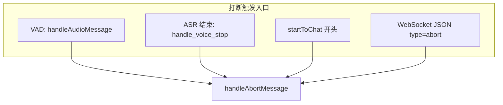
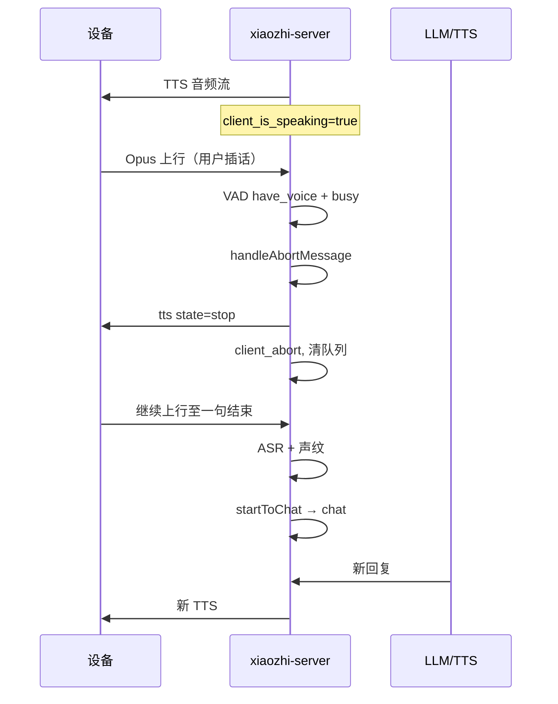

# 说话打断（Barge-in）逻辑说明

本文描述 **xiaozhi-server** 当前实现的「用户打断设备播读 / LLM 在途回复」全链路，便于联调设备固件、排查「插话无效」类问题。

**相关文档**

- [connection与chat流程说明.md](./connection与chat流程说明.md) 第六节（打断与 `client_abort`）
- [多角色与智伴Agent适配设计草案.md](./多角色与智伴Agent适配设计草案.md) 第三节（产品层打断策略）
- 策略实现：`main/xiaozhi-server/core/utils/owner_dialogue_guard.py`

---

## 1. 概念

| 术语 | 含义 |
|------|------|
| **机器忙** `is_machine_busy` | `client_is_speaking`（正在向设备发 TTS 音频）**或** `_chat_inflight > 0`（LLM 仍在生成，可能尚未开始播） |
| **主孩子独占窗口** `owner_exclusive_active` | 当前轮若识别为主孩子声纹，置 true；与 `is_owner_dialogue_busy` 配合（严格模式下限制谁可插话） |
| **打断 / Abort** | `handleAbortMessage`：置 `client_abort`、清 TTS/上报队列、停流式 ASR 会话、向设备发 `tts state=stop` |
| **受理** `should_accept_speech` | 本段 ASR 结果是否允许进入 `startToChat`；**false 则直接丢弃，不会打断也不会开新轮** |

**体验上**：用户期望「一说话喇叭就停」= **设备端立刻停播** + **服务端 abort** + **新一句 ASR 后进 chat**。服务端单独无法保证听感，设备应配合（见第 7 节）。

---

## 2. 配置项（`config.yaml` / `data/.config.yaml`）

| 配置键 | 默认（仓库） | 作用 |
|--------|--------------|------|
| `owner_child_barge_in_exclusive` | **false** | **false**：宽松模式，机器忙时也受理任意说话人，VAD 可打断，ASR 后倾向 abort。**true**：严格模式，走主孩子/声纹门禁（见下表） |
| `barge_in_requires_voiceprint` | **true** | **仅 strict=true 时生效**。true：机器忙时 VAD 不打断，插话须 ASR+声纹且 `speaker_id` 在声纹库 |
| `barge_in_min_voice_ms` | **400** | VAD 打断去抖：累计人声时长 ≥ 该值才 `handleAbortMessage`；**0** 表示有 voice 即打断 |

**组合效果（strict = `owner_child_barge_in_exclusive`）**

| strict | voiceprint gate | VAD 层（播/算时） | 机器忙时 `should_accept_speech` | ASR 后 `should_interrupt`（strict） |
|--------|-----------------|-------------------|----------------------------------|-------------------------------------|
| false | （忽略） | 允许（`allow_vad_barge_in=true`） | **始终 true** | **busy 即 true** |
| true | true | **不允许** | 仅 **已录声纹** `speaker_id ∈ speaker_ids` | 同左 |
| true | false | 允许 | 非独占窗口 **true**；独占窗口仅 **主孩子** | 独占且 **主孩子** |

生产环境若未同步仓库默认，以 **`data/.config.yaml` 实际值** 为准；仅改 `config.yaml` 不生效。

---

## 3. 打断入口（四条路径）

### 3.1 路径 A — VAD 即时打断（最快）

**文件**：`core/handle/receiveAudioHandle.py` → `handleAudioMessage`

**条件（同时满足）**

1. `have_voice`（Silero VAD 判定本帧有人声）
2. `is_machine_busy(conn)`（播 TTS 或 LLM 在途）
3. `client_listen_mode != "manual"`
4. `allow_vad_barge_in(conn) == true`
5. 累计人声 ≥ `barge_in_min_voice_ms`（或为 0 立即打断）

**然后**：`await handleAbortMessage(conn)`，**仍继续** `receive_audio` 收本帧音频。

**strict + voiceprint gate=true 时**：路径 A **关闭**，播读期间服务端**不会**因 VAD 发 abort。

### 3.2 路径 B — ASR + 声纹完成后打断

**文件**：`core/providers/asr/base.py` → `handle_voice_stop`（流式 ASR 子类可能提前触发）

**顺序**

1. ASR 出文本 + 可选声纹 `speaker_id`
2. `_set_current_round_speaker_type(conn)`
3. **`should_accept_speech`** → false 则 **return**（日志：「机器忙且非已录声纹说话人，丢弃 speech …」）**← 常见「完全打断不了」**
4. **`should_interrupt_on_voiceprint`** → true 则 `handleAbortMessage`
5. `startToChat(enhanced_text)`

**strict=false**：步骤 3 恒 true，步骤 4 在 busy 时恒 true（先 abort 再 chat）。

### 3.3 路径 C — startToChat 兜底

**文件**：`core/handle/receiveAudioHandle.py` → `startToChat`

在通过 `should_accept_speech` 之后、进意图/`chat` 之前：

- 非 manual 且（`client_is_speaking` **或** `_chat_inflight > 0`）→ 再调一次 `handleAbortMessage`

用于 VAD/ASR 未 abort 但仍在播/仍在算的情况。

### 3.4 路径 D — 设备/客户端显式 abort

**文件**：`core/handle/textHandler/abortMessageHandler.py`

WebSocket 文本：`{"type":"abort", "session_id":"..."}` → `handleAbortMessage`。

**推荐设备**：本地检测到用户插话时 **先停喇叭**，再发 `type:abort`（见第 7 节）。

---

## 4. handleAbortMessage 做什么

**文件**：`core/handle/abortHandle.py`

| 步骤 | 行为 |
|------|------|
| 1 | `conn.client_abort = True` |
| 2 | `tts.abort_playback()`（流式 TTS 子类可取消会话） |
| 3 | `asr.stop_ws_connection()`（若存在，打断流式 ASR） |
| 4 | `clear_queues()`：TTS 文本/音频队列、上报队列、音频流控器 reset |
| 5 | `reset_audio_states()`：VAD/ASR 缓冲清零 |
| 6 | `clearSpeakStatus()`：`client_is_speaking = False`，`maybe_clear_owner_exclusive` |
| 7 | WebSocket 下发 `{"type":"tts","state":"stop","session_id":...}` |

**不会**自动把 `_chat_inflight` 置 0；LLM 线程在 `connection.chat` 流式循环里检查 `client_abort` 后 break。新轮 `startToChat` / TTS FIRST 等处会复位 `client_abort`。

---

## 5. 与「主孩子 / 声纹 / 学情」的关系

| 模块 | 是否参与打断 |
|------|----------------|
| `owner_child_voice_print_id` / `speaker_ids` | **strict + voiceprint gate** 下决定 accept/interrupt |
| `owner_exclusive_active` | strict 且 gate off 时，独占窗口仅主孩子可 accept/interrupt |
| 学情 `learning_api_client` | **不参与**打断，仅用 `should_attach_owner_child_context` 决定是否上报 |
| 远程看娃 `parent_device_snapshot` | **不参与**设备语音打断（仅 busy 判断能否发起看娃） |

---

## 6. 端到端时序（宽松模式，推荐联调基线）

`owner_child_barge_in_exclusive: false`

**strict + voiceprint gate=true** 时：VAD 不 abort；若声纹失败，ASR 有字也会在 `should_accept_speech` 被丢弃，**无 stop、无新轮**。

---

## 7. 设备端建议（与服务器分工）

| 责任 | 设备 | 服务端 |
|------|------|--------|
| 听感「立刻停」 | **本地停 I2S/播放队列** | 发 `tts stop`（abort 后） |
| 作废旧回复 | 发 **`type:abort`** | `handleAbortMessage` + `client_abort` |
| 新问句识别 | 继续送 Opus | ASR → `startToChat` |

仅设备停播不发 abort：旧 LLM 可能继续往队列塞音频。  
仅服务端 abort 但 strict 丢弃插话：喇叭可能停了（若曾 abort）但**不处理新话**。

---

## 8. 常见日志与含义

| 日志 | 含义 |
|------|------|
| `播读/在途中人声… VAD 打断` | 路径 A 成功 |
| `ASR 完成后触发打断` | 路径 B |
| `startToChat 前打断上一轮` | 路径 C |
| `Abort message received speaking=… inflight=…` | abort 执行中 |
| **`机器忙且非已录声纹说话人，丢弃 speech`** | **路径 B 在 accept 被拒绝**；未 abort、未 startToChat。查 `speaker_id`、声纹是否 enabled、`owner_child_barge_in_exclusive` / gate |
| 有 ASR 文本但无「识别说话人」 | 声纹未返回 id，gate=true 时几乎必丢 |

---

## 9. 历史变更（便于对照「以前好使」）

|  commit 主题 | 行为变化 |
|--------------|----------|
| `65a5c1a2` 说话打断逻辑改造 | 引入 `owner_exclusive_active`、`should_accept_speech`（独占时仅主孩子） |
| `b581b412` 只有有声纹的说话才能打断 | 默认 **`barge_in_requires_voiceprint: true`**，关闭播读时 VAD abort；ASR 改为 `should_interrupt_on_voiceprint`，去掉显式「owner_busy + is_owner_speaker → abort」 |
| 后续 | `owner_child_barge_in_exclusive` 宽松/严格开关；abort 时 `stop_ws_connection` 等 |

---

## 10. 排查清单

1. 读 **`data/.config.yaml`** 中 `owner_child_barge_in_exclusive`、`barge_in_requires_voiceprint`、`barge_in_min_voice_ms`。
2. 插话时是否有 **`VAD 打断`** 或 **`Abort message received`**。
3. 若只有 **`丢弃 speech`**：查声纹 `speaker_id`、`voiceprint.enabled`、`owner_child_voice_print_id` 与库内 id 是否一致。
4. 若有 abort 但喇叭不停：查设备是否处理 **`tts state=stop`**；TTS 类型是否支持 `abort_playback`（如火山双流）。
5. **`client_listen_mode == manual`**：设计为不按自动打断处理。

---

## 11. 关键源码索引

| 路径 | 职责 |
|------|------|
| `core/utils/owner_dialogue_guard.py` | busy / accept / interrupt / VAD 策略 |
| `core/handle/receiveAudioHandle.py` | VAD 打断、`startToChat` |
| `core/providers/asr/base.py` | ASR 后 accept + interrupt |
| `core/handle/abortHandle.py` | 统一 abort |
| `core/handle/textHandler/abortMessageHandler.py` | `type:abort` |
| `core/connection.py` | `_chat_inflight`、`client_abort` 流式 break |
| `core/handle/sendAudioHandle.py` | `client_is_speaking`、下发音频 |
| `core/providers/tts/base.py` | TTS 线程看 `client_abort` |

---

*文档版本：与仓库 `owner_dialogue_guard` / `receiveAudioHandle` 当前实现一致；部署请以运行中配置与 commit 为准。*
